## 实验六 逻辑回归实验报告

本实验选择 Pima Indians Diabetes 数据集，用 NumPy 和 Pandas 从零实现逻辑回归，比较梯度下降与阻尼牛顿法的 40 组超参数。固定随机种子 42，按验证集 F1 选择 gd、学习率 0.01、迭代 100 次；在开发集重新训练后，测试 accuracy=0.7532，precision=0.6667，recall=0.5926，F1=0.6275。

## 一 实验目的与理论依据

目标是完成数据清洗、描述统计与图形展示、数据划分、模型实现、超参数比较和分类评价。随附学习文档《логистическая_регрессия.docx》第 14 章介绍二元响应的伯努利分布、logit 联系函数与最大似然估计。本实验采用其中的二分类建模思路，不直接调用现成分类器。

设 z = b + xᵀw，p = sigmoid(z) = 1 / (1 + exp(−z))，log(p/(1−p)) = z。标签 y∈{0,1}，预测阈值固定为 0.5。平均负对数似然 L = −Σ[y log p + (1−y) log(1−p)]/n。代码用等价形式 mean(logaddexp(0,z)−y·z) 保证数值稳定。

在设计矩阵 X 增加全 1 截距列后，梯度 g=Xᵀ(p−y)/n，Hessian H=Xᵀdiag(p(1−p))X/n。梯度下降更新 θ←θ−αg；牛顿法解 (H+10⁻⁸I)δ=g，再更新 θ←θ−αδ。牛顿法若损失上升则将步长减半；这个极小的对角阻尼只用于数值求解，不是损失函数中的 L2 正则项。两种方法均从零权重开始，执行指定次数，不使用提前停止。牛顿法的学习率是牛顿方向的步长系数，两种算法的同值步长不代表相同移动距离。

## 二 数据来源与预处理

数据说明页：https://www.kaggle.com/datasets/uciml/pima-indians-diabetes-database 。该页面说明样本来自至少 21 岁的 Pima 族女性。本次 Kaggle 下载接口返回 HTTP 403，实际下载使用公开镜像：https://raw.githubusercontent.com/jbrownlee/Datasets/master/pima-indians-diabetes.data.csv 。本地 CSV 无表头，字段顺序在代码中显式定义；未声称与无法下载的 Kaggle 文件逐字节相同。

本次数据共 768 行、8 个特征和 1 个标签；Outcome=0 有 500 条，Outcome=1 有 268 条。完全重复行数为 0；原始显式空值数为 0。SHA-256：6bfe5d0f379d17a0e0819b996407e3c09bf80febd4287f2ed212190dfff154af。

| 字段 | 含义 |
| --- | --- |
| Pregnancies | 怀孕次数 |
| Glucose | 血糖浓度 |
| BloodPressure | 舒张压 |
| SkinThickness | 肱三头肌皮褶厚度 |
| Insulin | 两小时血清胰岛素 |
| BMI | 体质指数 BMI |
| DiabetesPedigreeFunction | 糖尿病家族遗传函数 |
| Age | 年龄 |
| Outcome | 是否患糖尿病 0或1 |

Glucose、BloodPressure、SkinThickness、Insulin、BMI 的零值按该数据集常用处理视为缺失。Pregnancies=0 表示未怀孕，予以保留；标签 0 不处理为缺失。不根据测试集删除异常样本或修改阈值。先划分数据，再仅用训练集各列中位数填补，按训练集均值与总体标准差进行 z-score 标准化；标准差为零时使用 1。

| feature | zero_count | missing_after_cleaning |
| --- | --- | --- |
| Pregnancies | 111 | 0 |
| Glucose | 5 | 5 |
| BloodPressure | 35 | 35 |
| SkinThickness | 227 | 227 |
| Insulin | 374 | 374 |
| BMI | 11 | 11 |
| DiabetesPedigreeFunction | 0 | 0 |
| Age | 0 | 0 |

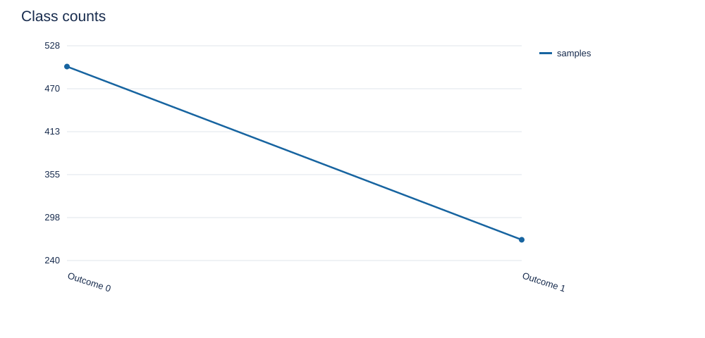

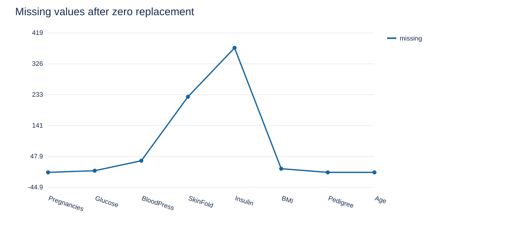

## 三 描述性统计与图形展示

以下为原始数据统计，包含零值。count 为非空记录数，std 为样本标准差（ddof=1），25%、50%、75% 为四分位数。不同字段单位不同，图中绝对高度不用于衡量特征重要性。清洗后的统计仅将上述零值置空，没有用全数据拟合填补或缩放参数；这些总体统计仅用于描述。

| feature | count | mean | std | min | 25% | 50% | 75% | max |
| --- | --- | --- | --- | --- | --- | --- | --- | --- |
| Pregnancies | 768.0000 | 3.8451 | 3.3696 | 0.0000 | 1.0000 | 3.0000 | 6.0000 | 17.0000 |
| Glucose | 768.0000 | 120.8945 | 31.9726 | 0.0000 | 99.0000 | 117.0000 | 140.2500 | 199.0000 |
| BloodPressure | 768.0000 | 69.1055 | 19.3558 | 0.0000 | 62.0000 | 72.0000 | 80.0000 | 122.0000 |
| SkinThickness | 768.0000 | 20.5365 | 15.9522 | 0.0000 | 0.0000 | 23.0000 | 32.0000 | 99.0000 |
| Insulin | 768.0000 | 79.7995 | 115.2440 | 0.0000 | 0.0000 | 30.5000 | 127.2500 | 846.0000 |
| BMI | 768.0000 | 31.9926 | 7.8842 | 0.0000 | 27.3000 | 32.0000 | 36.6000 | 67.1000 |
| DiabetesPedigreeFunction | 768.0000 | 0.4719 | 0.3313 | 0.0780 | 0.2437 | 0.3725 | 0.6262 | 2.4200 |
| Age | 768.0000 | 33.2409 | 11.7602 | 21.0000 | 24.0000 | 29.0000 | 41.0000 | 81.0000 |
| Outcome | 768.0000 | 0.3490 | 0.4770 | 0.0000 | 0.0000 | 0.0000 | 1.0000 | 1.0000 |

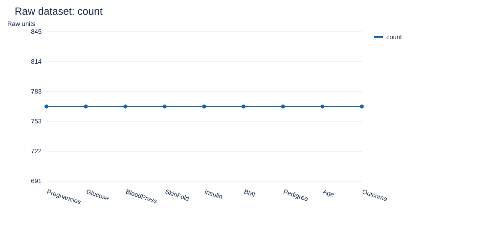

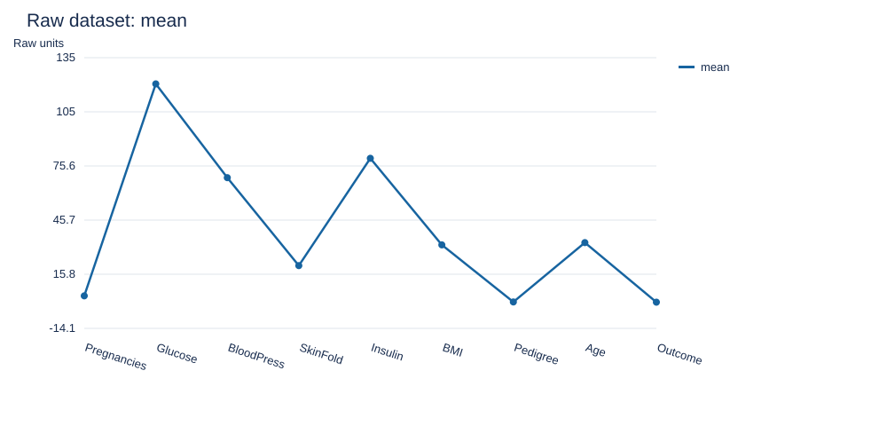

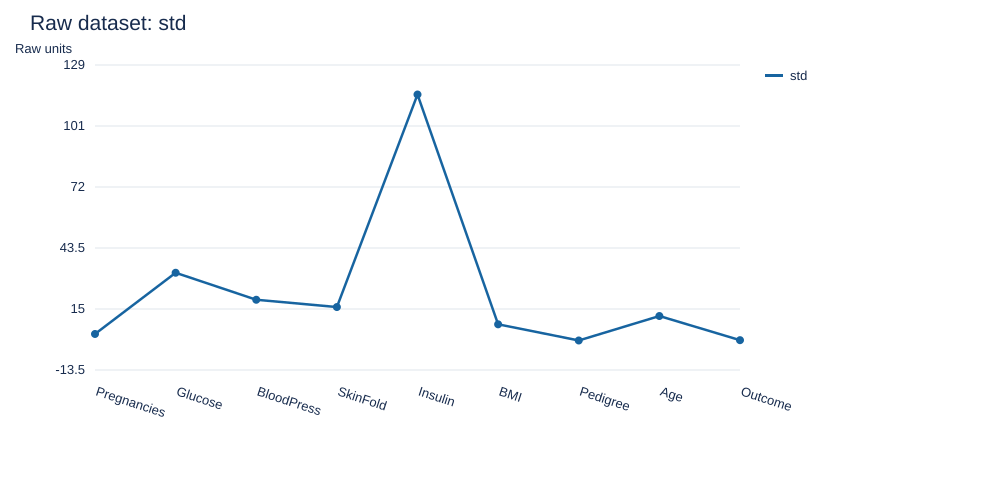

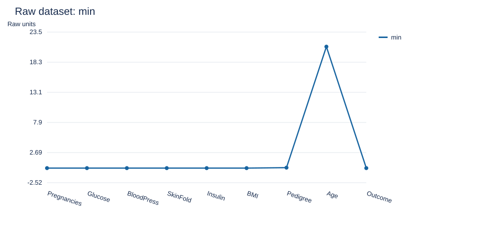

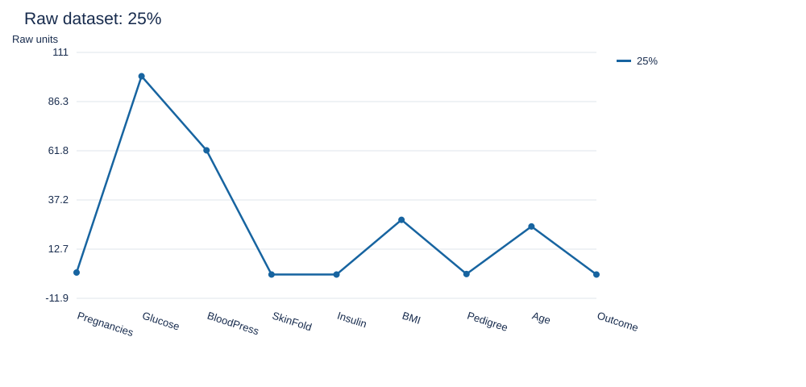

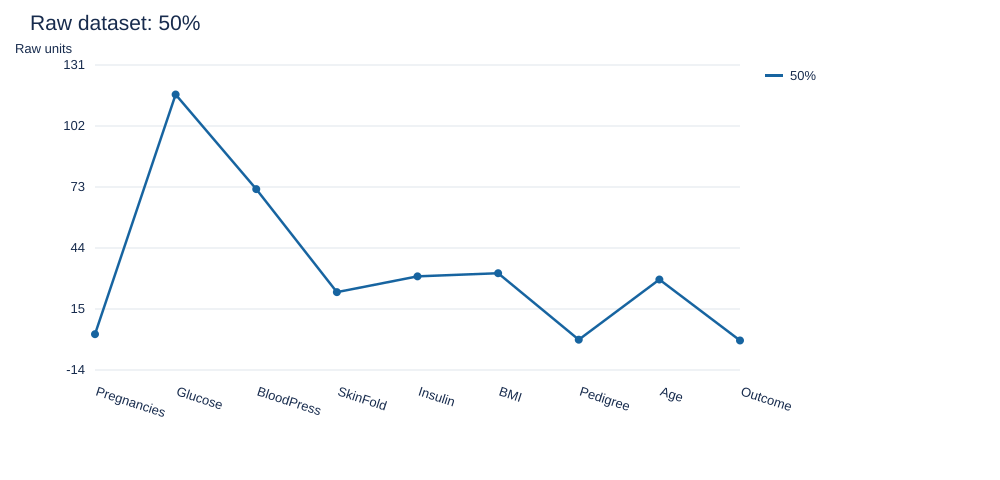

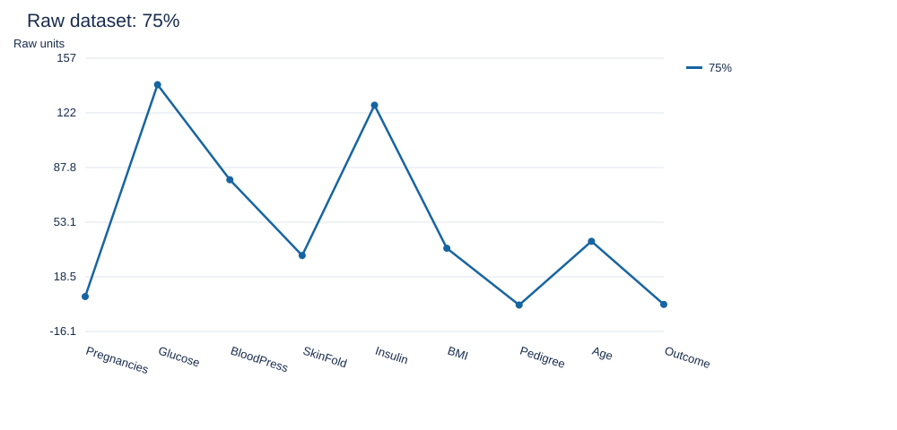

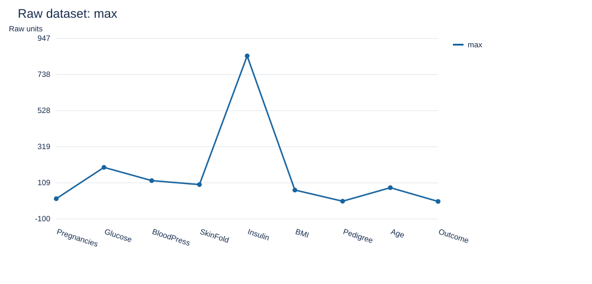

将异常零值置为缺失后的描述统计如下；计数下降反映有效观测减少。

| feature | count | mean | std | min | 25% | 50% | 75% | max |
| --- | --- | --- | --- | --- | --- | --- | --- | --- |
| Pregnancies | 768.0000 | 3.8451 | 3.3696 | 0.0000 | 1.0000 | 3.0000 | 6.0000 | 17.0000 |
| Glucose | 763.0000 | 121.6868 | 30.5356 | 44.0000 | 99.0000 | 117.0000 | 141.0000 | 199.0000 |
| BloodPressure | 733.0000 | 72.4052 | 12.3822 | 24.0000 | 64.0000 | 72.0000 | 80.0000 | 122.0000 |
| SkinThickness | 541.0000 | 29.1534 | 10.4770 | 7.0000 | 22.0000 | 29.0000 | 36.0000 | 99.0000 |
| Insulin | 394.0000 | 155.5482 | 118.7759 | 14.0000 | 76.2500 | 125.0000 | 190.0000 | 846.0000 |
| BMI | 757.0000 | 32.4575 | 6.9250 | 18.2000 | 27.5000 | 32.3000 | 36.6000 | 67.1000 |
| DiabetesPedigreeFunction | 768.0000 | 0.4719 | 0.3313 | 0.0780 | 0.2437 | 0.3725 | 0.6262 | 2.4200 |
| Age | 768.0000 | 33.2409 | 11.7602 | 21.0000 | 24.0000 | 29.0000 | 41.0000 | 81.0000 |

## 四 划分方案与实验设计

先进行分层 80/20 划分，开发集 614 条，测试集 154 条；再从开发集中分层抽取约 25% 作验证集，实际训练 460 条、验证 154 条，整体约 60/20/20。逐类四舍五入造成比例微小偏差。split.csv 保存原始行号及分区，随机数生成器为 NumPy default_rng。

网格为优化器 {gd,newton} × 学习率 {0.001,0.01,0.1,1.0} × 迭代次数 {5,20,100,500,2000}，共 40 组。按照作业要求，对每组都计算测试集 accuracy、precision、recall、F1；参数选择只依赖验证集 F1，平局时依次选择验证损失更小、迭代更少及固定排序靠前的配置。不得根据表中的测试结果反复改变网格、阈值或选择规则。

选定配置后，在训练集与验证集合并的开发集上重新拟合预处理和模型，再作最终测试。网格表使用约 60% 数据训练，最终模型使用约 80%，因此两者测试分数可能不同。测试集已被报告多次，这不是盲测流程；验证集选择避免直接按测试指标挑参数，但仍应在新的独立数据上验证泛化能力。

## 五 评价指标与超参数实验结果

正类为 Outcome=1。accuracy=(TP+TN)/N；precision=TP/(TP+FP)；recall=TP/(TP+FN)；F1=2TP/(2TP+FP+FN)。分母为零时对应指标定义为 0。类别不均衡时只看准确率可能掩盖正类识别不足，故以验证 F1 作为预先固定的选参指标。

## gd 的测试集指标

| learning_rate | iterations | validation_f1 | test_accuracy | test_precision | test_recall | test_f1 | train_loss |
| --- | --- | --- | --- | --- | --- | --- | --- |
| 0.0010 | 5 | 0.5636 | 0.7597 | 0.6667 | 0.6296 | 0.6476 | 0.6923 |
| 0.0010 | 20 | 0.5636 | 0.7597 | 0.6667 | 0.6296 | 0.6476 | 0.6897 |
| 0.0010 | 100 | 0.5636 | 0.7597 | 0.6667 | 0.6296 | 0.6476 | 0.6764 |
| 0.0010 | 500 | 0.5688 | 0.7597 | 0.6667 | 0.6296 | 0.6476 | 0.6242 |
| 0.0010 | 2000 | 0.5769 | 0.7532 | 0.6739 | 0.5741 | 0.6200 | 0.5335 |
| 0.0100 | 5 | 0.5636 | 0.7597 | 0.6667 | 0.6296 | 0.6476 | 0.6846 |
| 0.0100 | 20 | 0.5636 | 0.7597 | 0.6667 | 0.6296 | 0.6476 | 0.6613 |
| 0.0100 | 100 | 0.5794 | 0.7532 | 0.6667 | 0.5926 | 0.6275 | 0.5813 |
| 0.0100 | 500 | 0.5657 | 0.7662 | 0.7143 | 0.5556 | 0.6250 | 0.4824 |
| 0.0100 | 2000 | 0.5275 | 0.7922 | 0.7895 | 0.5556 | 0.6522 | 0.4494 |
| 0.1000 | 5 | 0.5688 | 0.7597 | 0.6667 | 0.6296 | 0.6476 | 0.6229 |
| 0.1000 | 20 | 0.5769 | 0.7532 | 0.6739 | 0.5741 | 0.6200 | 0.5323 |
| 0.1000 | 100 | 0.5474 | 0.7987 | 0.7949 | 0.5741 | 0.6667 | 0.4596 |
| 0.1000 | 500 | 0.5333 | 0.7922 | 0.7895 | 0.5556 | 0.6522 | 0.4466 |
| 0.1000 | 2000 | 0.5333 | 0.7922 | 0.7895 | 0.5556 | 0.6522 | 0.4465 |
| 1.0000 | 5 | 0.5657 | 0.7662 | 0.7143 | 0.5556 | 0.6250 | 0.4777 |
| 1.0000 | 20 | 0.5333 | 0.7922 | 0.7895 | 0.5556 | 0.6522 | 0.4490 |
| 1.0000 | 100 | 0.5333 | 0.7922 | 0.7895 | 0.5556 | 0.6522 | 0.4465 |
| 1.0000 | 500 | 0.5333 | 0.7922 | 0.7895 | 0.5556 | 0.6522 | 0.4465 |
| 1.0000 | 2000 | 0.5333 | 0.7922 | 0.7895 | 0.5556 | 0.6522 | 0.4465 |

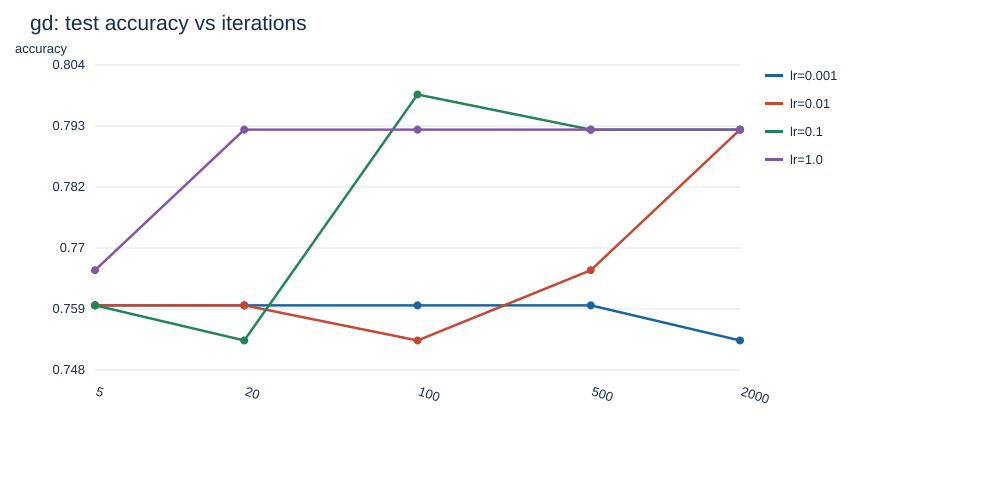

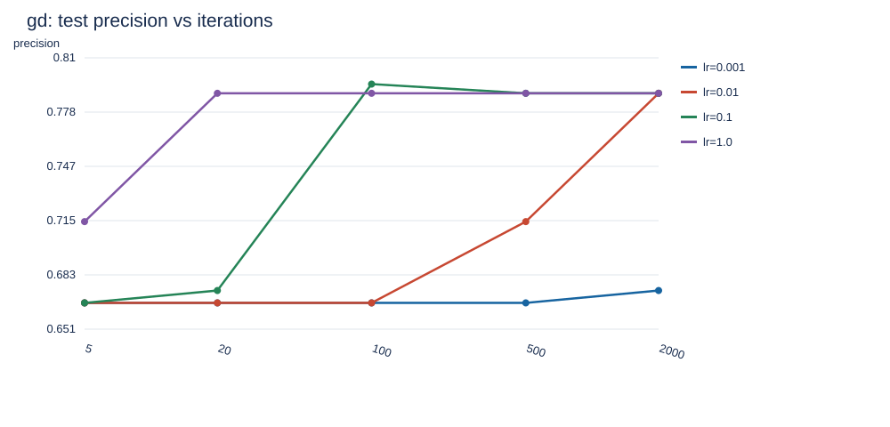

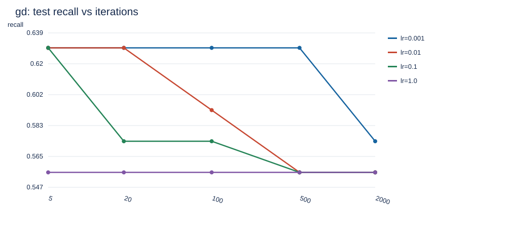

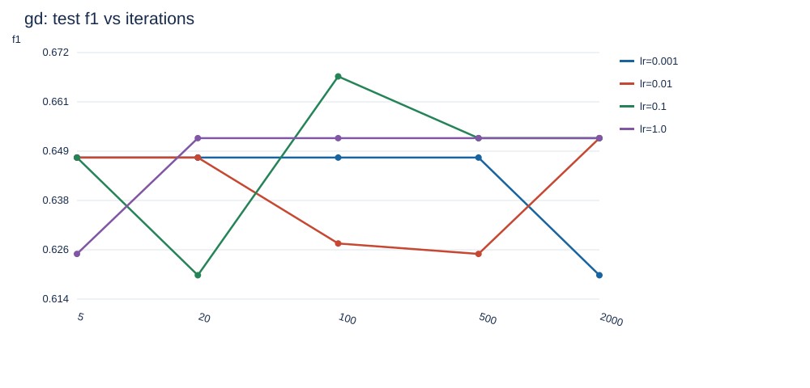

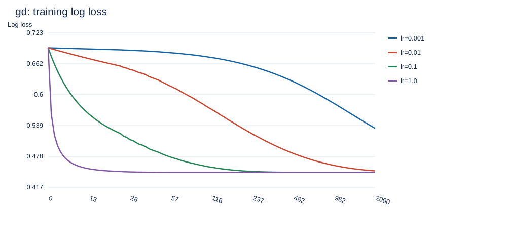

## newton 的测试集指标

| learning_rate | iterations | validation_f1 | test_accuracy | test_precision | test_recall | test_f1 | train_loss |
| --- | --- | --- | --- | --- | --- | --- | --- |
| 0.0010 | 5 | 0.4773 | 0.7792 | 0.7778 | 0.5185 | 0.6222 | 0.6911 |
| 0.0010 | 20 | 0.4773 | 0.7792 | 0.7778 | 0.5185 | 0.6222 | 0.6851 |
| 0.0010 | 100 | 0.4773 | 0.7792 | 0.7778 | 0.5185 | 0.6222 | 0.6558 |
| 0.0010 | 500 | 0.4828 | 0.7792 | 0.7778 | 0.5185 | 0.6222 | 0.5580 |
| 0.0010 | 2000 | 0.5169 | 0.7922 | 0.7895 | 0.5556 | 0.6522 | 0.4560 |
| 0.0100 | 5 | 0.4773 | 0.7792 | 0.7778 | 0.5185 | 0.6222 | 0.6735 |
| 0.0100 | 20 | 0.4773 | 0.7792 | 0.7778 | 0.5185 | 0.6222 | 0.6246 |
| 0.0100 | 100 | 0.5000 | 0.7922 | 0.7895 | 0.5556 | 0.6522 | 0.4972 |
| 0.0100 | 500 | 0.5333 | 0.7922 | 0.7895 | 0.5556 | 0.6522 | 0.4465 |
| 0.0100 | 2000 | 0.5333 | 0.7922 | 0.7895 | 0.5556 | 0.6522 | 0.4465 |
| 0.1000 | 5 | 0.4828 | 0.7792 | 0.7778 | 0.5185 | 0.6222 | 0.5547 |
| 0.1000 | 20 | 0.5169 | 0.7922 | 0.7895 | 0.5556 | 0.6522 | 0.4551 |
| 0.1000 | 100 | 0.5333 | 0.7922 | 0.7895 | 0.5556 | 0.6522 | 0.4465 |
| 0.1000 | 500 | 0.5333 | 0.7922 | 0.7895 | 0.5556 | 0.6522 | 0.4465 |
| 0.1000 | 2000 | 0.5333 | 0.7922 | 0.7895 | 0.5556 | 0.6522 | 0.4465 |
| 1.0000 | 5 | 0.5333 | 0.7922 | 0.7895 | 0.5556 | 0.6522 | 0.4465 |
| 1.0000 | 20 | 0.5333 | 0.7922 | 0.7895 | 0.5556 | 0.6522 | 0.4465 |
| 1.0000 | 100 | 0.5333 | 0.7922 | 0.7895 | 0.5556 | 0.6522 | 0.4465 |
| 1.0000 | 500 | 0.5333 | 0.7922 | 0.7895 | 0.5556 | 0.6522 | 0.4465 |
| 1.0000 | 2000 | 0.5333 | 0.7922 | 0.7895 | 0.5556 | 0.6522 | 0.4465 |

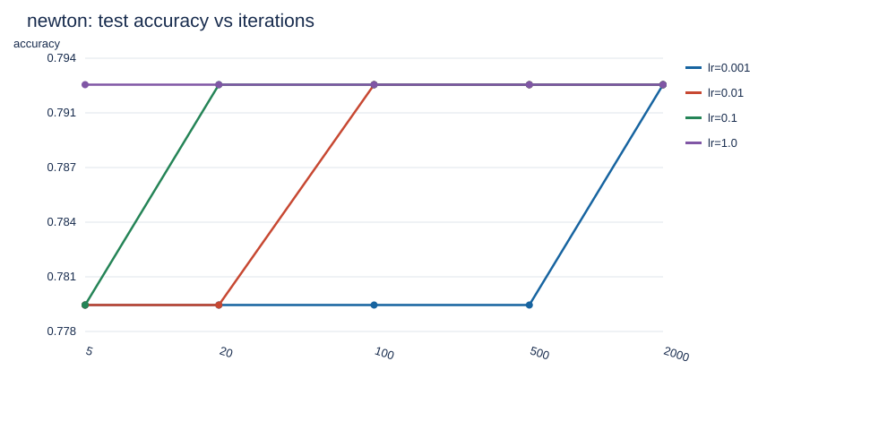

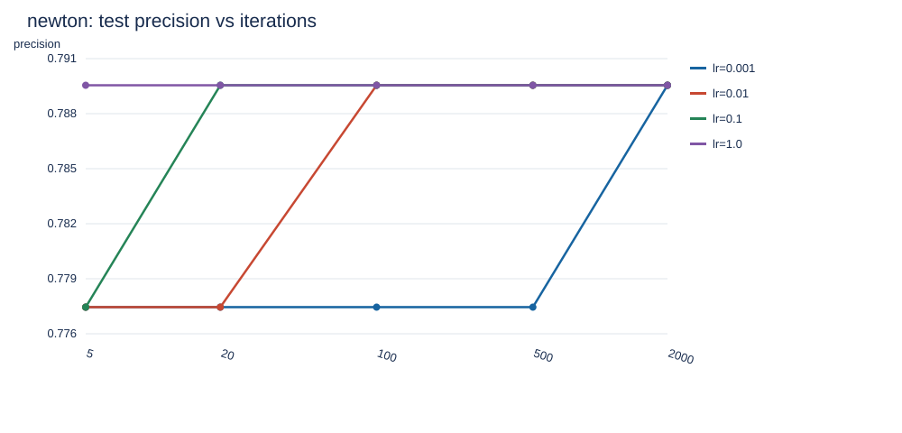

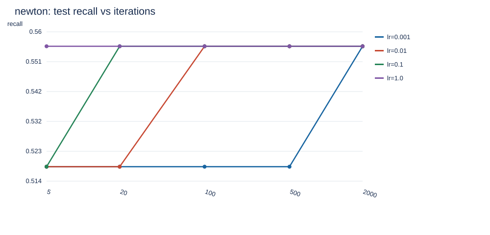

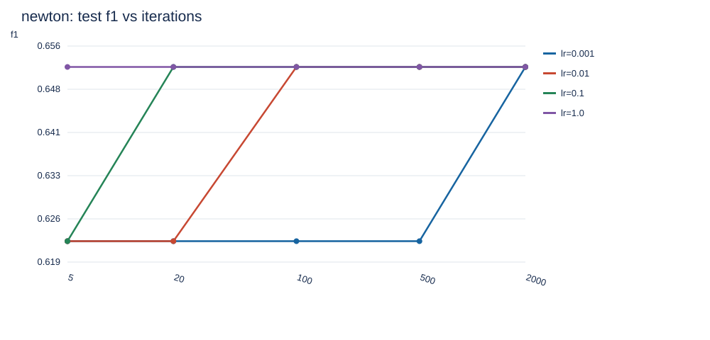

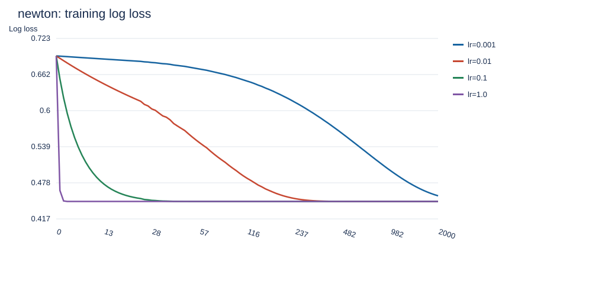

## 六 最终模型与结果分析

| model | accuracy | precision | recall | f1 |
| --- | --- | --- | --- | --- |
| majority baseline | 0.6494 | 0.0000 | 0.0000 | 0.0000 |
| selected and refit | 0.7532 | 0.6667 | 0.5926 | 0.6275 |

| 真实类别 | 预测0 | 预测1 |
| --- | --- | --- |
| 0 | 84 | 16 |
| 1 | 22 | 32 |

最终模型测试 log loss=0.596365，漏报 FN=22，误报 FP=16。混淆矩阵行是真实类别、列是预测类别。多数类基线全部预测 0，其 F1 为 0，说明仅靠多数类可以获得一定准确率，却不能识别正类。

gd：学习率 0.001、5 次时训练损失为 0.692270，测试 F1=0.6476；学习率 1、2000 次时训练损失为 0.446514，测试 F1=0.6522。学习率 1、20 次的损失为 0.449029，与 2000 次差值为 0.00251451。这些结果直接反映步长与迭代次数共同决定的收敛程度；训练损失更低并不保证测试 F1 更高。

newton：学习率 0.001、5 次时训练损失为 0.691102，测试 F1=0.6222；学习率 1、2000 次时训练损失为 0.446514，测试 F1=0.6522。学习率 1、20 次的损失为 0.446514，与 2000 次差值为 0。这些结果直接反映步长与迭代次数共同决定的收敛程度；训练损失更低并不保证测试 F1 更高。

验证集选择结果是 gd、α=0.01、100 次，验证 F1=0.5794、验证损失=0.606830。这里的“最佳”仅指固定划分、给定网格及既定排序规则下的结果，不能声称是所有数据划分上的全局最佳。

选中配置的训练损失为 0.581274，而牛顿法 α=1、20 次的训练损失为 0.446514。当前选择规则可能偏好尚未完全收敛的模型：迭代预算限制带来类似提前停止的效果，并不意味着其优化更充分。验证 F1 与排序第二配置的差距仅为 0.002516，没有足够证据声称这种微小优势具有统计显著性。网格中最高测试 F1 为 0.6667，但未据此更换最终配置。

牛顿法利用曲率，通常需要更少迭代达到相近训练损失，但每一步需构造 Hessian 并解线性方程组；本实验仅有 9 个参数，计算规模较小。梯度下降单步成本较低，小学习率需要更多迭代。迭代增多后各方法可能接近同一未正则化目标的解；分类阈值带来离散变化，准确率和 F1 不必随损失下降而单调提高。本次不使用正则化、类别重加权或阈值搜索，避免把额外因素混入三项指定超参数的比较。

完整耗时和损失见 hyperparameter_results.csv。耗时是单次运行的墙钟时间，受环境影响，不能仅据此作严格速度排名。数据规模较小，单次划分存在抽样波动；后续可使用分层交叉验证。样本限定人群，实验结论不能直接外推到其他人群。

## 七 可复现运行与文件说明

在 Labs/lab2 中运行：python -m pip install -r requirements.txt，然后运行 python logistic_regression.py。无需联网下载数据。可选参数为 --seed、--data、--output；--data 支持 Kaggle 带表头 CSV 或当前无表头镜像，需保持规定字段顺序。

代码中 LogisticRegression 为模型，Preprocessor 为仅在训练分区拟合的预处理，metrics 为手写指标。第三方依赖仅 NumPy 和 Pandas，SVG 图表、HTML 和 Markdown 均使用标准库生成。test_logistic_regression.py 验证极端数值、梯度、Hessian、两类优化器及数据划分隔离。

output 包含完整网格结果、原始和清洗后统计、缺失统计、划分记录、最终模型 model.npz、系数与赔率比、测试预测、summary.json、全部 SVG 图表及本报告。模型参数包括截距，系数对应标准化特征；exp(w) 是其他特征不变时增加一个训练标准差的赔率倍数，不是概率倍数，也不是因果效应。

运行环境：{"python": "3.12.14", "numpy": "2.3.5", "pandas": "3.0.1"}。核心脚本直接运行会重新生成本次实验的全部结果和报告。

## 八 结论

逻辑回归已完成从概率假设、稳定交叉熵到两类数值优化的实现。本次验证集支持使用 gd、学习率 0.01、100 次迭代，重训后测试 F1 为 0.6275。小步长与少迭代可能导致收敛不足，而继续训练在收敛后收益有限；优化器效率与最终泛化指标必须分别讨论。结论以实际运行结果为依据，全部 40 组测试指标均可查验。
