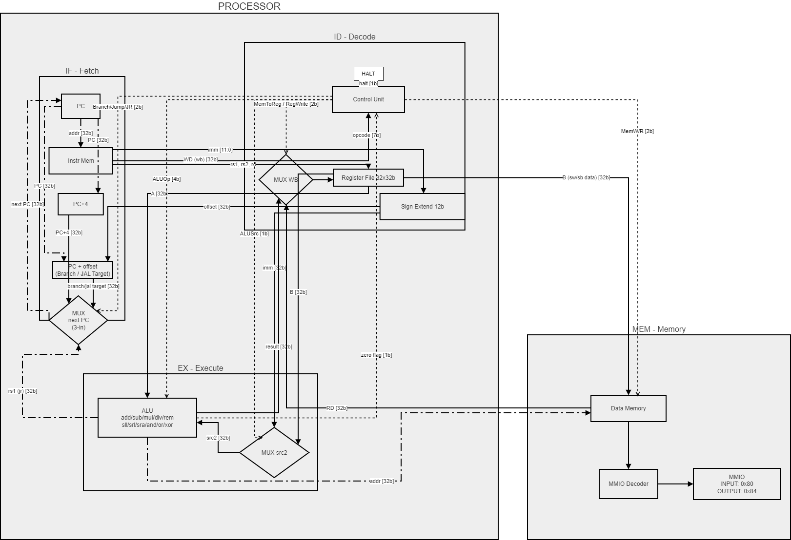

### 关于risc-iv架构的电路原理图的一些学习指南：

  

  

#### 总线
- 数据总线（Reg File ↔ ALU ↔ MEM）（32bit）Шина данных
- 地址总线（PC → Instr Mem / ALU → Data Mem）（32bit） Шина адреса
- 立即数（Sign Extend 输出）（32bit从12b扩展）Прямое число
- ALUOp 控制信号 （~4bit（16种操作））
- MemToReg / RegWrite / ALUSrc （1bit each）

#### 各模块功能与指令执行流程总结
- `PC(Program Counter)`：保存当前指令地址的32位寄存器，每个周期从 MUX next PC 接收下一个地址。是整个处理器的"节拍器"。
- `Instr Mem（指令存储器）`：只读，以 PC 为地址输出32位指令。指令字段同时送往 Control Unit（opcode）、Reg File（rs1/rs2/rd）、Sign Extend（imm[11:0]）三路，单周期并行发生。
- `Control Unit（控制单元）`：译码 opcode，输出6路控制信号：ALUSrc（选寄存器 B 还是立即数）、ALUOp（ALU 操作码）、MemWrite/MemRead、MemToReg（写回来源）、RegWrite（是否写寄存器）、Branch/Jump（是否跳转）。是所有虚线的源头。
- `Register File 32×32b`：32个32位寄存器，x0恒为0。同时支持两路读（rs1→A，rs2→B）和一路写（WD←写回数据）。读是组合逻辑，写发生在时钟上升沿。
- `Sign Extend 12b`：将指令中12位立即数符号扩展到32位，同时送往 MUX src2（作为 ALU 第二操作数）和 Branch Target 加法器（作为 PC 偏移量）。
- `ALU`：支持 add/sub/mul/div/rem/sll/srl/sra/and/or/xor 共11种操作，由 ALUOp 选择。同时输出32位结果和1位 zero flag（用于条件分支判断）。
- `Data Memory`：支持字（lw/sw）和字节（sb）访问。地址来自 ALU 结果，写入数据来自寄存器 B。当地址落在 0x80 或 0x84 时，MMIO Decoder 将请求路由到 MMIO 外设，实现与外部设备的通信（wrench 框架的输入输出接口）。
- `MUX WB`：由 MemToReg 控制，在 ALU 结果（R/I 算术型）和 Data Memory 读出值（lw 型）之间二选一，结果在 RegWrite=1 时写回 Reg File。

- `IF（取指）`：PC 寄存器给出当前地址，Instr Mem 读出 32 位指令。同时 PC+4 计算下一顺序地址，Sign Extend 计算的 offset 与 PC 相加得到分支目标，最终由 MUX next PC 决定下一个 PC 是 PC+4（顺序）还是分支目标（跳转），结果写回 PC。
- `ID（译码）`：指令字段拆分后，opcode 送 Control Unit 生成全部控制信号；rs1、rs2、rd 送 Register File 读出两个源操作数 A 和 B；imm[11:0] 经 Sign Extend 符号扩展到 32 位。Control Unit 是整个处理器的"指挥中枢"，它同时输出 ALUSrc、ALUOp、MemW/R、MemToReg、RegWrite、Branch/Jump 六路控制信号。
- `EX（执行）`：MUX src2 由 ALUSrc 决定——R 型指令选寄存器 B，I 型/S 型指令选立即数 imm——作为 ALU 第二操作数。ALU 执行运算（算术、逻辑、移位），输出 result 和 zero flag（用于分支判断）。zero flag 反馈给 Control Unit，与 Branch 信号结合决定是否跳转。
- `MEM（访存）`：对 load（lw）指令，ALU result 作地址，Data Memory 读出数据 RD；对 store（sw）指令，寄存器 B 的值写入该地址，MemWrite=1；其余指令此阶段透传 result。Data Memory 的访问地址若落在 0x80 或 0x84，MMIO Decoder 将其路由到 MMIO 外设而非内存，实现 memory-mapped I/O。
- `WB（写回，嵌入 ID 区域）`：MUX WB 根据 MemToReg 信号选择 ALU result（R 型/I 型计算指令）或 Memory RD（load 指令），在 RegWrite=1 时写入 Register File 的 rd 寄存器，完成一条指令的完整执行。

#### 答辩问题：
##### 1. RISC-IV 中的栈操作。内存分配、过程间数据传递 / risc-iv Работа со стеком. Выделение памяти, передача данных в/из процедур.

**中文**：栈通常向下增长（SP 寄存器）。分配栈帧使用 `addi sp, sp, -N`。参数可通过寄存器（A0–A7）或压栈传递，返回值通常放在 A0 中。被调用者需手动保存 callee-saved 寄存器（S* 系列）。调用使用 `jal` 指令。

**俄文**：Стек растёт вниз. Выделение: `addi sp, sp, -N`. Параметры — в регистрах A* или на стеке, возврат значения — в A0.

##### 2. 在原理图（schema）中，Nop 指令看起来如何？如何执行？/ schema Как будет выглядеть Nop и как он будет выполняться?

**中文**：Nop 通常编码为特殊 opcode（如全零或 `addi x0, x0, 0`）。在原理图中，控制单元解码后不激活 ALU、内存或写回操作，仅将 PC 增加指令长度（4 或 11 字节），不改变任何状态。执行时间为 1 个周期。

**俄文**：Nop — специальный opcode (часто все нули). Control Unit пропускает операции, только PC += размер инструкции.

##### 3. Jmp 指令在原理图中如何？如何执行？/ schema Как будет выглядеть Jmp и как он будет выполняться?

**中文**：Jmp 指令包含目标地址或偏移。在原理图中，控制单元通过多路选择器（mux）将新地址直接送入 PC，不保存返回地址。执行流程：取指 → 解码 → 更新 PC → 从新地址取下一条指令。

**俄文**：Jmp загружает новое значение в PC через mux. Нет сохранения возврата.

##### 4. Add 指令在原理图中如何？如何执行？/ schema Как будет выглядеть Add и как он будет выполняться?

**中文**：Add 指令涉及取两个操作数送入 ALU 进行加法运算，结果写回目标寄存器（或 Acc），同时更新状态标志。在原理图中路径为：取指 → 解码 → 读寄存器/内存 → ALU → 写回 + 更新标志寄存器。

**俄文**：Операнды → ALU (сложение) → запись результата + обновление флагов C/V.

##### 5. 寄存器文件内部如何工作？/ schema Как работает внутри регистровый файл?

**中文**：寄存器文件是由多个快速 SRAM 单元组成的阵列，包含读端口（通常两个）和写端口。地址解码器根据寄存器编号选择对应单元，多路复用器将数据送到数据总线，写操作由写使能（WE）信号控制，支持并行读写多个寄存器。

**俄文**：Массив SRAM с адресными портами чтения и записи. Декодер выбирает регистр, мультиплексоры выводят данные.

##### 6. 内存映射 I/O 内部如何工作？/ schema Как работает внутри Memory Mapped I/O?

**中文**：MMIO 在地址解码阶段被识别为 I/O 地址范围。当地址落在 MMIO 区间时，地址译码器激活外设控制器而非普通 RAM，通过数据总线与设备交换数据。外部看起来与内存访问完全一致，无需额外 I/O 指令。

**俄文**：Адрес декодируется в диапазон устройств. Вместо RAM активируется периферия, данные идут через общую шину.

##### 7. 控制单元（Control Unit）中是否有寄存器？/ schema Есть ли регистры в Control Unit?

**中文**：是的，控制单元通常包含以下寄存器：指令寄存器（IR，用于保存当前指令）、程序计数器（PC）、状态标志寄存器，以及可能的临时寄存器或微码状态寄存器。控制单元根据这些寄存器和指令 opcode 生成各种控制信号。

**俄文**：Да, обычно присутствуют: Instruction Register (IR), Program Counter (PC), регистры флагов и временные регистры.
