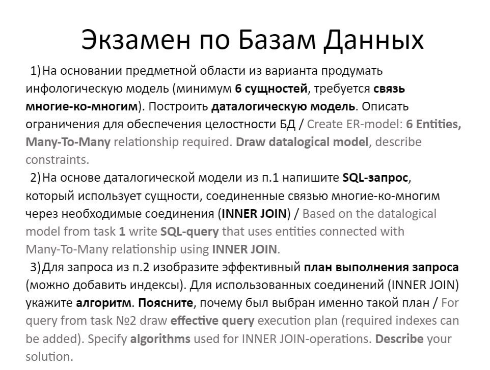

## [目录](./readme.md)/Exam 期末考试  
**2024 考试题目**  
  

**第二批题目：**  
### Экзамен по Базам Данных 
1. На основании предметной области из варианта продумать инфологическую модель (минимум 6 сущностей, требуется связь многие-ко-многим). Построить даталогическую модель. Описать ограничения для обеспечения целостности БД / Create ER-model: 6 Entities, `Many-To-Many` relationship required. Draw datalogical model, describe constraints.
2. Предложите триггеры для разработанной модели, опишите виды триггеров / Suggest triggers for the model from task 1, describe trigger types.
3. На основе даталогической модели из п.1 напишите SQL-запрос, который использует сущности, соединенные связью многие-ко-многим через необходимые соединения (`INNER JOIN`) / Based on the datalogical model from task 1 write SQL-query that uses entities connected with Many-To-Many relationship using `INNER JOIN`.
4. Для запроса из п.3 изобразите эффективный план выполнения запроса (можно добавить индексы). Для использованных соединений (`INNER JOIN`) укажите алгоритм. Поясните, почему был выбран именно такой план / For query from task №3 draw effective query execution plan (required indexes can be added). Specify algorithms used for `INNER JOIN`-operations. Describe your solution.

----------------------------------------  

1. 根据变式中的主题领域，建立信息模型（至少 6 个实体，要求`多对多`关系）。 建立数据模型。 描述约束条件以确保数据库的完整性/创建 ER 模型：6 个实体，要求有 `多对多` 关系。 绘制数据模型，描述约束条件。
2. 为任务 1 中开发的模型建议触发器，描述触发器类型。
3. 根据任务 1 中的数据模型，使用 `INNER JOIN` 编写使用`多对多`关系实体的 SQL 查询 / 根据任务 1 中的数据模型，使用 `INNER JOIN` 编写使用`多对多`关系实体的 SQL 查询。
4. 针对步骤 3 中的查询，编写高效的查询执行计划（可以添加索引）。 对于使用的连接（`INNER JOIN`）指定算法。 解释为什么选择这种特定的计划/对于任务 3 中的查询，绘制有效的查询执行计划（可以添加所需的索引）。 指明用于 `INNER JOIN` 操作的算法。 描述您的解决方案。

Варианты 变体
1) Археологические раскопки  考古发掘
2) Система контроля версий ПО 软件版本控制系统
3) Магазин сантехники 卫生洁具店
4) Сервис аренды самокатов 滑板车租赁服务
5) Пекарня 面包店
6) Онлайн-кино 在线影院
7) Система дистанционного обучения	远程学习系统
8) Грузовые перевозки 货物运输
9) Парикмахерская 理发店
10) Организация ????
11) Фотоателье 照相馆
12) Авторемонт 汽车维修
13) Химическая лаборатория 化学实验室 
14) Системы распределенного доступа 分布式接入系统
15) Система контроля глобального потепления 全球变暖控制系统
16) Система перевозок 运输系统
17) Космические путешествия 太空旅行
18) Радиостанция 广播电台
19) Метеостанция 气象站
20) Электростанция 发电厂
21) Библиотека 图书馆
22) Банк 银行
23) Магазин 商店
24) Аптека 药房
25) Ресторан 餐厅

#### 主题： 运输系统 Система перевозок  
1. 实体：
信息模型：

order(订单) -> id, customer_id, order_date, total_amount, status  

customer(顾客) -> id, name, address, phone_number  

transportation_company(运输公司) -> id, name, address, phone_number  

transport(运输工具) -> id, transportation_company_id, transport_type, status  

driver(司机) -> id, name, age, experience, salary  

route(路线) -> id, start_point, end_point, distance  

repository(仓库) -> id, name, address, cargo_capacity(货物容量)

cargo(货物) -> id, weight, type()

order_cargo(订单货物) -> id, order_id, cargo_id, quantity, status  

数据模型：  
多对多关系：
订单与货物之间多对多关系：一个订单可以包含多个货物，一个货物可以属于多个订单。(M - M)  

一对多关系：
运输公司 1 - M 运输工具  

顾客 1 - M 订单  

司机 1 - 1 路线  

2. 