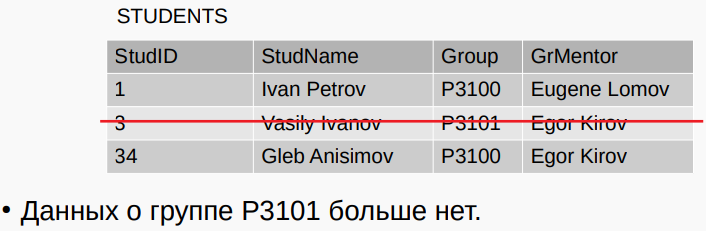

## [主页](../README.md)/Lecture3/[目录](./readme.md)
## Lecture 3: нормализация
## 讲座3：规范化

### 1. Реляционное представление 关系表示

Э. Кодд: любое представление данных можно свести к совокупности отношений.  
Э. Codd：任何数据表示都可以简化为一组关系。
- Отношение (relation) - двумерные таблицы особого вида.
- 关系 - 一种特殊的二维表格。
- У отношения есть атрибуты (столбцы) и кортежи (строки).
- 关系有属性（列）和元组（行）。
- У каждого атрибута есть имя
- 每个属性都有一个名称

#### Домены 领域
-  Каждый атрибут определяется некоторым допустимым набором значений
-  每个属性都由一组有效值定义
-  **Домен** — множество значений, допустимых в определенном контексте.
- **域**是在特定上下文中允许使用的一组值。
- **Смысл домена**: если значения берутся из одного и того же домена, то они относятся к одному типу — эти значения можно сопоставить (сравнить)
- **领域感**：如果值来自同一领域，则它们属于同一类型--这些值可以匹配（比较）

#### Основные правила (1) 基本规则 (1)
- Заголовок отношения — состоит из фиксированного множества атрибутов.
- 关系标头 - 由一组固定的属性组成。
- Тело отношения — состоит из меняющегося во времени множества кортежей.
- 关系体 - 由一组随时间变化的元组组成。

#### Основные правила (2) 基本规则 (2)
- Каждый кортеж состоит из множества пар атрибут значение, по одной паре для каждого атрибута из заголовка.
- 每个元组由多个属性-值对组成，标题中的每个属性都有一对。
- Для любой заданной пары атрибут(A)-значение(v), v является значением из единственного домена D, который связан с атрибутом A. 
- 对于任何给定的属性（A）-值（v）对，v 是唯一与属性 A 相关联的域 D 中的一个值。

#### Базовые понятия 基本概念
- Степень отношения — это число его атрибутов (отношение степени один - унарное, степени два — бинарное, степени n — n-арное).
- 关系的阶数是其属性的个数（阶数为 1 的关系是单元关系，阶数为 2 的关系是二元关系，阶数为 n 的关系是 n 元关系）。
- Кардинальное число (мощность отношения) — это число его кортежей.
- 基数（关系的幂次）是其图元的个数。

#### Терминология

 
#### Операции реляц. алгебры 关系代数操作
**Реляционная алгебра** — язык для определения новых отношений на основе существующих.  
**关系代数**是一种基于现有关系定义新关系的语言。  
В реляционной алгебре определен ряд **операций** над отношениями.  
在关系代数中，定义了一系列关系运算。  
**Результат** операции — **новое** отношение.  
运算结果 - 新的关系。  

В операциях будут использоваться обозначения:  
运算中将使用指定名称：  
- R, S — отношения (таблицы)  
- R, S - 关系（表格）
- φ — предикат (условие), φ1 Λ φ2 — составное условие  
- φ - 谓词（条件），φ1 Λ φ2 - 复合条件

#### Операция выборки 采样操作
- $σ_φ(R)$ — операция выборки — в результате операции формируется отношение на основе R, которое содержит только те строки (кортежи), которые удовлетворяют заданному предикату.
- $σ_φ(R)$--抽样运算--运算的结果是形成一个基于 R 的关系，其中只包含满足给定谓词的字符串（元组）。

```
SELECT * FROM STUDENTS WHERE 
    STUDENTS.GROUP = '3100' AND
    STUDENTS.ID >= 150000;
```

$σ_(STUDENTS.GROUP='3100')Λ(STUDENTS.ID>=150000)(STUDENTS)$

#### Проекция 投影
- $π_attr(R)$ — проекция — в результате операции формируется новое отношение, содержащее только те атрибуты из R, которые были указаны в проекции:
- $π_attr(R)$ - 投影--操作的结果是形成一个新的关系，其中只包含在投影中指定的 R 的属性：


  
  $R ⋈_θ S$   — соединение (тета-соединение)  
  $R ⋈_θ S$ - 连接（θ 连接）
        $R ⋈_θ S$ =  $σ_θ$  (R X S)


#### Сокращенная запись 缩写条目


### 2. Нормализация 规范化

#### Как проверить полученные отношения? 如何检验由此产生的关系？
Вопросы к полученной модели:  
对由此产生的模型提出问题：
- корректны ли полученные отношения?
- 获得的关系是否正确？
- правильно ли выявлено распределение атрибутов по отношениям?
- 属性在关系中的分布是否正确？

**Нормализация** - формальный метод для проверки/доработки модели на основе ключей и функциональных зависимостей в отношениях.  
**规范化**是一种正式的方法，根据关系中的键和功能依赖关系来验证/完善模型。  

#### Возможные проблемы 可能的问题
- Несоответствие смысловых связей реальной предметной области.
- 语义关系与实际主题领域不一致。

#### Аномалии вставки 插入异常
```
INSERT INTO STUDENTS 
 VALUES(57, 'Nina Simonova', 'P3100', 'E. Kirov');
INSERT INTO STUDENTS 
 VALUES(58, 'Petr Uvarov', 'P3100', 'Egor Lomov');
```


#### Аномалии модификации 修改异常
```
UPDATE STUDENTS 
 SET GrMentor = 'Eugene Lomov'
 WHERE StudName = 'Ivan Petrov';
```

#### Аномалии удаления 删除异常
```
DELETE FROM STUDENTS 
 WHERE StudName = 'Vasily Ivanov';
```


#### Функциональная зависимость 功能依赖性
**Функциональная зависимость** — средство для описания связей между атрибутами отношения.  
**功能依赖性** - 一种描述关系中属性之间关系的方法。  
   - R — отношение 关系
   - $A_1$, $A_2$ — атрибуты R


Если в R атрибут $A_2$ функционально зависит от атрибута $A_1$, то каждое значение $A_1$ связано с одним значением $A_2$ и определяет его.  
如果在 R 中，属性 $A_2$ 在功能上依赖于属性 $A_1$，那么 $A_1$ 的每个值都与 $A_2$ 有关，并决定 $A_2$ 的一个值。  
$А_1$ → $A_2$  
$А_1$ — **детерминант** функциональной зависимости.  
$A_1$ 是函数依赖性的**决定因素**。  
$А_1$ и $A_2$ могут представлять несколько атрибутов.  
$A_1$ 和 $A_2$ 可以代表多个属性。

For example:  


#### Минимальное множество функц. зависимостей 最小函数依赖集
Множество функциональных зависимостей **минимально**, если:  
在下列情况下，功能依赖性集合是**最小**的：  
- у всех зависимостей — один атрибут в правой части;
- 所有依赖项的右侧都有一个属性；
- $A_1$ → $A_2$ нельзя заменить на $A_3$ → $A_2$ ($A_3$ — подмножество атрибутов $A_1$);
- $A_1$ → $A_2$ 不能被 $A_3$ → $A_2$ 代替（$A_3$ 是 $A_1$ 的属性子集）；
- при удалении любой функц. зависимости из изначального множества не получается эквивалентное множество функц. зависимостей;
- 从原始集合中移除任何函数依赖关系都不会产生等价的函数依赖关系集合；

#### Аксиомы Армстронга 阿姆斯特朗公理
1. Рефлексивность: 自反性：
если $A_2$ — подмножество $А_1$, то $A_1$→ $A_2$  
如果 $A_2$ 是 $A_1$ 的子集，则 $A_1$→ $A_2$

2. Дополнение: 增编
если $A_1$ → $A_2$, то $A_1$, $A_3$ → $A_2$, $A_3$  
如果 $A_1$ → $A_2$，则 $A_1$，$A_3$ → $A_2$，$A_3$  

3. Транзитивность: 传递性
если ($A_1$ → $A_2$) Λ ($A_2$ → $A_3$), то $A_1$ → $A_3$  
如果 ($A_1$ → $A_2$) Λ ($A_2$ → $A_3$)，则 $A_1$ → $A_3$  

#### Ненормализованная форма 非规范化形式
Если на пересечении строки и столбца встречается несколько значений:  
如果某一行和某一列的交叉点上出现多个值：  


#### Процесс нормализации 规范化过程

##### Первая нормальная форма (1НФ) 第一正则表达式（1NF）
Отношение, на пересечении каждой строки и столбца — одно значение.  
关系，在每一行和每一列的交叉点上都有一个值。  

**Вариант 1**: сделать из групп значений отдельные строки.  
方案 1：将数值分组单独成行。


**Вариант 2**: разбить на таблицы, чтобы исключить группы  
方案 2：分成表格以排除组别


#### Вторая нормальная форма (2НФ)  第二正则表达式（2NF）
**2НФ** — 1) отношение в 1НФ и 2) атрибуты, не входящие в первичный ключ, в полной функциональной зависимости от первичного ключа отношения.  
**2NF** - 1) 1NF 关系，2) 主键中不包含的属性，在功能上完全依赖于关系的主键。  
$А_1$, $A_2$ — атрибуты R  (所有非主键列必须完全依赖于主键，而不是部分依赖) 

Полная функциональная зависимость: $A_2$ в полной функциональной зависимости от $А_1$, если $A_1$ → $A_2$, но нет зависимостей вида $A_3$ → $A_2$, где $A_3$ — подмножество $A_1$.  
完全函数依赖：$A_2$ 与 $A_1$ 完全函数依赖 如果 $A_1$ → $A_2$，但不存在 $A_3$ → $A_2$（其中 $A_3$ 是 $A_1$ 的子集）形式的依赖关系，那么 $A_1$ 与 $A_1$ 存在函数依赖关系。  

#### Третья нормальная форма (3НФ) 第三正则表达式（3NF）
**3НФ** — отношение в 1) 1НФ и 2НФ и 2) все атрибуты, которые не входят в первичный ключ, не находятся в транзитивной функциональной зависимости от первичного ключа.  
**3NF** - 符合以下条件的关系：1）1NF 和 2NF；2）不在主键中的所有属性都与主键不存在传递功能依赖关系。(非主键列之间不存在传递依赖。)
$А_1$, $A_2$, $A_3$ — атрибуты R  
$A_1$、$A_2$、$A_3$ 是 R 的属性  
**Транзитивная функциональная зависимость** — если для $А_1$, $A_2$, $A_3$ из R:  
**传递函数依赖性** - 如果 R 的 $A_1$、$A_2$、$A_3$：  
$A_1 → A_2 Λ A_2 → A_3$


#### Нормальная форма Бойса-Кодда (НФБК) 博伊斯-科德正则表达式（BCNF）
**НФБК** — отношение в НФБК, когда для всех функциональных зависимостей отношения выполняется условие: детерминант — потенциальный ключ.  
**NFBC** 是 NFBC 中的一个关系，当关系的所有功能依赖关系都满足 "行列式是潜在键" 这一条件时。
$А_1$ → $A_2$
А1 — **детерминант** функциональной зависимости.  
A1 是功能依赖性的决定因素。

#### Денормализация 去规范化
- Бывает, что для повышения производительности запросов производится денормализация:
- 有时，为了提高查询性能，需要进行去规范化处理：
  - несколько отношений объединяют в одно;
  - 几种关系合二为一；
- В результате:
  - можно повысить эффективность выполнения некоторых запросов (уменьшается число соединений таблиц);
  - 可以提高某些查询的效率（减少表连接的次数）；
  - увеличивается избыточность данных
  - 数据冗余增加
  - требуется больше усилий на поддержание целостности БД;
  - 要保持数据库的完整性，需要付出更多的努力；
 
