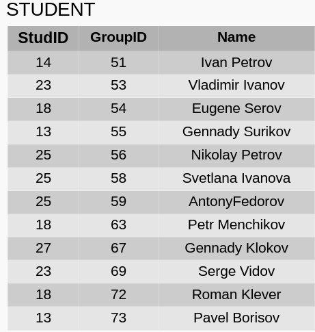
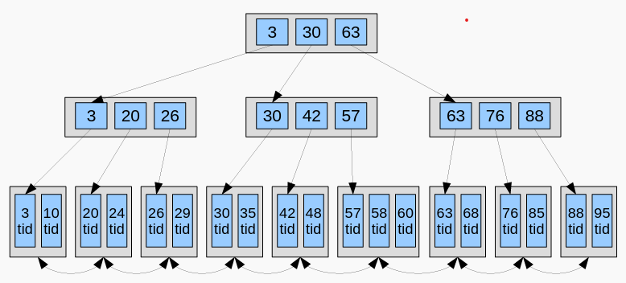
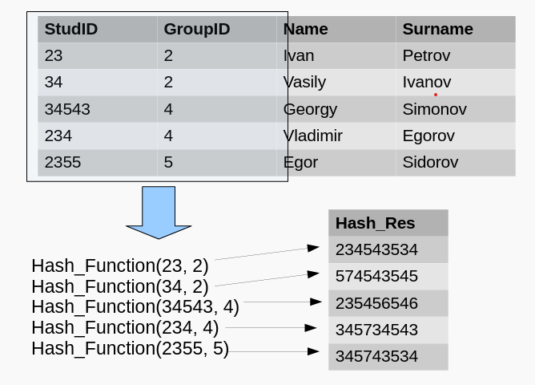
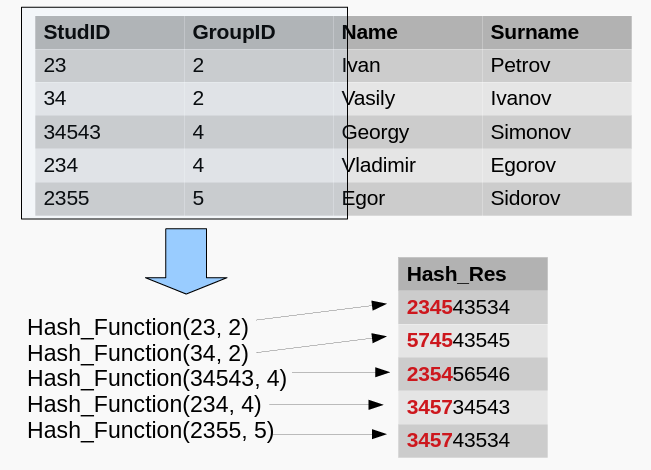
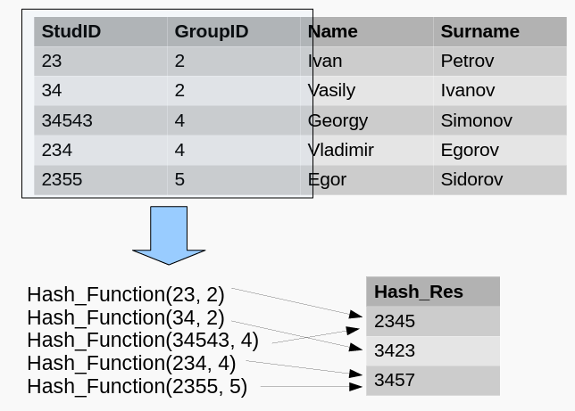
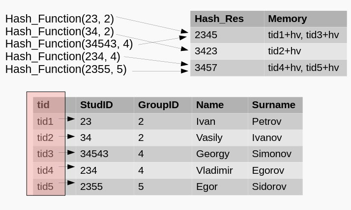

## [主页](../README.md)/Lecture6/[目录](./readme.md)
## Lecture 6: Индексы. Выполнение запросов  
## 讲座6：索引 执行查询  

### 1. Индексы 索引
Повышение производительности запросов  
提高查询性能  

Способы повышения производительности запросов:  
提高查询性能的方法：
- Использование индексов
- 索引的使用
- Настройка физических параметров СУБД (способ разделения пространства хранения данных, стратегии работы с транзакциями и т. д.).
- 配置 DBMS 物理参数（数据存储空间分区方法、事务处理策略等）。

**Индексы SQL** 索引 - список всех значений в группе из одного или нескольких столбцов, упорядоченный в некотором приемлемом для данного типа данных смысле (например, в порядке возрастания для чисел или в алфавитном порядке для символьных строк).  
**SQL 索引** 索引是一组一列或多列中所有值的列表，以给定数据类型可接受的方式排序（例如，数字按升序排列，字符串按字母顺序排列。  
Каждое значение имеет указатель на строку в таблице, где это значение встречается.  
每个值都有一个指针，指向表中出现该值的行。  

Индексы работают **неявно**:  
索引**隐式**工作：  
При выполнении запроса СУБД определяет, какие индексы нужно использовать.  
执行查询时，DBMS 会决定使用哪些索引。  
В рамках того или иного запроса СУБД может не использовать индекс.  
DBMS 可能不会将索引用作特定查询的一部分。  

*Правила работы с индексами*  
Индексы создаются по таблицам для ускорения операций, включающих:  
索引是逐表创建的，以加快涉及表的操作速度：
- предложения `WHERE` и `JOIN`
- `WHERE` 和 `JOIN` 语句
- определение значений MIN() или MAX() по индексированному столбцу;
- 确定索引列的 `MIN()` 或 `MAX()` 值；
- сортировку и группировку столбцов таблицы
- 对表格列进行排序和分组

#### Недостатки индексов 索引的缺点
- Индекс занимает место в памяти:
- 索引占用内存空间：
- При изменении/удалении содержимого индексированного столбца/при добавлении новой строки индекс необходимо обновлять. Эти действия замедляют операции.
- 当索引列的内容发生更改/删除/添加新行时，必须更新索引。 这些操作会减慢运行速度。
- Индексы неэффективны, если в таблице мало строк:
- 如果表中的行数很少，索引就会失效：
- Индексы могут быть неэффективными, если по условию выбираются большие объемы данных.
- 如果按照惯例选择大量数据，索引的效率可能会很低。

#### Стратегии применения 应用策略
- Какие операции будут применяться к таблицам: запрос данных или обновление таблицы?
- 将对表进行哪些操作：查询数据还是更新表？
- Какие столбцы и как часто будут использоваться в предикатах?
- 谓词中将使用哪些列以及使用频率？
- Как часто столбцы таблиц будут использоваться в соединениях (join)?
- 连接(join)中多久会用到表列？

Создание индексов:  
创建索引：  
- `CREATE INDEX index_name ON table_name (column1_name, column2_name);`
- `CREATE INDEX index_name ON table_name USING btree(column1, column2);`

#### B-tree 索引
- Дерево — связный ациклический граф.
- 树是一个连通的非循环图。
- Связность — означает наличие путей между любой парой вершин;
- 连接性 - 指任何一对顶点之间都有路径；
- Ацикличность — отсутствие циклов и то, что между парами вершин имеется только по одному пути.
- 非循环性 - 没有循环，顶点对之间只有一条路径。
- B-дерево — структура данных, дерево поиска. С точки зрения логического представления — сбалансированное, сильно ветвистое дерево.
- B 树是一种数据结构，一种搜索树。 就逻辑表示而言，它是一棵平衡的强分支树。
- Сбалансированность — длина любых двух путей от корня до листьев различается не более, чем на единицу.
- 平衡 - 从根到叶的任何两条路径的长度相差不超过一个单位。
- Ветвистость дерева — свойство каждого узла дерева ссылаться на большое число узлов-потомков.
- 树的分支是指树上的每个节点都能指向大量后代节点的特性。

**tid — tuple identifier, идентификатор записи (номер блока, индекс внутри блока).**    
**tid - 元组标识符、记录标识符（块编号、块内索引）**  
2 типа вершин: внутренние （ссылки на дочерние стр. и листовые страницы (ключ + tid).  
2 种节点类型：内部节点（链接到子页面和叶页面（key + tid））。  

- Значения (ключи) внутри каждого узла отсортированы.
- 每个节点内的值（键）都会排序。
- Дерево сбалансировано ключи равномерно распределены по узлам, что позволяет минимизировать количество переходов.
- 该树是平衡的，键均匀分布在各个节点上，以尽量减少转换次数。
- Полезен при использовании совместно с `=, >, >=, <, <=, BETWEEN` и подобными операторами.
- 与 `=、>、>=、<、<=、BETWEEN` 及类似运算符结合使用时非常有用。

#### Hash-index 哈希索引
Для построения такого индекса используется хэшфункция  
哈希函数用于构建这样的索引
**Хэш-функция** — функция для преобразования входных данных в результирующие данные фиксированного формата.  
**哈希函数** - 将输入数据转换为最终固定格式数据的函数。
哈希索引的工作流程：

- Очень эффективны, когда используется прямое сравнение (на attr — hash index):
- `...WHERE attr = 1`
- 在使用直接比较（attr - 哈希索引）时非常有效：
- Но индекс не будет применен, если:
- 但在下列情况下，该指数将不适用
- `… WHERE attr = 1 OR A=10`

#### Индексы в PostgreSQL
- GiST — обобщенное дерево поиска.
- GiST 是广义搜索树。
- GIN — обобщенный инвертированный индекс (для ускорения полнотекстового поиска).
- GIN - 广义倒排索引（加快全文检索）。