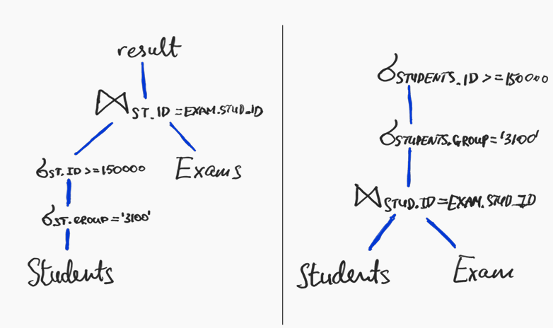
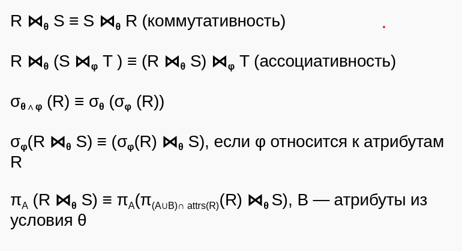
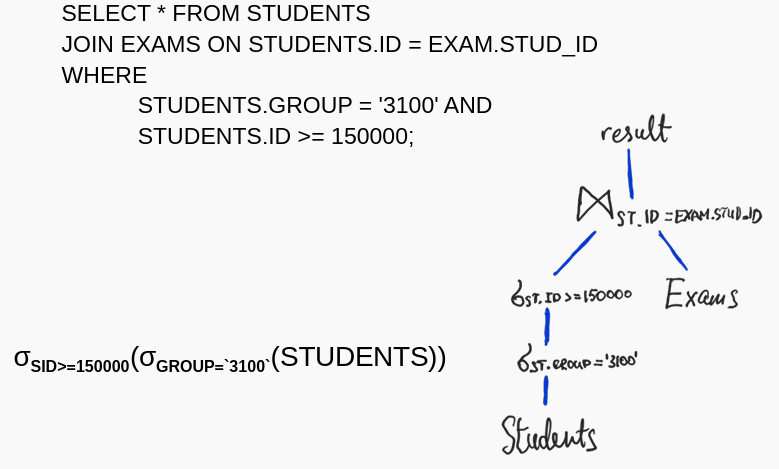
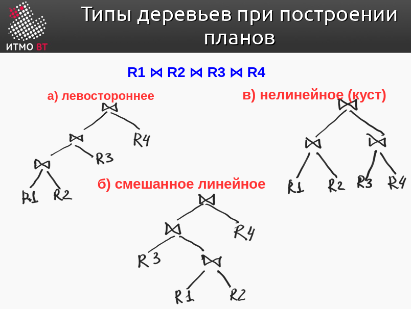

## [主页](../README.md)/Lecture6/[目录](./readme.md)
## Lecture 7: Выполнение запросов  
## 讲座7：执行查询  

### 1. Выполнение запросов и оптимизация 查询执行和优化

#### Повышение производительности запросов
#### 提高查询性能
Способы повышения производительности запросов:  
提高查询性能的方法:  
- Использование индексов.
- 使用索引。
- Настройка физических параметров СУБД (способ разделения пространства хранения данных, стратегии работы с транзакциями и т. д.).
- 配置 DBMS 物理参数（数据存储空间分区方法、事务处理策略等）。

#### Выполнение запросов
#### 执行查询
- 1. Разбор запроса (parser) → строится дерево 查询解析（解析器）→构建一棵树
- 2. Преобразование запроса (rewritter) 请求转换（改写）
- 3. Планировщик + Оптимизатор (planner) → план выполнения запроса  规划器 + 优化器（规划器） → 查询执行计划
- 4. Выполнение плана → executor  履行计划 → 执行

#### План выполнения запроса (query plan) 查询执行计划
- Чтобы выполнить SQL-запрос необходимо построить программу — план выполнения запроса.
- 要执行 SQL 查询，需要建立一个程序 - 查询执行计划。
- Таких программ может быть несколько.
- 这样的计划可以有好几个。
- 选最后效率最高的程序计划。

- 第一张图展示了查询执行流程。
  - 首先从表students开始，给出它这个表的判定条件，之后再与表exams进行连接，以他们之间的id相等作为连接条件，之后得出结果
- 第二张图展示了另一种查询执行计划。
  - 首先直接将表students和表exams进行连接，之后再给出连接条件id，之后再给出他们的判定条件(group，id)，之后给出结果。

  

#### Конвейерная обработка данных 输送数据处理
- **Конв. обр. данных** — передача результатов одной операции на обработку другой без создания временных отношений (для хранения промежуточных результатов).
- 送数据处理--在不建立时间关系（用于存储中间结果）的情况下，将一个操作的结果转移到另一个操作的处理过程中。
- Для планов, в которых большинство операций происходят в конвейере:
- 适用于大部分操作都在传送带上进行的计划：
  - при расчете стоимости плана выполнения запроса **отпадает необходимость** в учете стоимости записи и последующего чтения промежуточных таблиц.
  - 在计算查询执行计划的成本时，无需考虑写入和随后读取中间表的成本。

#### Левосторонние деревья 左撇子树
- Левостороннее дерево — результат соединения - в левой части дерева, представляющего план.
- 树的左侧 - 连接的结果 - 位于代表计划的树的左侧。
- Внешнее отношение — слева.
- 外部关系是在左侧。
- Обычно оптимизаторы запросов в СУБД рассматривают только **левосторонние деревья**:
- 通常，数据库管理系统中的查询优化器只考虑**左手树**：
  - необходимо сократить число планов для анализа; 
  - 有必要减少需要分析的计划数量；
  - такие планы позволяют избежать материализации, используя **конвейерную обработку данных**;
  - 通过使用**数字数据处理管道**来避免这些计划的实现；

#### Советы при построении плана 建立查询过程的一些建议
- Использовать конвейерную обработку (левосторонние планы, избегать блокирующих операций).
- 使用数字处理管道（左手计划，避免阻塞操作）。
- Делать выборку как можно раньше. 
- 尽早取样。
- Делать проекции раньше.
- 提前进行预测。
- Грамотно планировать соединения.
- 巧妙规划连接。
- Цель: уменьшение размеров промежуточных данных => уменьшение числа операций чтения записи во внешнюю память
- 目标：减少中间数据的大小 => 减少外部存储器的读写操作次数

#### Индексы при построении планов 计划编制中的索引
- полезны:
  - выборка данных (фильтрация);
  - 数据取样（过滤）；
  - соединения;
  - 连接
- Негативные эффекты: 负面影响：
  - может потребоваться материализация промежуточных результатов.
  - 可能需要实现中间结果。

#### Расчет стоимости плана выполнения запроса 计算查询执行计划的成本 
Можно выделить 3 основных составляющих:
- Чтение входных или промежуточных таблиц.
- 读取输入表或中间表 
- Запись промежуточных данных (материализация — результат сохраняется во временных отношениях после выполнения одной операции для обработки следующей операцией).
- 记录中间数据（物化--一个操作完成后，将结果存储在时间关系中，供下一个操作处理）。 
- Сортировка результата (`DISTINCT`).
- 对结果进行排序 (`DISTINCT`)。

### 2. Выполнение соединений 链接执行
- Реализации: 实现
  -  Nested-loops join (NLJ)
  -  嵌套循环连接（NLJ）
  -  Hash join (HJ)
  -  哈希连接 (HJ)
  -  Sort-merge join (SMJ)
  -  排序合并连接（SMJ）