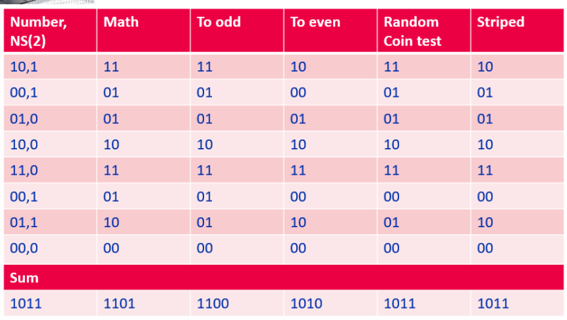
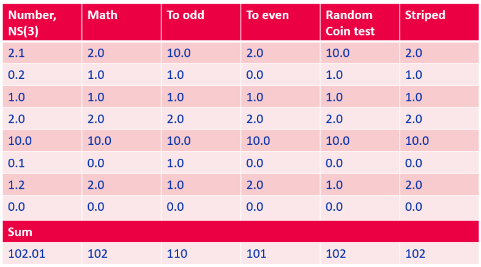

## Лекция №1. №2. Тема: «Сжатие информации и основы помехоустойчивого кодирования.»
## 讲座 #2.主题："信息压缩和抗噪编码基础知识。"

### Проблемы округления чисел в различных СС 不同进制中数字四舍五入的问题

В системах счисления с чётным основанием накапливается ошибка округления:  
四舍五入误差会在偶数基数的数字系统中累积：  
基数为 10：
1, 2, 3, 4,  $\leftarrow$  округление в меньшую сторону  
5, 6, 7, 8, 9,  $\leftarrow$  округление в бóльшую сторону    
0  $\leftarrow$   нет ошибки округления  

В системах счисления с нечётным основанием этой проблемы нет:  
四舍五入误差不会在奇数基数的数字系统中累积：  
基数为 7：
1, 2, 3  $\leftarrow$  округление в меньшую сторону(往大进一)  
4, 5, 6  $\leftarrow$  округление в бóльшую сторону(保留为当前整数)  
0  $\leftarrow$  нет ошибки округления

### Решение проблемы с округлением в СС с чётным основанием 偶数基数 CC 中四舍五入问题的解答  
Случайное округление: используется датчик случайных чисел при принятии решения о том, в бóльшую или меньшую сторону следует округлять.  
随机四舍五入：使用随机数传感器决定向上或向下舍入。  
Банковское округление (к ближайшему чётному): 3,5 ≈ 4, но 2,5 ≈ 2.  
银行四舍五入（取双数）：3.5 ≈ 4，但 2.5 ≈ 2。  
К ближайшему нечётному: 3,5 ≈ 3, но 2,5 ≈ 3. Аналогично: $4,3_(6)$ ≈ $5_(6)$.  
最接近的奇数：3.5 ≈ 3，但 2.5 ≈ 3。同理：$4,3_(6)$ ≈$5_(6)$。  
Чередующееся: направление округления меняется на противоположное при 
каждой операции округления (необходимо «помнить» о предыдущем округлении).  
交替：每次舍入操作的舍入方向相反（必须 "记住 "前一次舍入）。  

### Алфавит и его подмножества 字母表及其子集
Алфавит – конечное множество различных знаков (букв), символов, для которых определена операция конкатенации (присоединения символа к символу или 
цепочке символов).  
字母表是由不同字符（字母）和符号组成的有限集合，其中定义了连接操作（将一个符号连接到另一个符号或符号链）。  
Знак (буква) – любой элемент алфавита (элемент x алфавита X, где x є X).  
符号（字母）是字母表中的任何元素（字母表 X 中的元素 x，其中 x є X）。  
Слово – конечная последовательность знаков (букв) алфавита.  
单词是字母表中字符（字母）的有限序列。  
Словарь (словарный запас) – множество различных слов над алфавитом.  
词汇（vocabulary）--字母表上有许多不同的单词。  

### Кодирование данных
Кодирование (модуляция) данных — процесс преобразования символов алфавита Х в символы алфавита Y.  
数据编码（调制）是将字母 X 的字符转换成字母 Y 的字符的过程。  
Декодирование (демодуляция) — процесс, обратный кодированию.  
解码（解调）与编码相反。  
Символ — наименьшая единица данных, рассматриваемая как единое целое при кодировании/декодировании.  
字符是编码/解码过程中作为单一单元处理的最小数据单位。  
Кодовое слово – последовательность символов из алфавита Y, однозначно обозначающая конкретный символ 
алфавита Х.  
码字--字母表 Y 中的一串字符，唯一表示字母表 X 中的一个特定字符。  
Средняя длина кодового слова – это величина, которая вычисляется как взвешенная вероятностями сумма длин всех кодовых слов.  
平均码字长度是一个数值，是所有码字长度的概率加权和。  
$L=\sum_{i=1}^{n}p_iL_i$  

Если все кодовые слова имеют одинаковую длину, то код называется равномерным (фиксированной длины).  
如果所有码字长度相同，则称为统一码（固定长度）。  
Если встречаются слова разной длины, то – неравномерным (переменной длины).
如果出现不同长度的词，则为非统一码（变长）。  

### Сжатие данных 数据压缩
Сжатие данных — процесс, обеспечивающий уменьшение объёма данных путём сокращения их избыточности.  
数据压缩是一种通过减少数据冗余来缩小数据大小的过程。  
Сжатие данных — частный случай кодирования данных.  
数据压缩是一种特殊地编码数据方式。  
Коэффициент сжатия — отношение размера входного потока к выходному потоку.  
压缩系数是**输入数据流**的大小与**输出数据流**的大小之比。  
Отношение сжатия — отношение размера выходного потока ко входному потоку.  
压缩比是指**输出数据流**的大小与**输入数据流**的大小之比。  

### Типы и методы сжатия данных 数据压缩的类型和方法
Сжатие без потерь (полностью обратимое) — сжатые данные после декодирования  (распаковки) не отличаются от исходных.  
无损压缩（完全可逆）--解码（解压缩）后的压缩数据与原始数据没有区别。  
Сжатие с потерями (частично обратимое) — сжатые данные после декодирования  (распаковки) отличаются от исходных, так как при сжатии часть исходных данных была отброшена для увеличения коэффициента cжатия.  
有损压缩（部分可逆）--解码（解压缩）后的压缩数据与原始数据不同，因为在压缩过程中，为了提高压缩比，丢弃了部分原始数据。  
Статистические методы — кодирование с помощью усреднения вероятности 
появления элементов в закодированной последовательности.  
统计方法--通过平均编码序列中元素出现的概率进行编码。  
Словарные методы — использование статистической модели данных для разбиения 
данных на слова с последующей заменой на их индексы в словаре.  
字典方法--使用统计数据模型将数据划分为单词，然后用字典中的索引替换单词。  

### Помехоустойчивые коды 抗干扰代码
**Помехоустойчивые коды** — коды, позволяющие обнаружить и (или) исправить ошибки в 
кодовых словах, которые возникают при передаче по каналам связи.  
**抗干扰码** - 能检测和（或）纠正在通信信道传输过程中出现的码字错误的编码。  
1. Блочные — фиксированные блоки длиной i символов преобразуются в блоки длиной n символов:  
块 - 长度为 i 个字符的固定块被转换成长度为 n 个字符的块：
    1. Неравномерные — редко используемые символы кодируются большим количеством символов (имеют большую длину).  
    不等长 - 不常使用的字符被编码为大量字符（长度较大）。
    2. Равномерные — длина блока(символа) постоянна:  
    统一 - 块（字符）长度不变：
        1. Неразделимые — коды с постоянной плотностью единиц.
        不可分割 - 单位密度不变的编码。  
        2. Разделимые — можно отделить (выделить) служебные биты r от информационных битов i.  
        可分离 - 可以将服务比特 r 与信息比特 i 分离（隔离）。
2. Непрерывные (свёрточные) — передаваемая информационная последовательность не 
разделяется на блоки.  
连续（卷积）--传输的信息序列不分成块。 

Коэффициент избыточности — отношение числа проверочных разрядов (r) к общему числу 
разрядов (n).  
冗余系数是校验位数（r）与总位数（n）之比。

### Контроль чётности 奇偶校验位
Контрольная сумма — некоторое число, рассчитанное путем применения определенного 
алгоритма к набору данных и используемое для проверки целостности этого набора данных при 
их передаче или хранении.  
校验和是通过对数据集应用某种算法计算出的数字，用于验证数据集在传输或存储过程中的完整性。  
Бит чётности — частный случай контрольной суммы, представляющий из себя 1 контрольный бит, используемый для проверки четности количества единичных битов в двоичном числе.  
奇偶校验位是校验和的一种特例，它是 1 个校验位，用于检查二进制数中 1 位数的奇偶性。（如果1的个数为偶数，则校验位为0；如果1的个数为奇数，则校验位为1）  

### Код Хэмминга 汉明码
Код Хэмминга — блочный равномерный разделимый самокорректирующийся 
код. Исправляет одиночные битовые ошибки, возникшие при передаче или хранении данных.  
汉明码是一种块均匀可分离自校正码。它能纠正数据传输或存储过程中出现的单比特错误。  
Синдром последовательности S — 
набор контрольных сумм информационных 
и проверочных разрядов.  
序列综合征 S 是一组信息和校验码的校验和。（按XOR异或逻辑运算）

  

### Классический код Хэмминга 经典的汉明码
Определение минимального числа контрольных 
разрядов: 2r ≥ r + i + 1.  
确定最小控制位数：2r ≥ r + i + 1。

Классические коды Хэмминга с маркировкой (n; i):
(7,4); (15,11); (31,26)…  
标有 (n; i) 的经典汉明码：(7,4); (15,11); (31,26) ....

|信息位数范围，i|最小控制位数 r|
|:----:|:----:|
|1|2|
|2-4|3|
|5-11|4|
|12-26|5|
|27-57|6|

Коэффициент избыточности — отношение числа проверочных разрядов (r) к общему 
числу разрядов (n = i + r).  
冗余系数是校验位数（r）与总位数（n = i + r）之比。

