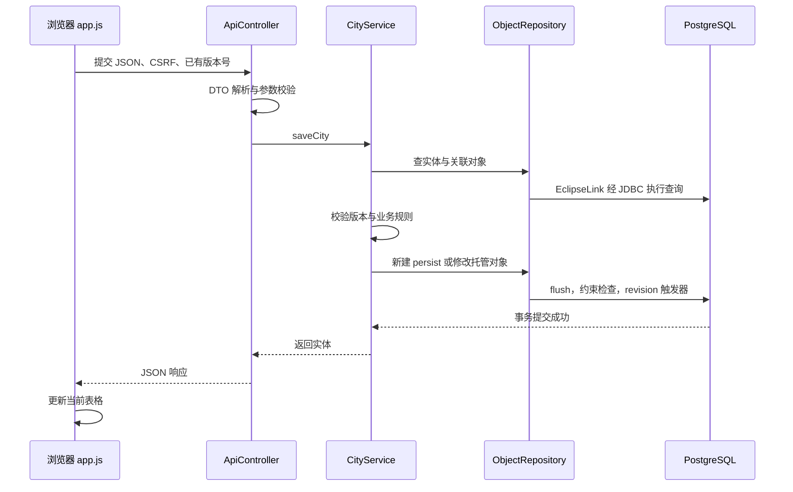

# 实验一实现流程与代码阅读指南

变体 **5742**；项目目录 `F:\InfoSystem\Lab1`。本文说明实际实现，不是实验报告。答辩资料见 [中俄双语答案](DEFENSE_QA_ZH_RU.md)。

## 1. 项目解决什么问题

注册用户可以管理城市、坐标和省长，执行查询、修改和删除，并调用五项特殊操作。数据保存在 PostgreSQL；多个用户看到的是共享业务数据。注册仅控制访问，不额外引入实验未要求的复杂角色或“每个人只能编辑自己的城市”规则。

前后端一起打包：浏览器获取静态页面，通过同源 HTTP/JSON 请求后端。服务器使用 Spring MVC 接收请求、Spring 服务处理业务、JPA/EclipseLink 保存对象。不需要 React、Vue、Node 后端或额外前端部署。

## 2. 技术及职责

| 技术 | 项目中的作用 |
|---|---|
| Java 17 | 实体、DTO、控制器、业务逻辑 |
| Gradle 8.5，Groovy DSL | 下载依赖、编译、测试、打包；配置为 build.gradle |
| Spring Boot 3.3.5 | 启动、配置整合、嵌入式 Tomcat、可执行 JAR |
| Spring MVC | HTTP 路由、JSON 输入输出、异常响应 |
| Spring Security | 注册账号登录、会话、CSRF、退出 |
| Jakarta Validation | 必填、范围等服务端约束 |
| Jakarta Persistence 3.1 | 对象映射与 EntityManager 标准 API |
| EclipseLink 4.0.4 | JPA provider，执行映射、查询与更新 |
| PostgreSQL | 业务表、约束、外键、触发器、五个函数 |
| Flyway | 按版本迁移数据库结构与函数 |
| 原生 HTML/CSS/JavaScript | 登录拼图、主页卡片、表格、表单、错误弹窗 |
| JUnit、Spring Test | 单元及真实 PostgreSQL 集成测试 |

没有使用 Spring Data JPA、Jakarta Data、Hibernate ORM、EJB 或 CDI 容器。Hibernate Validator 只负责数据校验。Spring Bean 与 JPA Entity 属于不同管理体系。

## 3. 清晰的项目结构

```text
Lab1/
├── build.gradle                  # Groovy 构建配置
├── settings.gradle
├── gradlew / gradlew.bat          # Gradle Wrapper
├── gradle/wrapper/
├── config/local.properties       # 本机连接信息，不提交、不打包
├── src/main/java/edu/lab/city/
│   ├── CityApplication.java      # main 入口
│   ├── config/
│   │   ├── PersistenceConfig.java # EclipseLink、EMF、事务管理
│   │   ├── SecurityConfig.java    # 认证与 CSRF
│   │   └── JsonConfig.java        # long 序列化，避免 JS 丢精度
│   ├── domain/
│   │   ├── City.java
│   │   ├── Coordinates.java
│   │   ├── Human.java
│   │   ├── AppUser.java           # 注册用户
│   │   ├── Climate.java
│   │   ├── Government.java
│   │   ├── StandardOfLiving.java
│   │   └── ZonedDateTimeConverter.java
│   ├── dto/Requests.java          # 输入与分页/操作结果 record
│   ├── repository/
│   │   ├── ObjectRepository.java  # JPA CRUD、筛选、排序、分页
│   │   ├── SpecialRepository.java # 调用数据库函数
│   │   └── UserRepository.java    # 持久化注册用户
│   ├── service/
│   │   ├── CityService.java       # 事务、关联对象、版本校验
│   │   ├── SpecialService.java    # 特殊操作组织
│   │   └── AccountService.java    # 注册及 UserDetailsService
│   └── web/
│       ├── ApiController.java
│       ├── AuthController.java
│       └── ApiExceptionHandler.java
├── src/main/resources/
│   ├── application.yml
│   ├── db/migration/
│   │   ├── V1__schema.sql
│   │   ├── V2__special_functions.sql
│   │   ├── V3__registered_users.sql
│   │   └── V4__rebind_schema_functions.sql
│   └── static/
│       ├── auth.html / auth.css / auth.js  # 登录、注册
│       ├── index.html / style.css / app.js # 主页、业务面板
│       ├── ui.js / ui.css                 # 共用弹窗与校验
│       └── images/cities/                 # 十座城市图片与来源清单
├── src/test/                     # ValidationTest、PostgresIntegrationTest
├── scripts/run-server.sh         # Linux 服务器启动
├── docs/                         # 实现、答辩、部署、UML、截图
└── build/libs/city-lab1.jar       # 可执行包，构建生成
```

## 4. 从零理解整个实现顺序

### 第一步：先确定领域模型与约束

City 是主要对象；它引用 Coordinates 和 Human。使用独立表而不是把坐标和省长字段重复写入每个城市。多个城市可以引用同一个坐标或省长，因此使用多对一关联，修改共享对象会反映在关联城市中。

实体保存实验规定的字段和类型；新增数据库生成主键及版本字段。枚举按字符串保存，避免调整枚举顺序后历史数值含义改变。输入 DTO 不允许客户端随意修改服务器维护的创建时间等字段。

### 第二步：建立数据库结构

本地数据库名 `city_lab1`，schema 名 `lab1_info`。数据库是连接目标；schema 是数据库内部的命名空间，不是数据库账号。

V1 建立城市、坐标、省长、revision 等对象与约束；V2 建立特殊函数；V3 增加 app_user；V4 重新绑定 schema 改名后函数体中的引用。应用启动先执行 Flyway，再初始化 EclipseLink。

本机已把原 schema 原地改名，并应用新增迁移；不需要再次改名或清库。已执行的 V1/V2 保留校验值，没有为了排版改写历史迁移。全新环境直接由 Flyway 创建 lab1_info。

### 第三步：配置 JPA 与事务

`PersistenceConfig` 绑定数据源，扫描 domain，选择 EclipseLinkJpaVendorAdapter，创建 EntityManagerFactory 和 JpaTransactionManager。关闭 weaving，避免简单实验额外配置字节码代理；关闭共享二级缓存，减少其他会话修改后读取旧数据的问题。

Repository 使用 `@PersistenceContext` 获得 EntityManager。Service 的 `@Transactional` 划定业务操作边界；同一修改中的检查与写入放在同一事务内。失败时回滚，成功时提交。真正的数据库连接由数据源提供。

### 第四步：实现 CRUD、输入校验和异常映射

控制器解析 DTO，触发 Validation；Service 查找关联对象、检查版本、保存实体；Repository 执行 JPA 操作。ApiExceptionHandler 把格式错误、找不到对象、版本冲突、外键冲突等转换为明确的 HTTP 错误。前端再统一显示红色弹窗。

### 第五步：接入前端并实现同步

HTML 提供页面结构，CSS 提供布局，app.js 管理请求、面板、表格与编辑窗口。所有修改请求携带 CSRF token。页面轮询 revision，当数据变化时重新获取当前列表；正在编辑的输入不被后台刷新覆盖。

### 第六步：补充注册登录、设计与验证

注册通过 JPA 写数据库，登录通过 Spring Security 校验哈希。完成两套页面设计后，检查桌面与移动布局，再验证账户、业务流程、错误路径和数据库函数。最后生成可执行 JAR 与不含私密连接配置的源码 ZIP。

## 5. 一次“保存城市”的完整链路



新建对象 ID 由数据库生成；编辑时查出托管实体再修改字段。`@Version` 使并发更新受到保护：即使两个请求先后都读到旧版本，提交时仍可检测版本冲突。删除同样需要匹配版本。

## 6. 各功能如何实现

### 表格、筛选、排序与分页

城市列表将页码、每页数量、筛选字段、精确匹配值和排序条件发送后端。Repository 在允许的字段白名单中选择 JPQL 属性路径，用参数绑定传递值，调用 setFirstResult/setMaxResults，并查询总数。不能直接把任意用户输入当作排序字段拼入查询。

精确匹配与“包含子串”特殊操作不同；大小写按当前实现区分。表头只改变显示名称首字母，不改变 JSON 字段或 Java 属性名称。

### 关联对象与删除保护

城市表单选择已有 Coordinates 和 Human 的 ID。保存时确认对象存在。删除仍被城市引用的坐标或省长会得到错误；数据库外键是最终保障，不只依赖前端按钮。删除城市不会自动删除共享关联对象。

### 注册、登录与退出

1. auth.js 请求 `/auth/csrf`，获得 token 和请求头名称。
2. 用户选择注册，提交用户名、密码和重复密码到 `/auth/register`。
3. AccountService 校验规则，将用户名归一化为小写；BCrypt 生成密码哈希。
4. UserRepository 把 AppUser 写入 app_user；唯一约束拦截重复名称和并发重复注册。
5. 登录表单提交 `/login`，Spring Security 调用 AccountService 的 UserDetailsService，从数据库查用户并验证密码。
6. 认证状态保存在服务器会话，浏览器携带会话 Cookie。退出使用带 CSRF 的 POST `/logout`。

没有预置 student/student2 网页账号。`s407959` 是数据库连接账号，不自动成为网页账号。用户资料重启后保留，密码不保存在浏览器 localStorage。

### 日期与数字精度

生日、建城日期使用原生 date 输入及日历按钮，不设置人为的 min/max 年龄或年份限制；可手工输入年份。实际可输入范围仍受浏览器日期控件、Java 类型和数据库支持范围约束。

界面统一显示 `YYYY-MM-DD`。保留实验实体中的 LocalDateTime、ZonedDateTime 类型；新选择日期在提交时补零点，生日补 UTC。未修改的旧日期保留原始时间，避免仅打开保存就丢失原数据。日期显示提取年月日，避免时区换算使生日错一天。

Java long 可超出 JavaScript Number 安全整数范围。JsonConfig 将 Long 以字符串输出，前端使用字符串/BigInt 处理需要精确的数值，避免大人口或 ID 变成近似数。

### 错误显示

`ui.js/ui.css` 实现共用错误 dialog。文字使用红色，表单内提示也为红色；表单设置 novalidate，再调用统一校验，避免浏览器原生提示与自定义弹窗混用。错误消息以 textContent 插入，避免将服务端字符串直接当 HTML 执行。网络、权限、格式、业务冲突都接入同一入口。

### 跨会话刷新

业务表触发器在修改时递增 revision。app.js 约每两秒读取版本号，发现变化后更新数据。去掉了页面上冗余的自动刷新说明，但功能保留。该方案是短轮询，不是 WebSocket，符合实验规模。

## 7. 五个 PostgreSQL 特殊函数

| 函数 | 实现与边界 |
|---|---|
| average_elevation | avg(meters_above_sea_level)，SQL 忽略 null；没有可平均值时为 null |
| group_by_area | 按 area 分组、count(*)，按面积排序 |
| names_containing | strpos(name, needle)>0，字面子串匹配；百分号与下划线不是通配符 |
| route_extreme_areas | 选最大、最小面积城市，计算三维欧氏距离；同面积按 ID 确定顺序 |
| route_newest_city | 按 establishmentDate 选最新建成城市，计算其到原点的三维距离 |

距离使用 `sqrt(dx² + dy² + dz²)`，z 为海拔。这是实验坐标模型，不是真实地图道路最短路径。最新城市按建城日期，而不是记录创建时间；空建城日期不参与选择。无候选城市返回 null；距离需要的海拔缺失时返回明确错误，不悄悄当成零。最大与最小选中同一城市时距离为零。

调用链为 ApiController → SpecialService → SpecialRepository → `createNativeQuery` → SQL 函数。Java/JavaScript 不重复计算这些结果。

## 8. 登录页和主页的设计想法与实现

### 登录页

参考用户提供的 Readymag 页面：不规则图片拼接、窄深色缝隙、大号字叠加。将内容换成上海、莫斯科、深圳、北京、圣彼得堡、伦敦、巴黎、纽约、柏林、洛杉矶十座城市，与城市管理主题一致。

auth.css 用 CSS Grid 定义不同跨度的图片格子，object-fit: cover 保持裁切，遮罩统一亮度；上方的 CITY 使用本机粗体字体与响应式字号。右侧用浅奶油底色放置登录/注册切换和表单，保证输入可读。手机端调整列布局，避免横向溢出。

所有图片放在项目内，运行时不依赖第三方图片站。来源与许可证在 PHOTO_CREDITS.md 和 credits.json 中，页面保留简短照片来源入口。去掉宣传句、技术说明和重复引导文字。


### 主页

参考 Harvest 的圆角导航、大标题、四个入口卡片。颜色使用奶油、陶土、沙色和深棕；分别用城市轮廓、坐标图形、人物轮廓和星形符号区分四项功能。

index.html 定义卡片及业务面板，style.css 使用 Grid、圆角与留白，app.js 负责切换。首页先提供四个清晰入口；进入模块后再展示数据表与操作，避免首页同时堆积大量字段。页面只保留 CITY、简短标题、模块名和账户操作。


## 9. 本地运行与查看数据库

1. IDEA 打开 `F:\InfoSystem\Lab1`，作为 Gradle 项目导入。
2. Project SDK 与 Gradle JVM 都选择 JDK 17；使用项目 Wrapper。
3. PostgreSQL 服务运行；现有本机连接信息在 config/local.properties，无需写进 Java。
4. 运行 CityApplication，工作目录设置为项目根目录；或在 PowerShell 执行：

```powershell
Set-Location F:\InfoSystem\Lab1
.\gradlew.bat test bootJar
java -jar .\build\libs\city-lab1.jar
```

访问 `http://localhost:8080`，先注册再登录。如果 8080 已由先前启动的本项目占用，使用现有页面，或先停止原实例再从 IDEA 运行。

```powershell
& 'C:\Program Files\PostgreSQL\17\bin\psql.exe' -h localhost -p 5432 -U s407959 -d city_lab1 -W
```

在 psql 中：

```sql
\conninfo
\dn
\dt lab1_info.*
\d lab1_info.city
\df lab1_info.*
SET search_path TO lab1_info;
SELECT id, username, registered_at FROM app_user;
SELECT * FROM city;
SELECT * FROM flyway_schema_history ORDER BY installed_rank;
\q
```

更完整的连接说明见 [LOCAL_DATABASE_ZH.md](LOCAL_DATABASE_ZH.md)。

## 10. 打包上传与远程运行

源码 ZIP 用于提交或让对方在 IDEA 中打开；可执行 JAR 用于直接运行。JAR 包含页面和依赖，**不包含 PostgreSQL 服务和数据库中的数据**。

远程流程：本地 `bootJar` → `scp` 上传 JAR → SSH 登录服务器 → 设置服务器实际数据库地址、账号、密码、schema 和可用端口 → Java 17 启动 → 查看日志。可参考项目 `scripts/run-server.sh` 与 [DEPLOYMENT_ZH.md](DEPLOYMENT_ZH.md) 的完整命令。

本机开发连接 localhost 的 city_lab1 即可。上传到学校主机后，localhost 指学校主机，不再是你的 Windows；需要改成学校提供的数据库连接参数。学校数据库的密码是数据库角色的密码，不应假设与 SSH 密码或网页登录密码相同。远程允许的端口和数据库权限以学校环境为准。

默认 lab1_info，可用 DB_SCHEMA 配置；不要把本机私密 config/local.properties 上传到公开仓库。全新数据库通过 Flyway 自动初始化；需要旧数据时另用 pg_dump/pg_restore 迁移，上传 JAR 不会搬运数据。

## 11. 测试结果及阅读顺序

2026-09-18：2 项单元测试、8 项 PostgreSQL 集成测试通过。浏览器验证通过：注册登录退出、图片加载、红色错误弹窗、日期选择与日期显示、大整数、CRUD、跨会话刷新、引用删除保护、五个特殊操作及移动布局。

集成测试使用独立的 `city_lab1_ui_test_20260918` 数据库。**integrationTest 会清理测试表，不能把 TEST_DB_URL 指向日常数据库。** 普通 `test` 不执行该组数据库测试。

推荐阅读：CityApplication → PersistenceConfig → domain → Requests → ObjectRepository → CityService → ApiController → app.js；认证部分再读 SecurityConfig → AuthController → AccountService → UserRepository → auth.js。

中文注释集中在事务、认证、查询白名单、日期适配、整数精度和自动刷新等关键位置。格式文件 `.editorconfig`、`.prettierrc.json` 便于维持可读排版。

UML 的 draw.io 可编辑文件与 PNG / SVG 图片位于 [diagrams](diagrams/)；简短俄语结论见 [CONCLUSION_RU.md](CONCLUSION_RU.md)。
