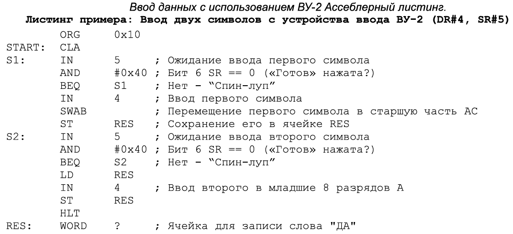
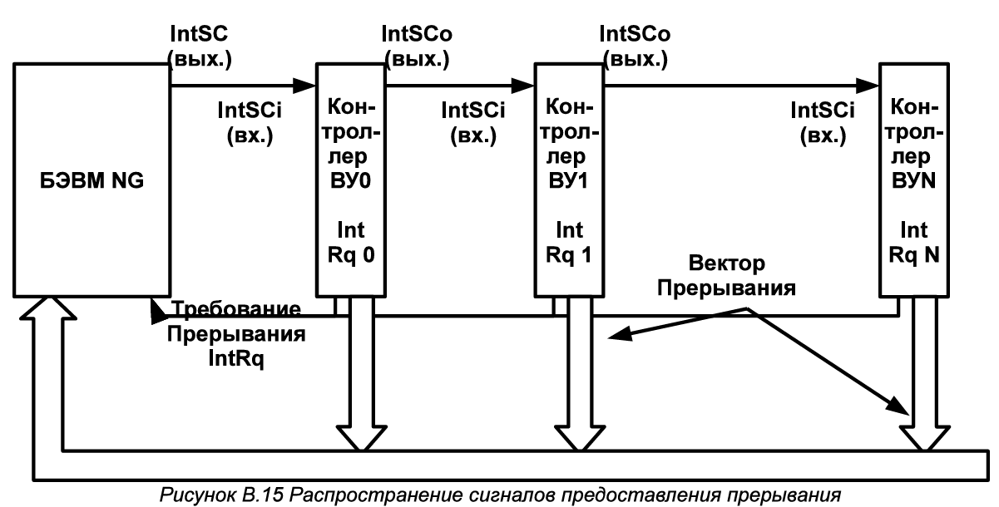
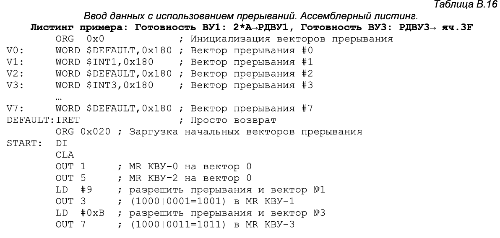
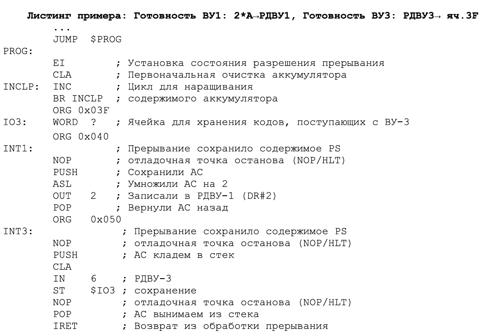

# [主页](../README.md)/[OPD](readme.md)/OPD Part 3

### Ввод-вывод 输入与输出

БЭВМ: Команды, связанные с вводом-выводом

#### 输出设备1

#### 输入输出设备3

#### Ассемблер БЭВМ
|Назначение 职能|Синтаксис 语法|Пример 示例|
|-------|--------|--------|
|Размещение в памяти 放置于内存|`ORG addr`|`ORG 0x10`|
|Адресная команда 地址命令|[метка 标签:] МНЕМОНИКА АРГУМЕНТ 助记符变量 |LD X ; (прямая относительная直接相对寻址) ST $Y ; (прямая абсолютная直接绝对寻址) LD -(X) ; JUMP (VALUES) ; SWAM (ARRAY)+|
|Безадресная команда 无地址命令|[метка 标签:] МНЕМОНИКА|START: CLA|
|Команда ввода-вывода 输入输出命令|[метка 标签:] МНЕМОНИКА АДРЕСВУ 地址助记符|OUT 0x3|
|Константы 常量|[метка:] знач.|X: WORD ?   Y: WORD X   VALUES: WORD 1, 2, 3   ARRAY: WORD 10 DUP(?)|

### 实验手册内容

#### Часть 2. Организация ввода-вывода в базовой ЭВМ
Обмен информацией с внешним устройством состоит из инициации обмена, где осуществляются предварительные действия по подготовке к вводу или выводу данных (установка соединения, ожидание готовности и пр.) и собственно обмена данными (их передачей или приемом).  

Если и инициацией и обменом занимается центральный процессор, то такой обмен называется программно-управляемым. Программно-управляемый обмен по способу инициации разделяется на синхронный, когда обмен начинается в заранее известный промежуток времени (например, каждую минуту) и асинхронный, когда программе неизвестно время начала обмена данными и она вынуждена периодически проверять возможность обмена (например, готовность внешнего устройства).  

Чтобы исключить периодическую проверку готовности, устройства могут сами инициировать обмен по специальному аппаратному сигналу, который называется запрос прерывания, а соответствующий обмен — управляемый прерываниями ввод-вывод. При таком способе внешнее устройство сигнализирует процессору о необходимости начать обмен, процессор приостанавливает (прерывает) текущую программу, осуществляет ввод-вывод с помощью программы обработки прерывания, а затем продолжает выполнять основную программу.  

Ввод-вывод с использованием прямого доступа к памяти (ПДП, в английской литературе DMA) организует и инициацию и обмен данными при помощи контроллеров ПДП. Такие контроллеры передают данные непосредственно в память ЭВМ, при этом центральный процессор в обмене данными не участвует.  

Обмен данными (прием и передача) может также быть организован синхронно, когда наличие данных на шине подтверждается специальным сигналом синхронизации с постоянной частотой, и асинхронно, с использованием сигналов готовности и/или подтверждения приема-передачи данных.  

Задачу инициации и обмена данными в ЭВМ осуществляют специальные программы (такие программы еще называют драйверами), которые совместно с аппаратурой ЭВМ организуют и контролируют процесс ввода-вывода.    

**2.1 Устройства ввода-вывода базовой ЭВМ**  

Модель базовой ЭВМ с контроллерами устройств ввода-вывода представлена на рис В.11. В базовой ЭВМ используются простейшие внешние устройства (BY):  

Внешние устройства (ВУ) в модели БЭВМ:  
- ВУ-0: Таймер (вызывает прерывание через заданное время в DR).  
- ВУ-1: Устройство вывода.
- ВУ-2: Устройство ввода.
- ВУ-3: Устройство ввода-вывода (один регистр данных).
- ВУ-4: Аналог ВУ-3 с раздельными регистрами для ввода/вывода.
- ВУ-5: Текстовый принтер.
- ВУ-6: Бегущая строка.
- ВУ-7: 8-разрядный 7-сегментный индикатор.
- ВУ-8: Клавиатура.
- ВУ-9: Цифровая клавиатура.

Контроллеры внешних устройств (КВУ):  
Каждый КВУ содержит:  
1. Дешифратор адреса
   1. Идентифицирует обращения к своему ВУ.
2. Логика управления КВУ
   1. Формирует и обрабатывает сигналы шины БЭВМ.
3. Регистр данных (DR)
   1. Для обмена данными между процессором и ВУ (8-разрядный).
4. Регистр состояния (SR)
   1. Хранит флаг готовности (1 бит) к обмену данными.
5. Регистр управления (MR)
   1. Биты 0-2: Номер вектора прерывания.
   2. Бит 3: Разрешение прерывания от контроллера.
   3. При активации: Генерирует IntRq и выставляет номер вектора на шину адреса.

**Системная шина БЭВМ**  
Сигналы и шины:  
 - Шина данных (Data0..7): Передача данных.
 - Шина адреса (Addr0..7):
    - От процессора к КВУ: Адрес ВУ.
    - От КВУ к процессору: Номер вектора прерывания (подтверждается IntV).
 - Управляющие сигналы:

|Сигнал|Назначение|
|:-----:|:-----:|
|`IntRq`|Запрос прерывания от ВУ.|
|`Input`|Команда ввода данных (IN #req).|
|`Output`|Команда вывода данных (OUT #req).|
|`IntSC`|Начальный сигнал предоставления прерывания (управляется микрокодом).|
|`IntSCi#`|Входящий цепочный сигнал прерывания (проверка очереди).|
|`IntSCo#`|Исходящий цепочный сигнал прерывания (передача следующему КВУ).|
|`Rdy`|Подтверждение завершения операции ввода-вывода.|
|`Syn`|Тактовый сигнал синхронизации.|

**Компоненты со стороны процессора:**  
- Дешифратор приказа (DC IO):
    - Преобразует команды в сигналы:
        - DI → Выход 0.
        - ET → Выход 1.
        - IN → Сигнал Input (выход 2).
        - OUT → Сигнал Output (выход 3).
- Регистр разрешения прерывания (в PS):
    - 5-й бит: Глобальный статус разрешения прерываний.
- Регистр прерывания от КВУ (в PS):
    - 6-й бит: Активен при наличии запроса прерывания.
- Логика управления шиной:
    - Координирует подключение/отключение приемопередатчиков для обмена с одним КВУ за раз.

**Назначение регистров КВУ (Таблица B.12):**

- R: Только чтение (например, SR).
- W: Только запись (например, MR).
- R/W: Чтение и запись (например, DR для ВУ-3).
- Направление обмена:
    - Data In: Ввод из КВУ.
    - Data Out: Вывод в КВУ.
    - Data i/o: Двунаправленный обмен.

#### 第 2 部分. 基础计算机中输入/输出的组织  
与外部设备的信息交换包括交换启动和实际数据交换（数据传输或接收），前者是为数据输入或输出做准备的初步操作（建立连接、等待准备就绪等）。

如果启动和交换都由中央处理器处理，这种交换称为软件控制交换。 根据启动方法，软件控制交换可分为同步交换和异步交换，前者是指交换在已知的时间间隔内开始（例如每分钟一次），后者是指程序不知道数据交换开始的时间，而必须定期检查交换的可能性（例如外部设备是否准备就绪）。  

为了消除周期性的就绪检查，设备本身可以通过一种称为中断请求的特殊硬件信号启动交换，相应的交换称为中断控制 I/O。 在这种方法中，外部设备向处理器发出启动交换的信号，处理器暂停（中断）当前程序，使用中断处理程序执行 I/O，然后继续执行主程序。  

直接内存访问（DMA）I/O 使用 DMA 控制器组织启动和通信。 此类控制器直接向计算机内存传输数据，CPU 不参与数据交换。  

数据交换（接收和发送）也可以同步进行，即通过特殊的恒频同步信号确认总线上是否存在数据；也可以异步进行，即使用就绪和/或接收-发送确认信号。  

计算机中的启动和数据交换任务由特殊程序（此类程序也称为驱动程序）执行，它们与计算机硬件一起组织和控制输入-输出过程。  

**2.1 基础计算机的输入/输出设备**  
模型中的外部设备 (ВУ)：
- ВУ-0：定时器（通过DR寄存器设定时间触发中断）。
- ВУ-1：输出设备。
- ВУ-2：输入设备。
- ВУ-3：输入输出设备（单数据寄存器）。
- ВУ-4：类似ВУ-3，但输入/输出寄存器分离。
- ВУ-5：文本打印机。
- ВУ-6：跑马灯显示器。
- ВУ-7：8位7段数码管。
- ВУ-8：键盘。
- ВУ-9：数字键盘。

**外部设备控制器 (КВУ)：**
每个КВУ包含：
1. 地址译码器
    - 识别对其所属ВУ的访问。

2. КВУ控制逻辑
    - 生成和处理总线信号。

3. 数据寄存器 (DR)
    - 用于处理器与ВУ之间的数据交换（8位）。

4. 状态寄存器 (SR)
    - 存储就绪标志（1位），表示设备就绪状态。
5. 控制寄存器 (MR)
    - 位0-2：中断向量号。
    - 位3：控制器中断使能位。
    - 激活时：生成 `IntRq` 并将向量号输出到地址总线。

**基础计算机系统总线**
信号与总线：

- 数据总线 (Data0..7)：数据传输。
- 地址总线 (Addr0..7)：
  - 处理器→КВУ：设备地址。
  - КВУ→处理器：中断向量号（由 IntV 信号确认）。
- 控制信号：

|信号|功能描述|
|:-----:|:-----:|
|`IntRq`|ВУ发出的中断请求。|
|`Input`|数据输入命令 (IN #req)。|
|`Output`|数据输出命令 (OUT #req)。
|`IntSC`|中断授权起始信号（微代码控制）。|
|`IntSCi#`|中断链输入信号（检查队列优先级）。|
|`IntSCo#`|中断链输出信号（传递至下一个КВУ）。|
|`Rdy`|输入输出操作完成确认信号。|
|`Syn`|总线同步时钟信号。|

**处理器端组件：**
- 命令译码器 (DC IO)：
  - 将指令转换为控制信号：
    - `DI` → 输出0。
    - `ET` → 输出1。
    - `IN` → `Input` 信号（输出2）。
    - `OUT` → `Output` 信号（输出3）。

- 中断使能寄存器 (位于PS)：
  - 第5位：全局中断使能状态。
- КВУ中断寄存器 (位于PS)：
  - 第6位：当存在中断请求时激活。
- 总线控制逻辑：
  - 协调收发器连接/断开，确保单КВУ独占总线访问。

**КВУ寄存器功能 (表B.12)：**
- R：只读（如SR）。
- W：只写（如MR）。
- R/W：读写（如ВУ-3的DR）。
- 数据流向：
  - `Data In`：从КВУ输入。
  - `Data Out`：输出至КВУ。
  - `Data i/o`：双向交换。

## 2.3 Программно-управляемый асинхронный обмен / 程序控制的异步数据交换  
При использовании программно-управляемого асинхронного обмена должна быть составлена программа, обеспечивающая пересылку данных из памяти ЭВМ в аккумулятор и далее в регистр памяти контроллера ВУ (вывод данных) или из регистра данных контроллера ВУ в аккумулятор и затем в память ЭВМ (ввод данных).  
在使用程序控制的异步数据交换时，需要编写一个程序，确保数据从计算机内存传输到累加器，然后传输到外部设备（ВУ）控制器的内存寄存器中（数据输出），或者从外部设备控制器的数据寄存器传输到累加器，再传输到计算机内存中（数据输入）。  

Программа такого обмена строится так: сначала проверяется готовность ВУ к обмену и если оно готово, то дается команда на обмен. ВУ сообщает о готовности установкой флага в 6-м разряде регистре SR.  
这种交换程序的构建方式如下：首先检查外部设备是否准备好进行交换，如果准备好，则发出交换命令。外部设备通过将状态寄存器（SR）的第6位标志置1来通知其准备就绪。  

Пример / 示例:  
С помощью устройства ввода ВУ-2 (DR#4, SR#5) записать в ячейку в памяти коды символов слова "ДА" в кодировке КО18-R. Пример программы представлен в табл. B.14.  
使用输入设备ВУ-2（DR#4，SR#5）将字符“ДА”的编码（КО18-R编码）写入内存单元。示例程序如表B.14所示。  

В начале программа висит в ожидании готовности: считывается статусный (с номером 5) регистр ВУ-2, который передается через шину данных в 6 разряде числа, сравнивается с 0x40 (01000000), и пока устройство не готово (SR равен 0).  
程序开始时处于等待准备状态：读取ВУ-2的状态寄存器（编号为5），通过数据总线传输的第6位数值与0x40（01000000）进行比较，如果设备未准备好（SR为0），则继续等待。  

Такие циклы с неопределенным временем завершения, называются циклами “spin-loop”, они постоянно проверяют готовность устройства или переменной в программе, загружая процессор.  
这种具有不确定完成时间的循环称为“自旋循环”（spin-loop），它们会不断检查设备或程序变量的准备状态，占用处理器资源。  

Как только 6 разряд SR принимает значение 1 (устройство готово), в регистр данных ВУ считывается в младшие 8 разрядов аккумулятора, старшие разряды AC при этом остаются не изменными.  
一旦SR的第6位变为1（设备准备就绪），数据寄存器中的内容会被读取到累加器的低8位中，累加器的高位保持不变。  

Для того, чтобы подготовить AC к приему второго символа, происходит обмен байтов аккумулятора при помощи команды `SWAB`, и сохранение этого символа в старших разрядах в ячейку результата.  
为了准备接收第二个字符，通过`SWAB`命令交换累加器的字节，并将该字符保存在结果单元的高位中。  

Далее снова происходит ожидание готовности устройства, после получения готовности загружается ячейка с результатом и считывается 2 символ в младшую часть аккумулятора. Готовое слово с двумя символами в аккумуляторе сохраняется в ячейку результата.  
随后，程序再次等待设备准备就绪。在设备准备就绪后，加载结果单元并将第二个字符读取到累加器的低8位中。此时，累加器中包含两个字符的完整字被保存到结果单元中。  

Необходимо еще раз подчеркнуть, что ввод-вывод происходит только с младшей частью аккумулятора, старшая часть во время выполнения команд IN или OUT не изменяется.  
需要特别强调的是，输入/输出操作仅涉及累加器的低8位，高位在执行IN或OUT命令时不会改变。  

  

Также важно, что при данной реализации асинхронного обмена ЭВМ тратит время на ожидание (неопределенно долгое!) момента готовности циклически опрашивая флаг (spin-loop) и не может выполнять никакой другой работы.  
此外，在这种异步交换的实现中，计算机会花费时间（可能无限长！）通过循环轮询标志（自旋循环）来等待设备准备就绪，期间无法执行其他任务。  

Разумная организация процедур ввода-вывода позволяет избегать такого зацикливание, например через периодический опрос флага при выполнении основной программы или через прерывания.  
合理的输入/输出程序组织可以避免这种循环等待，例如通过在主程序中定期轮询标志或使用中断机制。  

## 2.4 Управляемый по прерыванию программы ввод-вывод / 中断驱动的程序输入/输出  

Этот вид обмена отличается от асинхронного тем, что сигнал готовности ВУ к обмену анализируется не программным, а аппаратным путем.  
这种交换方式与异步交换的区别在于，外部设备（ВУ）准备就绪的信号是通过硬件而非软件方式分析的。  

ЭВМ может выполнять любую не связанную с обменом программу (будем называть ее основной).  
计算机可以执行任何与交换无关的程序（称为主程序）。  

Когда будет нажата кнопка готовности, то в случае, если в контроллере прерывания разрешены (например, реализуется через схему „И“ регистра состояния SR и старшего бита регистра управления MR, рис. B.11, контроллер КВУ-1) поступает сигнал "Запрос прерывания" по линии IntRq.  
当按下准备就绪按钮时，如果控制器中的中断被允许（例如通过状态寄存器SR和控制器寄存器MR的最高位实现“与”逻辑，见图B.11，控制器КВУ-1），则会发出“中断请求”信号（IntRq）。  

После чего этот сигнал поступит на схему „И“ центрального процессора B.11 с 5 битом регистра состояния (El – разрешение прерываний) проверяющий разрешены ли прерывания в ЭВМ и записывающий результат схемы в 6 бит регистра состояния (INT – прерывание).  
随后，该信号会传递到中央处理器的“与”逻辑电路（图B.11），通过检查状态寄存器的第5位（El – 中断允许）来判断计算机是否允许中断，并将结果写入状态寄存器的第6位（INT – 中断）。  

После цикла исполнения очередной инструкции основной программы в ЭВМ будет запущен комплекс программ, проверяющий, было ли требование прерывания, и если было, то формирует управляющий сигнал "Предоставление прерывания" IntSC, который последовательно проходит через все контроллеры (сигналы IntSCo - выходной и IntSCi - входной) и проверяет было ли в этом контроллере прерывание.  
在当前指令周期结束后，计算机将启动一系列程序来检查是否有中断请求，如果有，则生成“中断响应”信号（IntSC）。该信号依次通过所有控制器（信号IntSCo为输出，IntSCi为输入），检查是否有控制器发出中断。  

Когда сигнал доходит до нужного контроллера, то он выставляет на шину адреса свой номер вектора прерывания (см. рис. B.15). После чего процессор по номеру прерывания вызывает программу обработки прерывания.  
当信号到达目标控制器时，控制器会在地址总线上输出其中断向量编号（见图B.15）。随后，处理器根据中断向量编号调用中断处理程序。  

Ячейки памяти с адресами О-ОхF отведены для инициализации векторов прерывания, по 2 ячейки на каждый вектор. В начале программы все контроллеры ВУ, в которых должны вызывать прерывания должны быть проинициализированы.  
内存地址0x00-0x0F保留用于中断向量初始化，每个向量占用2个单元。在程序开始时，所有需要触发中断的外部设备控制器必须完成初始化。  

Если прерывания разрешены, то после выполнения всех команд кроме НЛТ, а также если режим выполнения БЭВМ установлен в значение "РАБОТА", выполняются следующие действия:  
如果中断被允许，则在执行完除HLT之外的所有指令后，或者当计算机处于“工作”模式时，将执行以下操作：  

  

Шаг 1 / 步骤1:  
По завершению цикла исполнения текущей команды происходит переход на цикл прерывания. Если в этот момент 6 бит регистра состояния INT (прерывание) не равен 1, то происходит переход к следующей команде. При наличии требования прерывания БЭВМ формирует сигнал "Предоставление прерывания" (IntSC) через выполнение микрокоманды INT'S.  
当前指令周期结束后，进入中断周期。如果此时状态寄存器的第6位INT（中断）不为1，则继续执行下一条指令。如果有中断请求，计算机通过执行微指令INT'S生成“中断响应”信号（IntSC）。  

Шаг 2 / 步骤2:  
Сохраняется счетчик команд и регистр состояния БЭВМ в стеке.  
将程序计数器和状态寄存器保存到堆栈中。  

Шаг 3 / 步骤3:  
Младшие 8 разрядов (номер вектора прерывания) записываются в буферный регистр и вычисляется адрес с переходом на подпрограмму обработки прерывания, как номер вектора * 2, после чего тот записывается в DR, а после в IP.  
将低8位（中断向量编号）写入缓冲寄存器，并计算中断处理子程序的地址（中断向量编号乘以2），随后将该地址写入DR，再写入IP。  

Шаг 4 / 步骤4:  
Далее к младшим 8 разрядам буферного регистра прибавляется 1, чтобы выбрать адрес следующей ячейки вектора прерывания (новый регистр состояния PS), ограничивая результат 8-ю разрядами. После чего по этому адресу содержимое в памяти записывается в DR, а после в PS.  
将缓冲寄存器的低8位加1，以选择中断向量的下一个单元地址（新的状态寄存器PS），并将结果限制在8位内。随后，将该地址的内容从内存写入DR，再写入PS。  

Шаг 5 / 步骤5:  
Контроллер прерываний вновь переводится в состояние разрешение прерывания командой ET и осуществляется возврат к выполнению прерванной программы, т.е. к команде, адрес которой хранится в стеке, также восстанавливается сохраненный регистр состояния из стека.  
通过ET命令重新允许中断控制器中断，并返回到被中断的程序，即执行堆栈中保存的指令地址，同时从堆栈中恢复保存的状态寄存器。  

Пример / 示例:  
Составить программу, которая постоянно наращивает на 1 содержимое аккумулятора. Восемь младших разрядов удвоенного значения аккумулятора должны выводиться на BY-1 по его запросу, а по запросу BY-3 содержимое регистра данных BY-3 должно записаться в ячейку 3F.  
编写一个程序，不断将累加器的内容加1。当ВУ-1请求时，累加器值的低8位两倍结果将输出到ВУ-1；当ВУ-3请求时，ВУ-3数据寄存器的内容将被写入内存单元3F。  

   
  

Если эту программу занести в память базовой ЭВМ, установить в СК пусковой адрес 20 и нажать кнопку ПУСК, то начнет выполняться бесконечный цикл наращивания содержимого аккумулятора.  
如果将此程序加载到基础计算机的内存中，将启动地址设置为20并按下启动按钮，则会开始执行累加器内容无限递增的循环。

Когда же на пульте управления (рис В.11) будет нажата любая из кнопок готовности ВУ, то будет выполнен переход к подпрограмме обработки прерываний.  
当在控制面板（图B.11）上按下任何外部设备的准备就绪按钮时，将跳转到中断处理子程序。  

Для отладки программы (табл. В.8) в ней используются точки останова. Если в ячейке памяти точки останова расположена команда NOP, то программа выполняется в обычном, не отладочном режиме.  
在调试程序（表B.8）时，使用了断点。如果断点内存单元中的指令是NOP，则程序以非调试模式正常运行。  

Если вместо NOP поместить команду HLT, то программа во время выполнения остановится и будет возможно проконтролировать содержимое регистров и ячеек памяти. После завершения контроля необходимо продолжить дальнейшее исполнение программы.  
如果将NOP替换为HLT，则程序在执行时会暂停，此时可以检查寄存器和内存单元的内容。检查完成后，可以继续执行程序。  

В приведенном примере точки останова позволяют исследовать содержимое аккумулятора в момент возникновения прерывания, а так же правильность подсчета и вывода на ВУ-3 удвоенного его значения.  
在此示例中，断点允许在中断发生时检查累加器的内容，以及验证ВУ-3输出的两倍值是否正确。  

