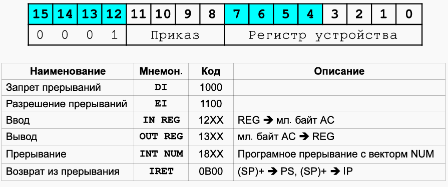
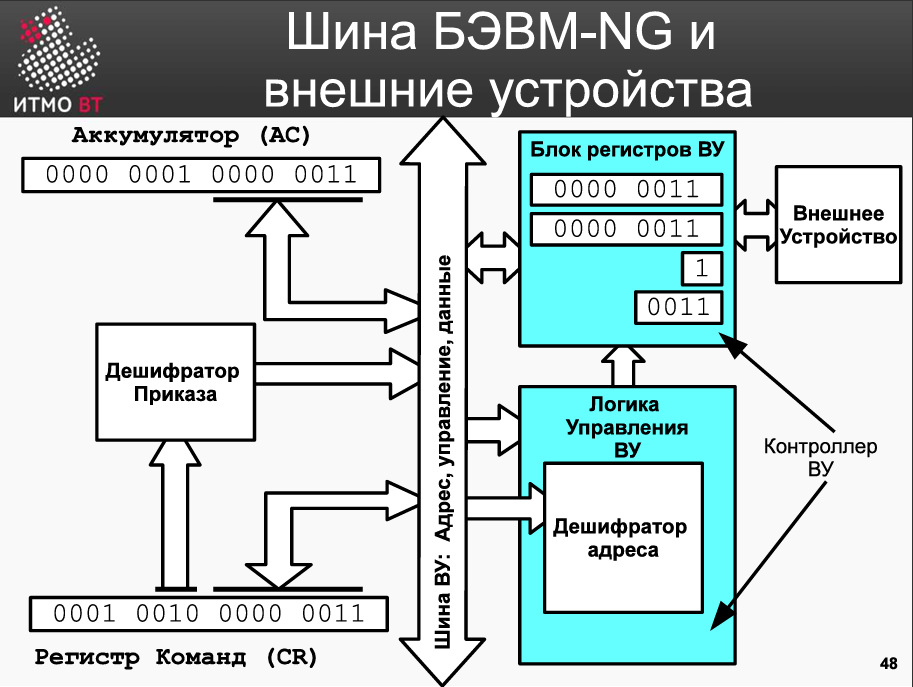
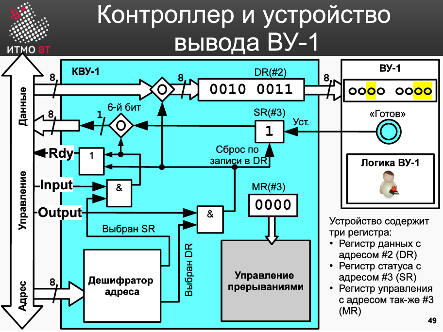
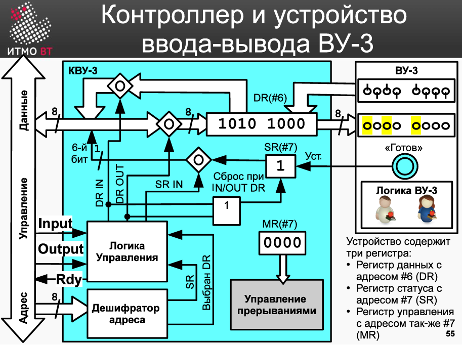
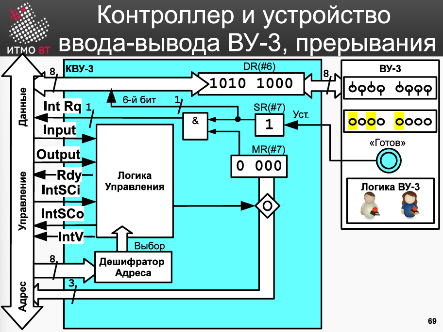
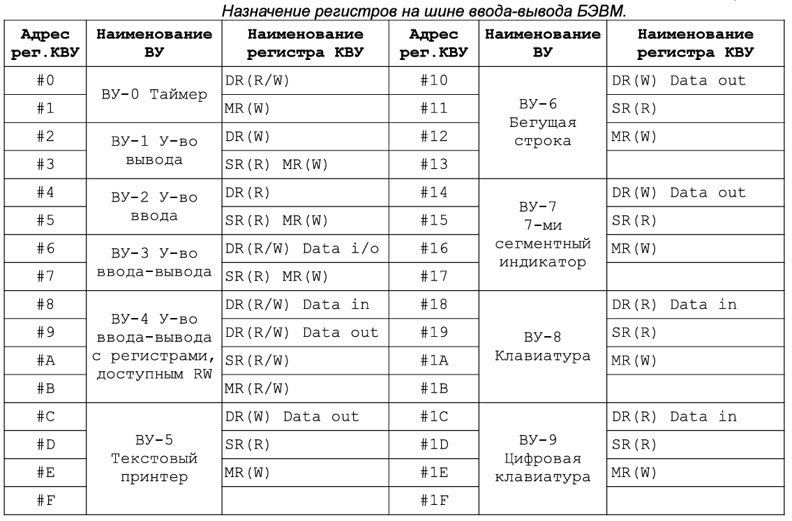

# [主页](../README.md)/[OPD](readme.md)/OPD Part 3

### Ввод-вывод 输入与输出

БЭВМ: Команды, связанные с вводом-выводом

#### 输出设备1

#### 输入输出设备3

#### Ассемблер БЭВМ
|Назначение 职能|Синтаксис 语法|Пример 示例|
|-------|--------|--------|
|Размещение в памяти 放置于内存|`ORG addr`|`ORG 0x10`|
|Адресная команда 地址命令|[метка 标签:] МНЕМОНИКА АРГУМЕНТ 助记符变量 |LD X ; (прямая относительная直接相对寻址) ST $Y ; (прямая абсолютная直接绝对寻址) LD -(X) ; JUMP (VALUES) ; SWAM (ARRAY)+|
|Безадресная команда 无地址命令|[метка 标签:] МНЕМОНИКА|START: CLA|
|Команда ввода-вывода 输入输出命令|[метка 标签:] МНЕМОНИКА АДРЕСВУ 地址助记符|OUT 0x3|
|Константы 常量|[метка:] знач.|X: WORD ?   Y: WORD X   VALUES: WORD 1, 2, 3   ARRAY: WORD 10 DUP(?)|

### 实验手册内容

#### Часть 2. Организация ввода-вывода в базовой ЭВМ
Обмен информацией с внешним устройством состоит из инициации обмена, где осуществляются предварительные действия по подготовке к вводу или выводу данных (установка соединения, ожидание готовности и пр.) и собственно обмена данными (их передачей или приемом).  

Если и инициацией и обменом занимается центральный процессор, то такой обмен называется программно-управляемым. Программно-управляемый обмен по способу инициации разделяется на синхронный, когда обмен начинается в заранее известный промежуток времени (например, каждую минуту) и асинхронный, когда программе неизвестно время начала обмена данными и она вынуждена периодически проверять возможность обмена (например, готовность внешнего устройства).  

Чтобы исключить периодическую проверку готовности, устройства могут сами инициировать обмен по специальному аппаратному сигналу, который называется запрос прерывания, а соответствующий обмен — управляемый прерываниями ввод-вывод. При таком способе внешнее устройство сигнализирует процессору о необходимости начать обмен, процессор приостанавливает (прерывает) текущую программу, осуществляет ввод-вывод с помощью программы обработки прерывания, а затем продолжает выполнять основную программу.  

Ввод-вывод с использованием прямого доступа к памяти (ПДП, в английской литературе DMA) организует и инициацию и обмен данными при помощи контроллеров ПДП. Такие контроллеры передают данные непосредственно в память ЭВМ, при этом центральный процессор в обмене данными не участвует.  

Обмен данными (прием и передача) может также быть организован синхронно, когда наличие данных на шине подтверждается специальным сигналом синхронизации с постоянной частотой, и асинхронно, с использованием сигналов готовности и/или подтверждения приема-передачи данных.  

Задачу инициации и обмена данными в ЭВМ осуществляют специальные программы (такие программы еще называют драйверами), которые совместно с аппаратурой ЭВМ организуют и контролируют процесс ввода-вывода.    

**2.1 Устройства ввода-вывода базовой ЭВМ**  

Модель базовой ЭВМ с контроллерами устройств ввода-вывода представлена на рис В.11. В базовой ЭВМ используются простейшие внешние устройства (BY):  

Внешние устройства (ВУ) в модели БЭВМ:  
- ВУ-0: Таймер (вызывает прерывание через заданное время в DR).  
- ВУ-1: Устройство вывода.
- ВУ-2: Устройство ввода.
- ВУ-3: Устройство ввода-вывода (один регистр данных).
- ВУ-4: Аналог ВУ-3 с раздельными регистрами для ввода/вывода.
- ВУ-5: Текстовый принтер.
- ВУ-6: Бегущая строка.
- ВУ-7: 8-разрядный 7-сегментный индикатор.
- ВУ-8: Клавиатура.
- ВУ-9: Цифровая клавиатура.

Контроллеры внешних устройств (КВУ):  
Каждый КВУ содержит:  
1. Дешифратор адреса
   1. Идентифицирует обращения к своему ВУ.
2. Логика управления КВУ
   1. Формирует и обрабатывает сигналы шины БЭВМ.
3. Регистр данных (DR)
   1. Для обмена данными между процессором и ВУ (8-разрядный).
4. Регистр состояния (SR)
   1. Хранит флаг готовности (1 бит) к обмену данными.
5. Регистр управления (MR)
   1. Биты 0-2: Номер вектора прерывания.
   2. Бит 3: Разрешение прерывания от контроллера.
   3. При активации: Генерирует IntRq и выставляет номер вектора на шину адреса.

**Системная шина БЭВМ**  
Сигналы и шины:  
 - Шина данных (Data0..7): Передача данных.
 - Шина адреса (Addr0..7):
    - От процессора к КВУ: Адрес ВУ.
    - От КВУ к процессору: Номер вектора прерывания (подтверждается IntV).
 - Управляющие сигналы:

|Сигнал|Назначение|
|:-----:|:-----:|
|`IntRq`|Запрос прерывания от ВУ.|
|`Input`|Команда ввода данных (IN #req).|
|`Output`|Команда вывода данных (OUT #req).|
|`IntSC`|Начальный сигнал предоставления прерывания (управляется микрокодом).|
|`IntSCi#`|Входящий цепочный сигнал прерывания (проверка очереди).|
|`IntSCo#`|Исходящий цепочный сигнал прерывания (передача следующему КВУ).|
|`Rdy`|Подтверждение завершения операции ввода-вывода.|
|`Syn`|Тактовый сигнал синхронизации.|

**Компоненты со стороны процессора:**  
- Дешифратор приказа (DC IO):
    - Преобразует команды в сигналы:
        - DI → Выход 0.
        - ET → Выход 1.
        - IN → Сигнал Input (выход 2).
        - OUT → Сигнал Output (выход 3).
- Регистр разрешения прерывания (в PS):
    - 5-й бит: Глобальный статус разрешения прерываний.
- Регистр прерывания от КВУ (в PS):
    - 6-й бит: Активен при наличии запроса прерывания.
- Логика управления шиной:
    - Координирует подключение/отключение приемопередатчиков для обмена с одним КВУ за раз.

**Назначение регистров КВУ (Таблица B.12):**

- R: Только чтение (например, SR).
- W: Только запись (например, MR).
- R/W: Чтение и запись (например, DR для ВУ-3).
- Направление обмена:
    - Data In: Ввод из КВУ.
    - Data Out: Вывод в КВУ.
    - Data i/o: Двунаправленный обмен.

#### 第 2 部分. 基础计算机中输入/输出的组织  
与外部设备的信息交换包括交换启动和实际数据交换（数据传输或接收），前者是为数据输入或输出做准备的初步操作（建立连接、等待准备就绪等）。

如果启动和交换都由中央处理器处理，这种交换称为软件控制交换。 根据启动方法，软件控制交换可分为同步交换和异步交换，前者是指交换在已知的时间间隔内开始（例如每分钟一次），后者是指程序不知道数据交换开始的时间，而必须定期检查交换的可能性（例如外部设备是否准备就绪）。  

为了消除周期性的就绪检查，设备本身可以通过一种称为中断请求的特殊硬件信号启动交换，相应的交换称为中断控制 I/O。 在这种方法中，外部设备向处理器发出启动交换的信号，处理器暂停（中断）当前程序，使用中断处理程序执行 I/O，然后继续执行主程序。  

直接内存访问（DMA）I/O 使用 DMA 控制器组织启动和通信。 此类控制器直接向计算机内存传输数据，CPU 不参与数据交换。  

数据交换（接收和发送）也可以同步进行，即通过特殊的恒频同步信号确认总线上是否存在数据；也可以异步进行，即使用就绪和/或接收-发送确认信号。  

计算机中的启动和数据交换任务由特殊程序（此类程序也称为驱动程序）执行，它们与计算机硬件一起组织和控制输入-输出过程。  

**2.1 基础计算机的输入/输出设备**  
模型中的外部设备 (ВУ)：
- ВУ-0：定时器（通过DR寄存器设定时间触发中断）。
- ВУ-1：输出设备。
- ВУ-2：输入设备。
- ВУ-3：输入输出设备（单数据寄存器）。
- ВУ-4：类似ВУ-3，但输入/输出寄存器分离。
- ВУ-5：文本打印机。
- ВУ-6：跑马灯显示器。
- ВУ-7：8位7段数码管。
- ВУ-8：键盘。
- ВУ-9：数字键盘。

**外部设备控制器 (КВУ)：**
每个КВУ包含：
1. 地址译码器
    - 识别对其所属ВУ的访问。

2. КВУ控制逻辑
    - 生成和处理总线信号。

3. 数据寄存器 (DR)
    - 用于处理器与ВУ之间的数据交换（8位）。

4. 状态寄存器 (SR)
    - 存储就绪标志（1位），表示设备就绪状态。
5. 控制寄存器 (MR)
    - 位0-2：中断向量号。
    - 位3：控制器中断使能位。
    - 激活时：生成 `IntRq` 并将向量号输出到地址总线。

**基础计算机系统总线**
信号与总线：

- 数据总线 (Data0..7)：数据传输。
- 地址总线 (Addr0..7)：
  - 处理器→КВУ：设备地址。
  - КВУ→处理器：中断向量号（由 IntV 信号确认）。
- 控制信号：

|信号|功能描述|
|:-----:|:-----:|
|`IntRq`|ВУ发出的中断请求。|
|`Input`|数据输入命令 (IN #req)。|
|`Output`|数据输出命令 (OUT #req)。
|`IntSC`|中断授权起始信号（微代码控制）。|
|`IntSCi#`|中断链输入信号（检查队列优先级）。|
|`IntSCo#`|中断链输出信号（传递至下一个КВУ）。|
|`Rdy`|输入输出操作完成确认信号。|
|`Syn`|总线同步时钟信号。|

**处理器端组件：**
- 命令译码器 (DC IO)：
  - 将指令转换为控制信号：
    - `DI` → 输出0。
    - `ET` → 输出1。
    - `IN` → `Input` 信号（输出2）。
    - `OUT` → `Output` 信号（输出3）。

- 中断使能寄存器 (位于PS)：
  - 第5位：全局中断使能状态。
- КВУ中断寄存器 (位于PS)：
  - 第6位：当存在中断请求时激活。
- 总线控制逻辑：
  - 协调收发器连接/断开，确保单КВУ独占总线访问。

**КВУ寄存器功能 (表B.12)：**
- R：只读（如SR）。
- W：只写（如MR）。
- R/W：读写（如ВУ-3的DR）。
- 数据流向：
  - `Data In`：从КВУ输入。
  - `Data Out`：输出至КВУ。
  - `Data i/o`：双向交换。

