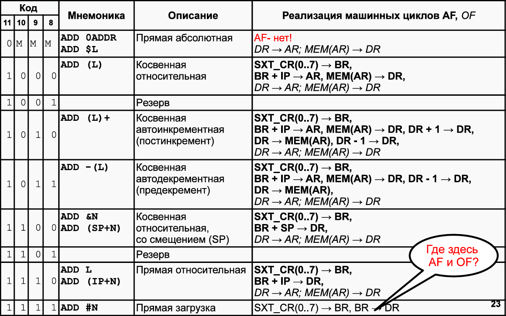
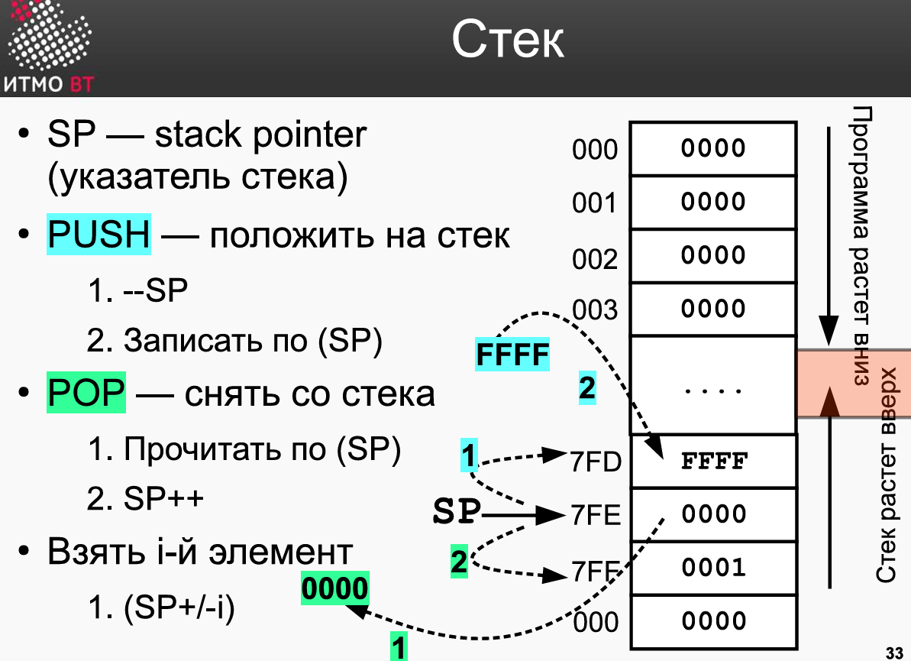
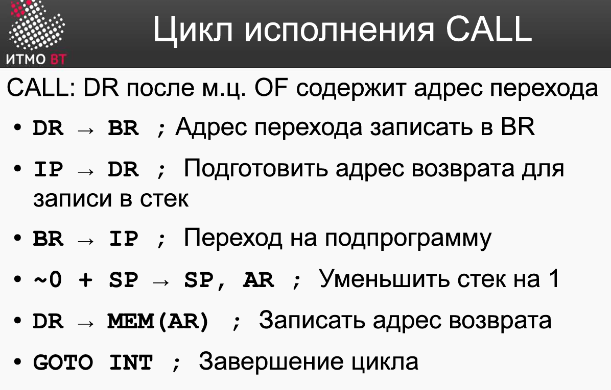
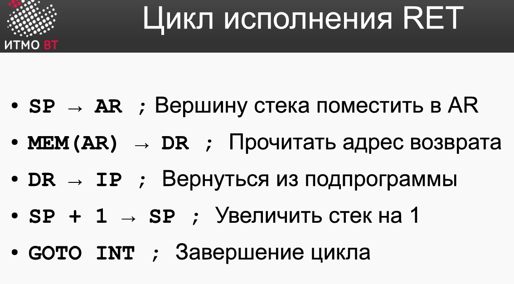
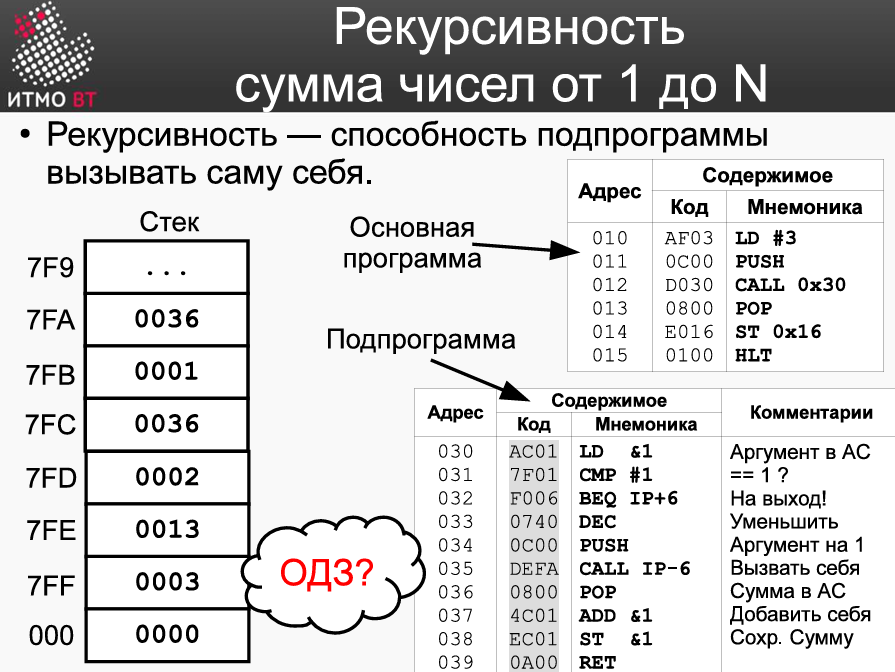

# [主页](../README.md)/[OPD](readme.md)/lab4

地址命令下的相对寻址方式

程序往下执行
堆栈往上增长

`CALL`指令的执行过程

`RET`指令的执行过程

这个程序用来计算1到N的累加和，主要通过递归来实现。递归是子程序用来调用自身的一种编程技巧。

## Контрольные вопросы
命令的微指令操作（寄存器之间）
Дополнительные вопросы:

AC01
Выборка адрес
SXTB (0..7)DR  -> BR
SP + BR -> DR

D695
Выборка операнда
??
E ST
C JUMP
Исполнение
CALL 695
IP -> -(SP), 695 -> IP

DR -> br
IP -> DR
br -> IP
-(SP) -> AR SP
DR -> MEM(AR)

ADD (C)
SXTB
SP + M

AC <-> MEM(SP)

SWAP

SP -> AR
MEM(AR) -> DR
DR -> BR
AC -> DR
DR -> MEM(AR) 
BR -> AC
/// положить в др знач стека
