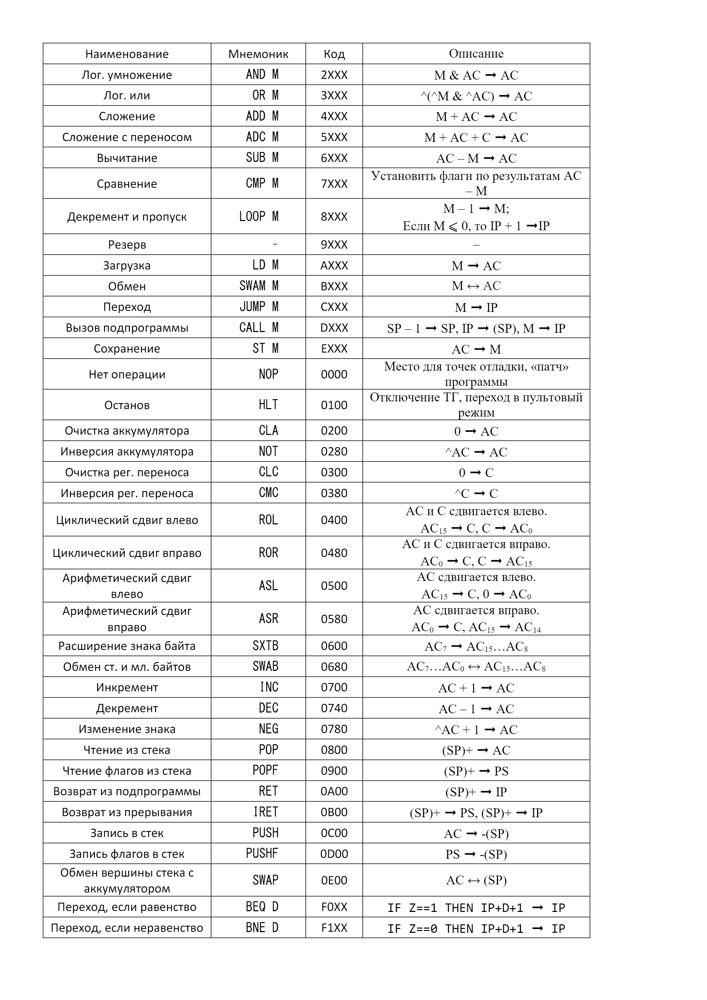
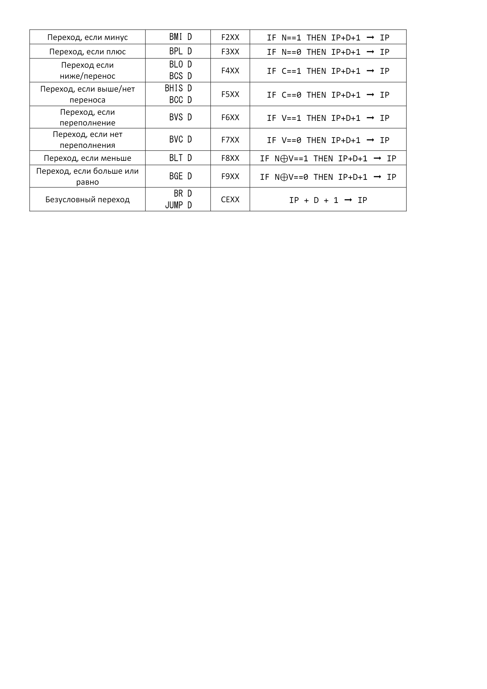

# [主页](../README.md)/OPD课程

## Основы профессиональной деятельности c БЭВМ-NG

### Part
[Part1](/OPD/Part1.md)  
[Part2](/OPD/Part2.md)  
[Part3](/OPD/Part3.md)  
[Part4](/OPD/Part4.md)

[lab1](/OPD/lab/lab1/quesOfLab1.md)  
[lab2](/OPD/lab/lab2/lab2.md)  
[lab3](/OPD/lab/lab3/readme.md)  
[lab4](/OPD/lab/lab4/readme.md)  

#### 命令

