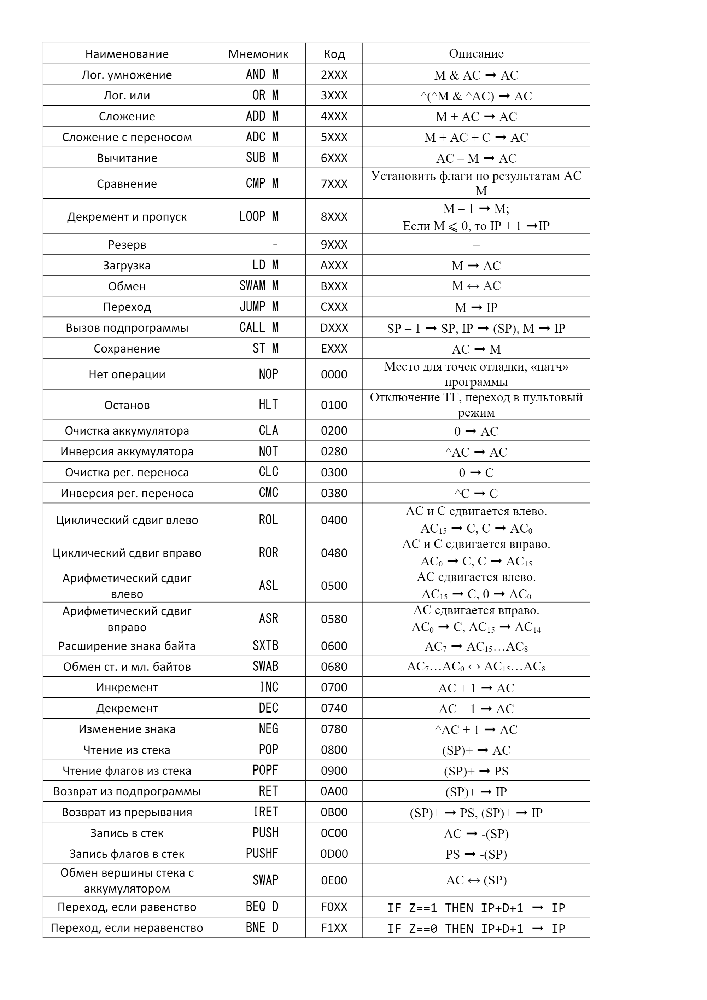
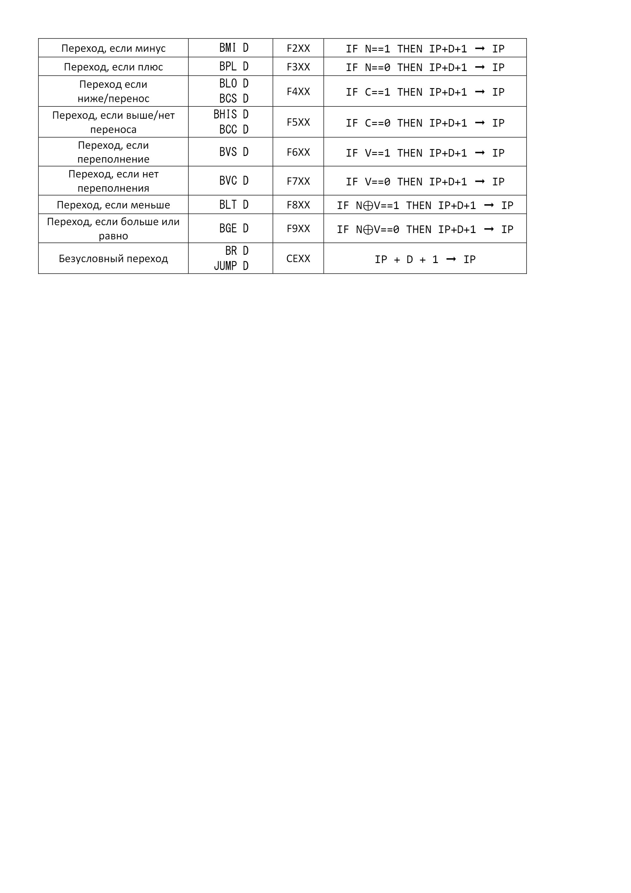

# [主页](../README.md)/OPD课程

<!-- kb:course-overview:start -->

专业活动基础 · Основы профессиональной деятельности

**课程状态：✓ 已通过**

[课程总览](../navigation/courses.md) · [第 1 学期](../academic/semester-01.md) · [第 2 学期](../academic/semester-02.md) · [知识索引](../knowledge/index.md)

[理论 · Теория](#theory) · [实验 / 作业 · Практика](#labs) · [答辩 · Защита](#defense) · [考试 · Экзамен](#exam)

保留 БЭВМ、I/O、中断及 Lab 1–6 原路径；Part 2/4 只有标题，不作为独立理论入口。

<!-- kb:course-overview:end -->

## Основы профессиональной деятельности c БЭВМ-NG

### Part
[Part1](/OPD/Part1.md)  
[Part2](/OPD/Part2.md)  
[Part3](/OPD/Part3.md)  
[Part4](/OPD/Part4.md)

[lab1](/OPD/lab/lab1/quesOfLab1.md)  
[lab2](/OPD/lab/lab2/lab2.md)  
[lab3](/OPD/lab/lab3/readme.md)  
[lab4](/OPD/lab/lab4/readme.md)  

#### 命令

<!-- kb:course-resources:start -->

## 理论 · Теория 

- [БЭВМ 基础、指令与计算机组成](Part1.md)
- [I/O 与中断](Part3.md)

## 实验 / 作业 · Практика 

| 实验 / 作业资料 | 状态 |
|---|---|
| [Lab 3：程序与问答](lab/lab3/lab3.md) | ✓ 已通过 |
| [Lab 4](lab/lab4/lab4.md) | ✓ 已通过 |
| [Lab 5](lab/lab5/lab5.md) | ✓ 已通过 |
| [Lab 6](lab/lab6/lab6.md) | ✓ 已通过 |

## 答辩 · Защита 

- [Lab 1：命令与控制问题](lab/lab1/quesOfLab1.md)

## 考试 · Экзамен 

- [考试题目与 PDF / DOCX](exam)
- [阶段测验](rub/rub2.md)

## 复习与关联

- [实验答辩入口](../study/defense.md) · [考前复习入口](../study/revision.md)
- 关联课程：[计算机体系结构](../ComputerArchitecture/readme.md) · [操作系统](../OperatingSystem/readme.md)

<!-- kb:course-resources:end -->
