### Variant 1

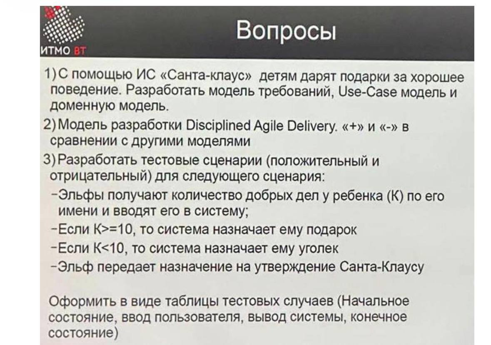  

### Variant 2

вариант 2

1) клининговая система 清洁系统
2) профилирование мониторинг + написать мбин  
3) тестовое покрытие системы экзаменов  

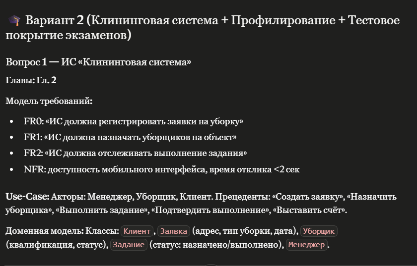  

2. 监控和分析：
Мониторинг — это непрерывное наблюдение за работой системы (ОС, JVM, приложения) с целью сбора метрик производительности. Мониторинг показывает что происходит — загрузка CPU, память, I/O.
监控是指持续观察系统运行情况（操作系统、JVM、应用程序），以收集性能指标。监控可以显示系统正在发生的情况 ，例如 CPU 负载、内存使用情况和 I/O 使用情况。

Профилирование — это целенаправленный анализ поведения конкретного приложения: какие методы сколько времени занимают, сколько объектов создаётся, какие потоки конкурируют за блокировки. Профилирование показывает почему происходит.
性能分析是对特定应用程序行为的定向分析：哪些方法耗时多久，创建了多少对象，哪些线程在争用锁。性能分析揭示了事件发生的原因 。

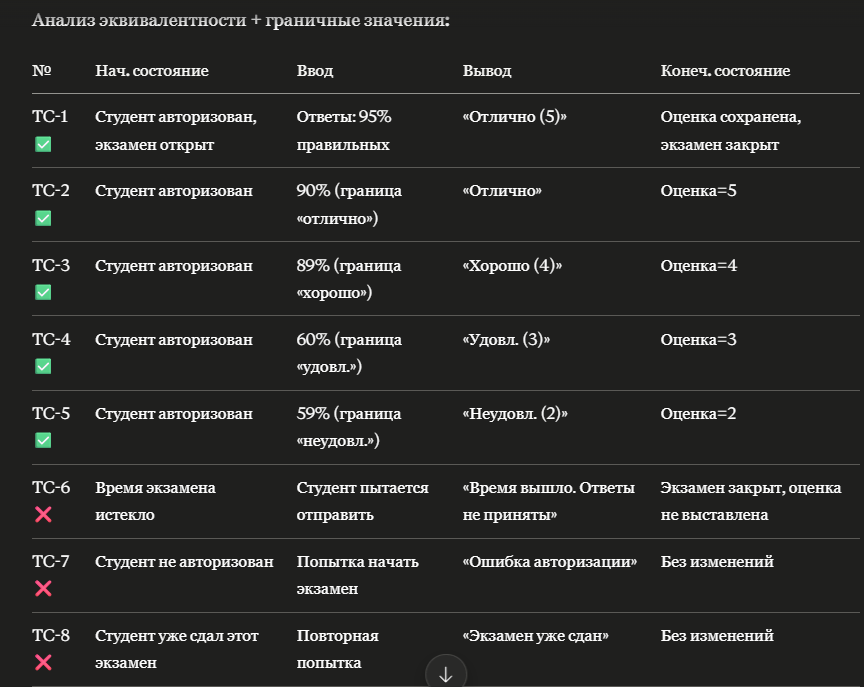
### Variant 3

вариант 3

1) ИС Колобок (20 мин)
2) модель прототипирования VS спиральная модель (7 мин)
3) make file hello.c и world.c (5 мин)

### Variant 4

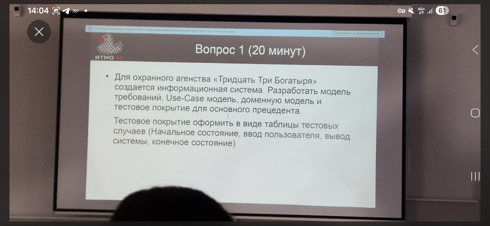  
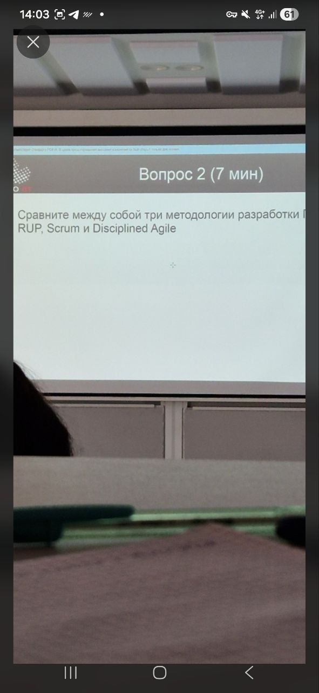  
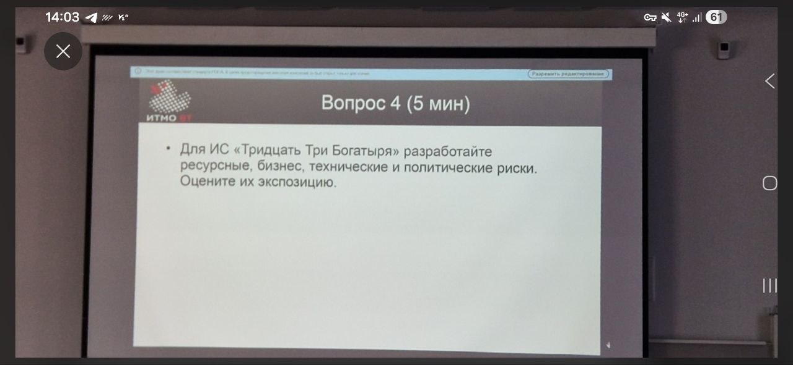  

### 变体4答案

1. Модель требований, Use-Case, доменная модель, тестовое покрытие 需求模型、用例、领域模型、测试覆盖率 (ИС охранного агентства «Тридцать Три Богатыря»)
Предположим основной прецедент — «Оформить охранный наряд». 安保公司系统

**Модель требований:**

FR0: «ИС должна регистрировать заявки на охрану объекта»
FR1: «ИС должна назначать охранников на объект»
FR2: «ИС должна формировать отчёты о дежурствах»
NFR: доступность 99.9%, ролевая авторизация (диспетчер, охранник, менеджер)

**Use-Case модель:**
Акторы: Диспетчер, Охранник, Менеджер.  
Прецеденты: «Принять заявку», «Назначить охранника», «Составить наряд», «Подтвердить выход на объект», «Сформировать отчёт». Include/Extend связи аналогично примеру выше.  

**Доменная модель:**
Классы: Объект (адрес, тип), Заявка (дата, статус), Охранник (имя, квалификация, статус: {свободен, занят}), Наряд (дата, объект, охранник, статус), Менеджер. Ассоциации: Заявка→Объект, Наряд→Охранник, Наряд→Заявка.

**Тестовое покрытие** (таблица тест-кейсов для «Назначить охранника»):
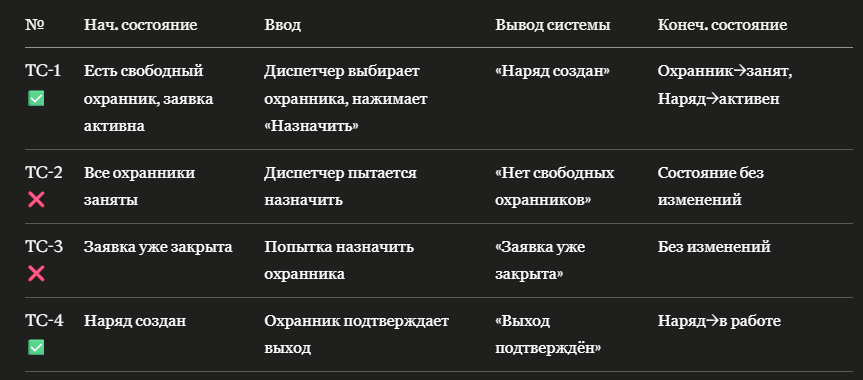  

2. Сравнение RUP, Scrum, Disciplined Agile 

Ключевые тезисы:
- RUP: фазовый (Inception→Elaboration→Construction→Transition), тяжёлый, много артефактов, хорош для крупных корпоративных проектов, плохо масштабируется на маленькие команды.
- RUP：分阶段（初始阶段→细化阶段→构建阶段→过渡阶段），较为繁重，工件众多，适用于大型企业项目，但难以扩展到小型团队。
- Scrum: лёгкий, спринты 2–4 недели, Product Backlog/Sprint Backlog, ежедневный Scrum. Минус — слабо масштабируется, нет архитектурной дисциплины.
- Scrum：轻量级，迭代周期为 2-4 周，包含产品待办事项列表/迭代待办事项列表，每日站会。缺点：可扩展性差，缺乏架构规范。
- DAD: надстройка над Scrum/Kanban/Lean для масштабирования. Включает дисциплины RUP (архитектура, развёртывание), гибкость Scrum. Минус — сложен в освоении.
- DAD：基于 Scrum/Kanban/Lean 构建，以提高可扩展性。它融合了 RUP 的架构和部署规范，并结合了 Scrum 的敏捷性。缺点：难以精通。

3. Ресурсные, бизнес, технические, политические риски для ИС «ТТБ» + Экспозиция
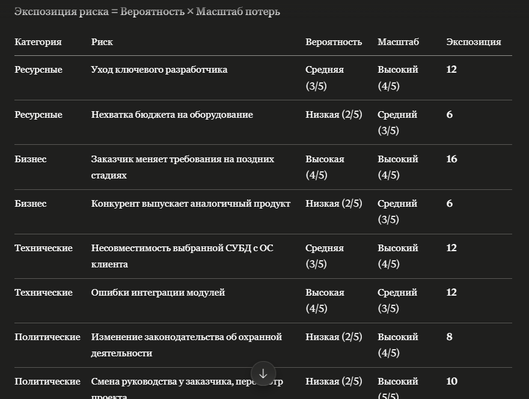  

#### 什么是 Disciplined Agile Delivery (DAD) 模型？/ Что такое модель Disciplined Agile Delivery (DAD)?
Disciplined Agile Delivery (DAD) — это разработанный фреймворк, ориентированный на полный жизненный цикл и корпоративное масштабирование.  
Disciplined Agile Delivery (DAD，纪律敏捷交付) 是由斯科特·安布勒（Scott Ambler）等人提出的一种面向企业级、关注全生命周期的敏捷软件交付框架。  

**区别**
1. 生命周期的完整性 целостность жизненного цикла (vs Scrum)
Предоставляет сквозной (End-to-End) жизненный цикл. Он четко делит проект на фазы запуска, создания и внедрения.  
提供端到端（End-to-End）的完整生命周期。它明确划分了开始、构建、过渡三个阶段，是一个完整的项目闭环。  

1. 纪律约束与企业级扩展 Расширение на уровне дисциплины и предприятия
Наследует сильные стороны RUP (деление на фазы), но отбрасывает бюрократию, сохраняя гибкость в разработке.  
继承了 RUP 区分“生命周期阶段”的优点，但抛弃了 RUP 的“文档枷锁”，在具体执行时依然采用敏捷和精益（Lean）的轻量化方式。  

**Плюсы DAD**: масштабируется на большие команды, поддерживает несколько lifecycle (Agile/Lean/Kanban), учитывает управление архитектурой, подходит для BigData, не ограничен одним подходом (в отличие от Scrum).  
DAD 的优点：可扩展至大型团队，支持多种生命周期（敏捷/精益/看板），兼顾架构管理，适用于大数据，且不局限于单一方法（与 Scrum 不同）。  
**Минусы DAD**: сложнее освоить, чем Scrum; меньше готовых инструментов; новая методология (рыночная незрелость); требует зрелой команды.    
DAD 的缺点：比 Scrum 更难学习；现成的工具较少；方法论较新（市场尚不成熟）；需要经验丰富的团队。  

#### текстовые сценарии 文本脚本

填写表格形式：
|начальное состояние|ввод|действие системы|вывод|конечное состояние|
|:-----:|:-----:|:-----:|:-----:|:-----:|

#### 简单写个mbean类
1. 定义接口
```java
public interface SimpleMBean {
    // 这是一个属性（读/写）
    public String getName();
    public void setName(String name);

    // 这是一个操作（可以被调用）
    public void printHello();
}
```

2. 实现该接口
```java
public class Simple implements SimpleMBean {
    private String name = "Hello World";

    @Override
    public String getName() {
        return this.name;
    }

    @Override
    public void setName(String name) {
        this.name = name;
    }

    @Override
    public void printHello() {
        System.out.println("MBean Hello: " + name);
    }
}
```

3. 注册并运行 MBean
```java
import java.lang.management.ManagementFactory;
import javax.management.MBeanServer;
import javax.management.ObjectName;

public class Main {
    public static void main(String[] args) throws Exception {
        // 1. 获取平台的 MBean Server
        MBeanServer mbs = ManagementFactory.getPlatformMBeanServer();

        // 2. 为 MBean 创建一个唯一的对象名称 (格式: 域名:name=MBean名称)
        ObjectName name = new ObjectName("com.example:type=SimpleMBean");

        // 3. 创建 MBean 实例并注册
        Simple mbean = new Simple();
        mbs.registerMBean(mbean, name);

        // 4. 让程序保持运行，方便我们用 jconsole 查看
        System.out.println("MBean 注册成功，正在运行中...");
        Thread.sleep(Long.MAX_VALUE);
    }
}
```

#### 简单写个makefile文件
1. 写个hello.c
```c
#include <stdio.h>
void hello() {
    printf("Hello, ");
}
```

2. 写个world.c
```c
#include <stdio.h>
void world() {
    printf("World!\n")
}
```

3. 最后makefile联系它们一起
```makefile
CC = gcc
CFLAGS = -Wall -g
TARGET = app

OBJS = main.o hello.o world.o

all: $(TARGET)

$(TARGET): $(OBJS)
	$(CC) $(CFLAGS) -o $(TARGET) $(OBJS)

main.o: main.c
	$(CC) $(CFLAGS) -c main.c

hello.o: hello.c
	$(CC) $(CFLAGS) -c hello.c

world.o: world.c
	$(CC) $(CFLAGS) -c world.c

clean:
	rm -f $(OBJS) $(TARGET)

.PHONY: all clean
```

#### 风险类型
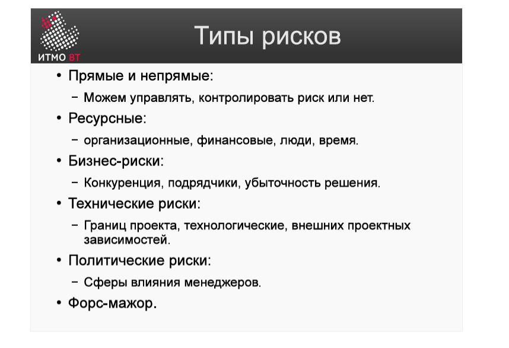  
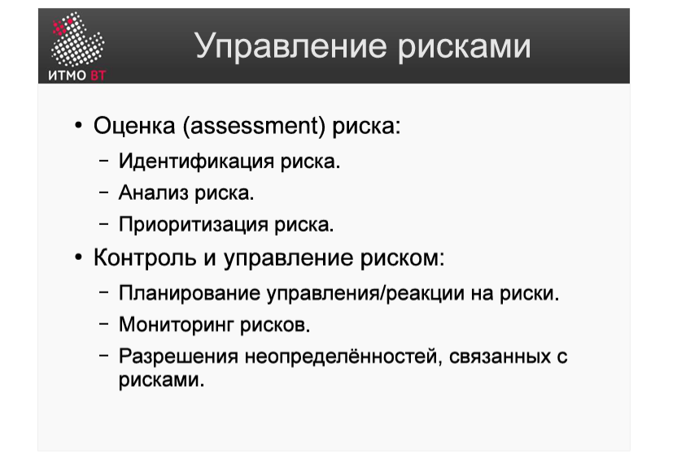   
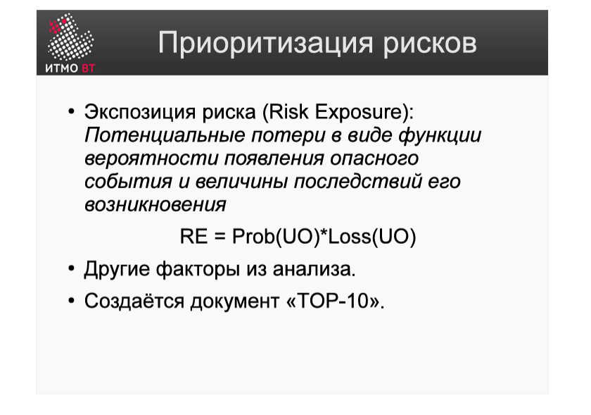  
风险优先级=发生危险概率*后果严重程度