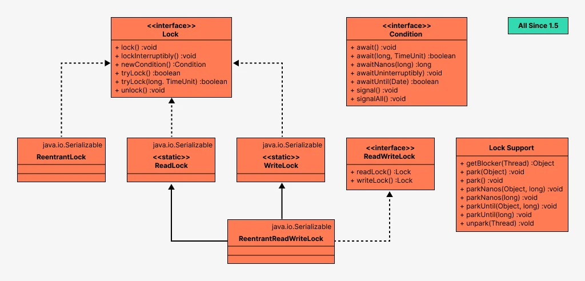
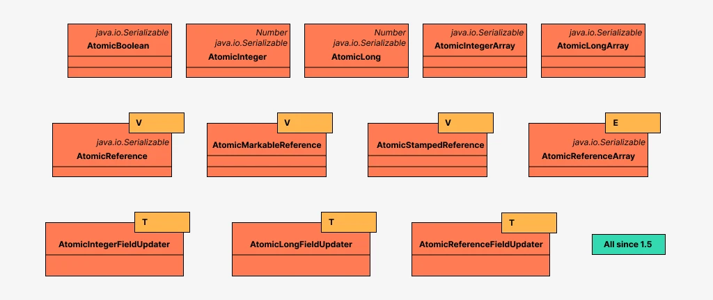
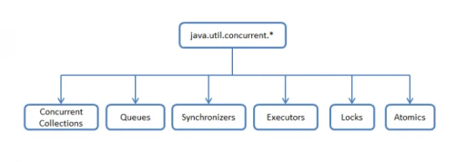

### Вопросы к защите лабораторной работы:

sequenceDiagram
    participant Client
    participant UDPChannelManager
    participant RequestHandler
    participant CommandProcessor
    participant ProductDAO
    
    Client->>UDPChannelManager: 发送请求数据
    UDPChannelManager->>RequestHandler: 传递请求
    RequestHandler->>CommandProcessor: 处理命令
    CommandProcessor->>ProductDAO: 数据库操作
    ProductDAO-->>CommandProcessor: 返回结果
    CommandProcessor-->>RequestHandler: 生成响应
    RequestHandler-->>UDPChannelManager: 返回响应
    UDPChannelManager-->>Client: 发送响应

**模块结构**

1. Common模块：
   - 包含共享类：CommandRequest, CommandResponse, Product, Coordinates等。

   - 工具类：SerializationUtil, HashUtil。

2. Client模块：

   - 用户交互：InteractiveShell, InputHandler。

   - 网络代理：ServerProxy发送请求。

3. Server模块：

   - 网络层：UDPChannelManager接收请求，RequestHandler处理请求。

   - 数据层：ProductDAO, OrganizationDAO操作数据库。

**数据传输流程**

1. 客户端发送请求：

   - 用户输入命令（如add），InputHandler构造Product对象。

   - ServerProxy序列化CommandRequest并通过UDP发送到服务端。

2. 服务端处理请求：

   - UDPChannelManager接收请求并交给RequestHandler。

   - RequestHandler反序列化请求，调用对应的CommandHandler（如AddHandler）。

   - AddHandler通过productDAO.save()保存数据到数据库。

3. 数据库操作：

   - ProductDAO执行SQL插入操作，并关联CoordinatesDAO和OrganizationDAO

+----------------+       +----------------+       +----------------+
|   Client       |       |   Server       |       |   Database     |
|----------------|       |----------------|       |----------------|
| 1. 用户输入     |  -->  | 2. 接收请求     |  -->  | 3. 执行SQL插入  |
| 5. 显示结果     |  <--  | 4. 返回响应     |  <--  |                |
+----------------+       +----------------+       +----------------+

客户端与服务端之间的联系：
1. 服务端 -- 主要负责根据客户端发送过来的请求进行业务逻辑和数据的处理。
- 监听指定端口，等待客户端连接。
- 接收客户端发送的请求数据（如命令类型）。
- 根据请求类型调用相应的处理器（如 AddHandler）进行处理。
- 将处理结果封装为响应对象，通过 Socket 返回给客户端。
 
Сервер -- в основном отвечает за бизнес-логику и обработку данных в соответствии с запросом, отправленным клиентом.
- Слушает указанный порт и ожидает подключения клиента.
- Получает данные запроса (например, типы команд), отправленные клиентом.
- В соответствии с типом запроса вызывает соответствующий процессор (например, AddHandler) для обработки.
- Инкапсулировать результат в объект ответа и вернуть его клиенту через Socket. 

2. 客户端（Client） 或称用户端，是指与服务器相对应，为客户提供本地服务的程序。（主要与用户进行交互功能）
- 向服务端发送请求（包含命令和相关参数）。
- 接收服务端返回的响应。
- 根据响应的内容进行展示或进一步处理。

Клиент (Client) или так называемая сторона пользователя, является противоположностью сервера, для предоставления локальных услуг для программы клиента.(Основные интерактивные функции при взаимодействии с пользователем)
- Отправляет запрос (содержащий команды и соответствующие параметры) на сервер.
- Получение ответа от сервера.
- Отображение или дальнейшая обработка на основе содержания ответа.

1. Многопоточность. Класс `Thread`, интерфейс `Runnable`. Модификатор `synchronized`. 多线程。 类 `Thread`, 接口 `Runnable`. 修改器 `synchronised`。
Многопоточные программы расширяют концепцию многозадачности на более низком уровне: программа выполняет несколько задач одновременно. Обычно каждая задача называется потоком, что сокращенно означает управление потоком.  
多线程程序在较低的层次上扩展了多任务的概念：一个程序同时执行多个任务。通常，每一个任务称为一个线程(thread), 它是线程控制的简称。  
实现`Runnable`接口的方式：
- 定义一个类`MyRunnable`，实现`Runnable`接口
- 重写`run()`方法，在`run()`方法中定义线程要执行的任务。
- 创建`MyRunnable`类的实例，并将其作为参数传递给`Thread`类的构造器。

Что такое `synchronised`? За пределами программирования это означает некоторую настройку, которая позволяет двум устройствам или программам работать вместе.  
什么是 "同步"？ 在编程之外，它指的是允许两个设备或程序一起工作的一些设置。  
Если блок кода помечен ключевым словом synchronized, это означает, что он может выполняться только одним потоком одновременно.  
如果代码块标有同步关键字，则表示一次只能由一个线程执行。

2. **Методы `wait()`, `notify()` класса `Object`, интерфейсы `Lock` и `Condition`. 对象 "类、接口 `Lock` 和 `condition` 的方法 wait()、"notify()"。**
- wait() 方法暂停当前线程，并立即释放对象锁; Метод wait() приостанавливает текущий поток и немедленно освобождает блокировку объекта; метод
- `notify()/notifyAll()` 方法唤醒其他等待该对象锁的线程,并在执行完同步代码块中的后续步骤后，释放对象锁 Метод `notify()/notifyAll()` пробуждает другие потоки, ожидающие блокировку объекта, и освобождает ее после выполнения последующих шагов в блоке синхронизации.(前者只唤醒其中一个线程，后者唤醒所有)
- `Lock` — интерфейс из `lock` framework, предоставляющий гибкий подход по ограничению доступа к ресурсам/блокам по сравнению с `synchronized`. 锁 "是 "锁 "框架中的一个接口，与 "同步 "相比，它提供了一种灵活的方法来限制对资源/块的访问。

3. **Классы-сихронизаторы из пакета `java.util.concurrent`. `java.util.concurrent` 包中的同步器类。**
В `java.util.concurrent` много различных классов, которые по функционалу можно поделить на группы: `Concurrent Collections`, `Executors`, `Atomics` и т.д. Одной из этих групп будет Synchronizers (синхронизаторы).  
`java.util.concurrent` 中有许多不同的类，它们可根据功能分成不同的组： 并发集合、执行器、原子等。 其中一组是同步器。  
- 原子性管理同步状态 Атомарность управляет состояниями синхронизации
- 阻塞、唤醒线程 Блокировка, пробуждение потоков
- 线程同步队列（用于管理被阻塞的线程） Очередь синхронизации потоков (для управления заблокированными потоками)

Синхронизаторы – вспомогательные утилиты для синхронизации потоков, которые дают возможность разработчику регулировать и/или ограничивать работу потоков и предоставляют более высокий уровень абстракции, чем основные примитивы языка (мониторы).  
同步器是辅助的线程同步工具，允许开发人员调节和/或限制线程的运行，并提供比基本语言原语（监控器）更高的抽象层次。

4. Модификатор `volatile`. Атомарные типы данных и операции.  `易失性`修改器。 原子数据类型和操作
Модификатор `volatile` накладывает некоторые дополнительные условия на чтение/запись переменной. Важно понять две вещи о volatile переменных:

- Операции чтения/записи volatile переменной являются атомарными.
- Результат операции записи значения в volatile переменную одним потоком, становится виден всем другим потокам, которые используют эту переменную для чтения из нее значения.

volatile 修饰符对变量的读/写施加了一些附加条件。 了解 volatile 变量的两点非常重要：

- 对 volatile 变量的读/写操作是原子操作。
- 一个线程向 volatile 变量写入值的操作结果对所有使用该变量读取值的其他线程都是可见的。

С помощью volatile квалификатора можно предоставить доступ к расположениям памяти, которые используются асинхронными процессами, такими как обработчики прерываний. Если volatile используется в переменной, которая также имеет ключевое слово __restrict , volatile имеет приоритет.  
volatile 限定符可用于授权访问异步进程（如中断处理程序）使用的内存位置。 如果 volatile 被用在一个也有 __restrict 关键字的变量中，则 volatile 优先。  

5. **Коллекции из пакета `java.util.concurrent`.  来自 `java.util.concurrent` 软件包的集合。**
`Concurrency` – это библиотека классов в Java, в которой собрали специальные классы, оптимизированные для работы из нескольких нитей. Эти классы собраны в пакете `java.util.concurrent`.  
`Concurrency` 是 Java 中的一个类库，它收集了经过优化的特殊类，以便在多线程下工作。 这些类被收集在`java.util.concurrent`包中。  

6. Интерфейсы `Executor`, `ExecutorService`, `Callable`, `Future` 接口 `Executor`, `ExecutorService`, `Callable`, `Future
Интерфейс `callable` по умолчанию выбрасывает исключения, и это подходит для небольших задач.  
`callable`接口会默认抛出异常，且它适合于小型任务。  

Интерфейс `java.util.concurrent.Future` описывает API для работы с задачами, результат которых мы планируем получить в будущем: методы получения результата, методы проверки статуса.  
`java.util.concurrent.Future`接口描述了一个 API，用于处理我们计划在未来得到结果的任务：获取结果的方法和检查状态的方法。  

7. **Пулы потоков 线程池
Потоки (thread) в приложении можно разделить на три категории:** 
应用程序中的线程可分为三类：  
Пул потоков - это пул ресурсов, который управляет набором потоков.  
线程池就是管理一系列线程的资源池  
- Нагружающие процессор (CPU bound). 占用 CPU。
- Блокирующие ввод-вывод (Blocking IO). 阻塞性输入输出（Blocking IO）。
- Неблокирующие ввод-вывод (Non-blocking IO). 非阻塞性输入输出（Non-blocking IO）。
  
Пул потоков — это коллекция рабочих потоков, которые эффективно выполняют асинхронные обратные вызовы от имени приложения. Пул потоков в основном используется для уменьшения количества потоков приложения и управления рабочими потоками. Приложения могут помещывать рабочие элементы в очередь, связывать работу с подождаемыми дескрипторами, автоматически выполнять очередь на основе таймера и связываться с ввода-выводами.  
线程池是代表应用程序有效执行异步回调的工作线程的集合。 线程池主要用于减少应用程序线程数量和管理工人线程。 应用程序可以将工作项放入队列，将工作与可等待句柄关联，根据定时器自动执行队列，以及与 I/O 关联。

8. **`JDBC`. Порядок взаимодействия с базой данных. Класс `DriverManager`. Интерфейс `Connection`  与数据库交互的顺序。 类 `DriverManager`. 接口 `Connection`**.
Класс `DriverManager` является уровнем управления `JDBC`, отслеживает все доступные драйверы и управляет установлением соединений между БД и соответствующим драйвером.  
`DriverManager` 类是 `JDBC` 管理层，负责跟踪所有可用的驱动程序，并管理数据库与相应驱动程序之间连接的建立。  
Соединение с базой данных описывается классом, реализующим интерфейс `java.sql.Connection`. Имея соединение с базой данных, можно создавать объекты типа `Statement`, служащие для исполнения запросов к базе данных на языке SQL.  
数据库连接由实现 `java.sql.Connection` 接口的类来描述。 有了与数据库的连接，就可以创建 `Statement` 类型的对象，用于执行 SQL 语言的数据库查询。

9. Интерфейсы `Statement`, `PreparedStatement`, `ResultSet`, `RowSet`  接口 `Statement`, `PreparedStatement`, `ResultSet`, `RowSet`
- `Statement`: `SQL` выражение, которое не содержит параметров `statement`：不含参数的 `SQL` 表达式
- `PreparedStatement` : Подготовленное `SQL` выражение, содержащее входные параметры `PreparedStatement`：包含输入参数的 `SQL` 表达式
- `ResultSet` предоставляет методы для получения и манипуляции результатами выполненных запросов. `ResultSet` 提供了检索和操作已执行查询结果的方法。
- То есть если метод execute вернул нам true, значит мы можем получить и `ResultSet`. 也就是说，如果执行方法返回 true，那么我们也可以得到 `ResultSet` 。

10.   **Шаблоны проектирования.** 设计模式
Шаблон проектирования (паттерн, от англ. design pattern) — повторяемая архитектурная конструкция в сфере проектирования программного обеспечения, предлагающая решение проблемы проектирования в рамках некоторого часто возникающего контекста.  
设计模式是软件设计中一种可重复的结构构造，它能在某种经常出现的情况下为设计问题提供一种解决方案。