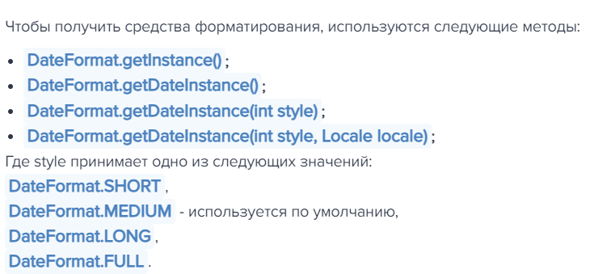

## [MainPage](../READEME.md)/[Program](readme.md)/lab8
# Лабораторная работа #8

## Внимание! У разных вариантов разный текст задания!
1. Интерфейс должен быть реализован с помощью библиотеки Swing
2. Графический интерфейс клиентской части должен поддерживать русский, македонский, датский и английский (Соединенное Королевство) языки / локали. Должно обеспечиваться корректное отображение чисел, даты и времени в соответстии с локалью. Переключение языков должно происходить без перезапуска приложения. Локализованные ресурсы должны храниться в классе.  
Доработать программу из лабораторной работы №7 следующим образом:  

Заменить консольный клиент на клиент с графическим интерфейсом пользователя(GUI).   
В функционал клиента должно входить:  

1. Окно с авторизацией/регистрацией.
2. Отображение текущего пользователя.
3. Таблица, отображающая все объекты из коллекции
   1. Каждое поле объекта - отдельная колонка таблицы.
   2. Строки таблицы можно фильтровать/сортировать по значениям любой из колонок. Сортировку и фильтрацию значений столбцов реализовать с помощью Streams API.
4. Поддержка всех команд из предыдущих лабораторных работ.
5. Область, визуализирующую объекты коллекции
   1. Объекты должны быть нарисованы с помощью графических примитивов с использованием Graphics, Canvas или аналогичных средств графической библиотеки.
   2. При визуализации использовать данные о координатах и размерах объекта.
   3. Объекты от разных пользователей должны быть нарисованы разными цветами.
   4. При нажатии на объект должна выводиться информация об этом объекте.
   5. При добавлении/удалении/изменении объекта, он должен автоматически появиться/исчезнуть/измениться  на области как владельца, так и всех других клиентов. 
   6. При отрисовке объекта должна воспроизводиться согласованная с преподавателем анимация.
6. Возможность редактирования отдельных полей любого из объектов (принадлежащего пользователю). Переход к редактированию объекта возможен из таблицы с общим списком объектов и из области с визуализацией объекта.
7. Возможность удаления выбранного объекта (даже если команды remove ранее не было).

Перед непосредственной разработкой приложения необходимо согласовать прототип интерфейса с преподавателем. Прототип интерфейса должен быть создан с помощью средства для построения прототипов интерфейсов(mockplus, draw.io, etc.)  

**Вопросы к защите лабораторной работы:**  

1. Компоненты пользовательского интерфейса. Иерархия компонентов. 用户界面组件。 组件的层次结构
- **Элементы ввода данных** 数据输入要素
  - Поле ввода 输入栏
  - Выпадающий список 下拉列表
  - Флажок или чекбокс 复选框或复选框
  - Переключатель или радиокнопка 开关或单选按钮
  - Кнопка 按钮
- **Графические элементы** 图形元素
  - Иконка 图标
  - Изображение 图形；映像
  - График или диаграмма 图表
- **Навигационные элементы** 导航要素
  - Меню 菜单
  - Ссылка 链接
  - Вкладки 标签
  - Панель навигации 导航栏
- **Отображение информации** 显示信息
  - Текстовое поле 文本字段
  - Таблица 列表
  - Список или дерево 列表或树
  - Прогресс-бар 进度条
Визуальное представление 视觉呈现  
Визуальная иерархия — это концепция, которая позволяет пользователю обрабатывать информацию в определенном порядке . Ее функция в дизайне интерфейса (UI) — облегчить понимание информации пользователем.  
视觉层次是一个概念，它允许用户按照特定顺序处理信息。 它在界面（UI）设计中的作用是让用户更容易理解信息。  


2. Базовые классы Component, Container, JComponent. 基类 Component、Container、JComponent。  
`Component` - Базовый класс для всех элементов GUI в AWT (например, кнопки, текстовые поля).    
`Component` - Java AWT（Abstract Window Toolkit）中所有图形用户界面（GUI）组件的抽象基类。提供基础方法（如绘制、事件处理、尺寸调整等）。同时为所有GUI组件的父类。  
`Container` - Контейнер, способный содержать другие компоненты (например, окна, панели).  
`Container` - 继承自 Component，是能容纳其他 Component 对象的容器（如窗口、面板）。管理子组件的布局、添加/删除操作。  
`JComponent` - Базовый класс для всех компонентов Swing (например, JButton, JPanel).  
`JComponent` - Java Swing 库中所有组件的基类，继承自 Container。提供高级功能（如双缓冲、可定制外观、键盘事件处理）。


3. Менеджеры компоновки. 布局管理器。
Менеджер расположения (layout manager) определяет, каким образом на форме будут располагаться компоненты. Независимо от платформы, виртуальной машины, разрешения и размеров экрана менеджер расположения гарантирует, что компоненты будут иметь предпочтительный или близкий к нему размер и располагаться в том порядке, который был указан программистом при создании программы.  
布局管理器决定组件在表单上的排列方式。 无论平台、虚拟机、分辨率和屏幕尺寸如何，布局管理器都能确保组件达到或接近首选尺寸，并按照程序员创建程序时指定的顺序排列。  

4. Модель обработки событий. Класс-слушатель и класс-событие. 事件处理模型。 监听器类和事件类
События - это вещи, которые происходят в системе, которую вы программируете. Когда происходит событие, система генерирует (или "запускает") какой-то сигнал и предоставляет механизм для автоматического выполнения какого-то действия (т.е. выполнения какого-то кода) при наступлении события.  
事件是发生在你正在编程的系统中的事情——当事件发生时，系统产生（或“触发”）某种信号，并提供一种机制，当事件发生时，可以自动采取某种行动（即运行一些代码）。  
#### `Listener` 类是用来**监听事件的类**，它实现了 `ActionListener` 接口，并重写了 `actionPerformed()` 方法。当事件发生时，系统会自动调用 `actionPerformed()` 方法。  
#### `Event` 类是用来**封装事件信息的类**。它包含了事件发生的时间、事件源、事件类型等信息。  


5. Технология JavaFX. Особенности архитектуры, отличия от AWT / Swing. JavaFX 技术。 架构特点，与 AWT / Swing 的区别。
`AWT (Abstract Windowing Toolkit)`, что в переводе с китайского означает "Абстрактный оконный инструментарий", является базовым инструментом, предоставляемым Java для создания и настройки графических интерфейсов Java. Недостатком AWT является то, что он предоставляет только очень тонкий слой абстракции поверх родного пользовательского интерфейса, и AWT не гарантирует, что программа будет вести себя последовательно на различных платформах, вопреки тому, чтокредо Java "пиши один раз, запускай везде".
`AWT（Abstract Windowing Toolkit）`，中文译为抽象窗口工具包，是Java提供的用来建立和设置Java图形用户界面的基本工具。AWT的缺点是在原生的用户界面上仅提供了一个非常薄的抽象层，AWT不能保证程序在各种平台上表现一致，违背了Java“一次编写，到处运行”的信条。  
`Java Swing` является частью `Java Foundation Classes (JFC)`, Swing - легкий компонент по сравнению с AWT, его недостаток - медленная работа, преимущество - возможность использования на всех платформах для единообразного поведения.Swing также предоставляет более богатый набор компонентов и более мощную функциональность, чем AWT, но гибкость Swing также увеличивает егосложность.
`Java Swing`是`Java Foundation Classes（JFC）`的一部分，相对于`AWT`，`Swing`是轻量级元件，缺点是运行速度慢，优点是可以在所有平台上采用统一的行为。Swing也提供了比AWT更为丰富的组件和强大功能，但Swing的灵活性也增加了其复杂性。  
`JavaFX` - это следующее поколение инструментария графического пользовательского интерфейса Java.Включает набор графических и мультимедийных API, которые мы можем использовать для создания и развертывания богатых клиентских приложений.JavaFX позволяет разработчикам быстро создавать богатые кросс-платформенные приложения.JavaFX поддерживает современные графические процессоры благодаря аппаратному ускорению графики.JavaFX позволяет разработчикам объединить графику, анимацию и элементы управления пользовательским интерфейсом в едином интерфейсе программирования.  
`JavaFX`是Java下一代图形用户界面工具包。包括一组图形和媒体API，我们可以用它们来创建和部署富客户端应用程序。JavaFX允许开发人员快速构建丰富的跨平台应用程序。JavaFX通过硬件加速图形支持现代GPU。JavaFX允许开发人员在单个编程接口中组合图形，动画和UI控件。  

6. Интернационализация. Локализация. Хранение локализованных ресурсов. 国际化。 本地化。 本地化资源的存储。
`**Интернационализация (i18n)**` - это процесс разработки приложения такой структуры, при которой дополнение нового языка не требует перестройки и перекомпиляции (сборки) всего приложения. Достигается это за счет отдельного хранения данных интернационализации в виде файлов свойств, загружаемых приложением динамически в процессе работы.  
***国际化（i18n）***是以这样一种结构开发应用程序的过程，即添加一种新语言后，整个应用程序无需重建和重新编译（构建）。 为此，应用程序在运行过程中以动态加载属性文件的形式单独存储国际化数据。  
`**Локализация (l10n)**` – это адаптация приложения к конкретному языку и региону путем перевода выводимых пользователю текстовых элементов и документации, а также определения данных времени, валют и др., согласно специфике данного региона.  
***本地化 (l10n)***是通过翻译显示给用户的文本元素和文档，以及根据该地区的具体情况定义时间、货币数据等，使应用程序适应特定的语言和地区。  

7. Форматирование локализованных числовых данных, текста, даты и времени. Классы NumberFormat, DateFormat, MessageFormat, ChoiceFormat. 本地化数字数据、文本、日期和时间的格式化。 类 NumberFormat、DateFormat、MessageFormat、ChoiceFormat。
`NumberFormat` — абстрактный базовый класс для всех форматов чисел. Возвращает максимальное число цифр, разрешенных в дробной части числа.  
`NumberFormat` 是所有数字格式的抽象基类。 返回数字小数部分允许的最大位数。  

Класс `MessageFormat` предназначен для создания строк.  
Данный класс Java принимает набор объектов, форматирует их, а затем вставляет форматированные строки в шаблон в соответствующих местах. Это своего рода альтернатива (или даже дополнение) к статическому методу `String.format`.  
`MessageFormat` 类旨在创建字符串。
该 Java 类接收一组对象，将其格式化，然后将格式化后的字符串插入模板的适当位置。 它是静态 `String.format` 方法的一种替代方法（甚至可以说是一种补充）。  
`ChoiceFormat` позволяет прикрепить формат к диапазону чисел. Обычно он используется в MessageFormat для работы с множественным числом. Выбор задается с помощью возрастающего списка двоек, где каждый элемент задает полуоткрытый интервал до следующего элемента.  
`ChoiceFormat`允许你将格式附加到一系列数字上。它通常用于`MessageFormat`处理复数。选项由一个升序的双精度数列表指定，其中每一项指定到下一项的半开区间  
```
 X matches j if and only if limit[j] ≤ X < limit[j+1]
```