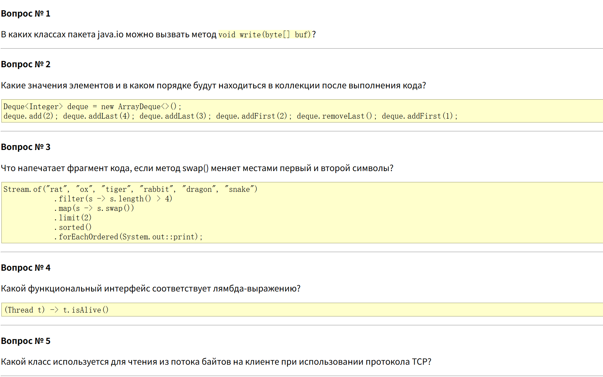
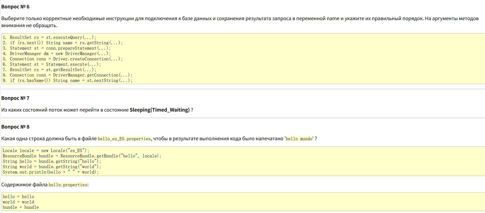
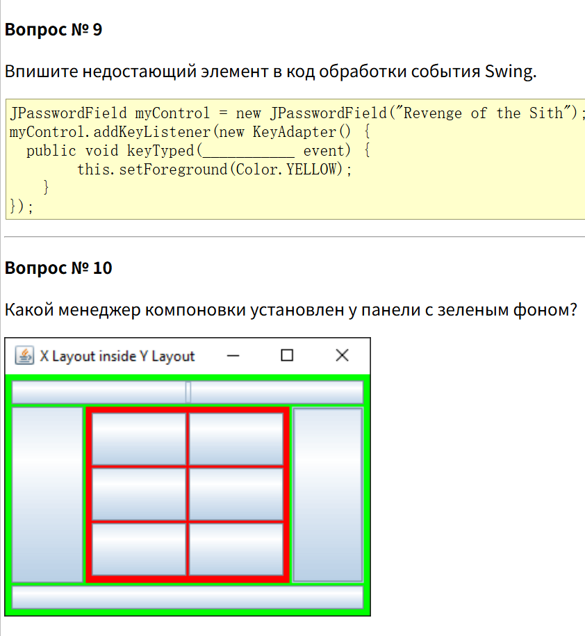
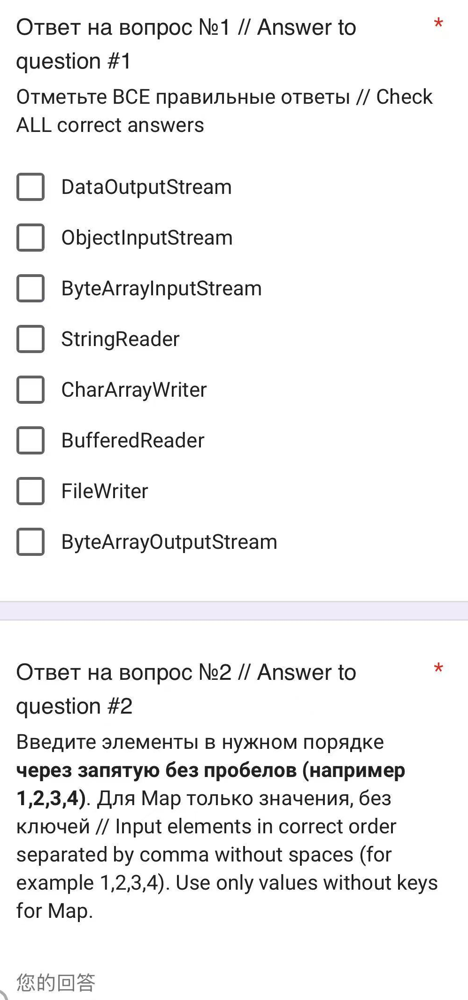
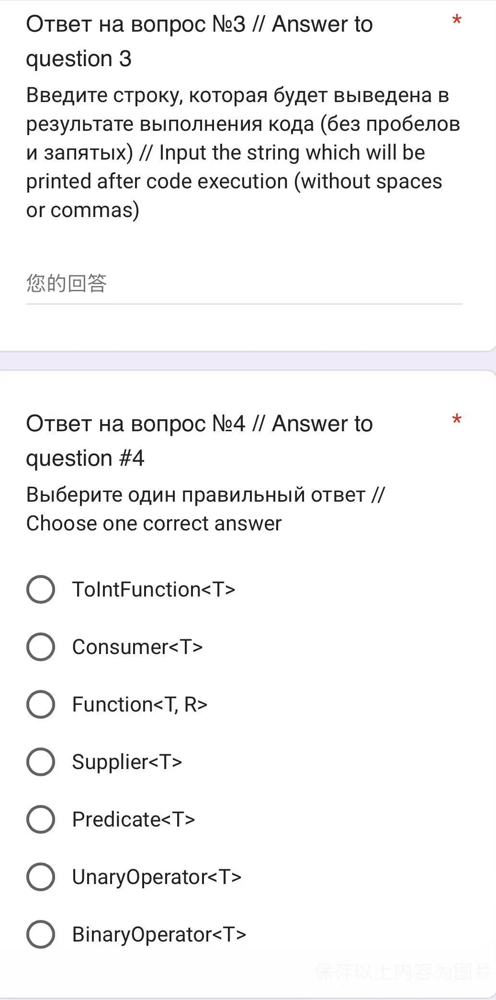
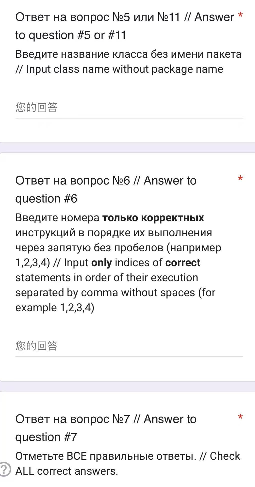
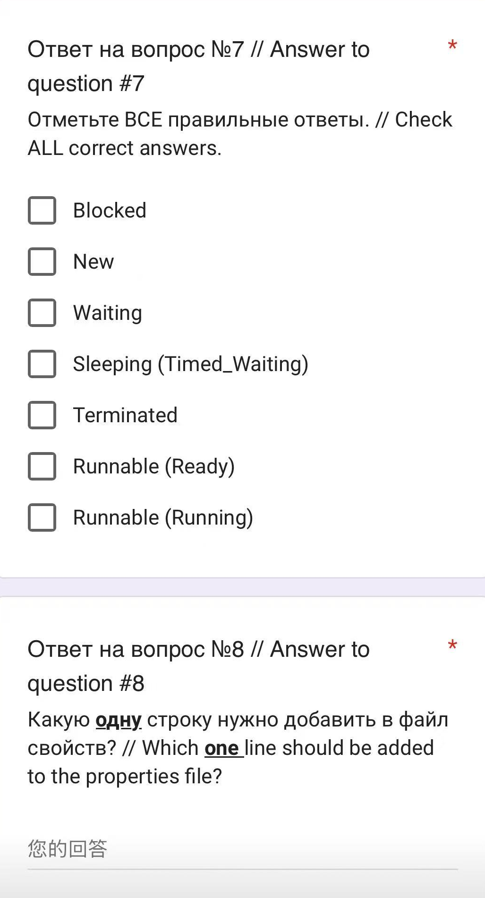
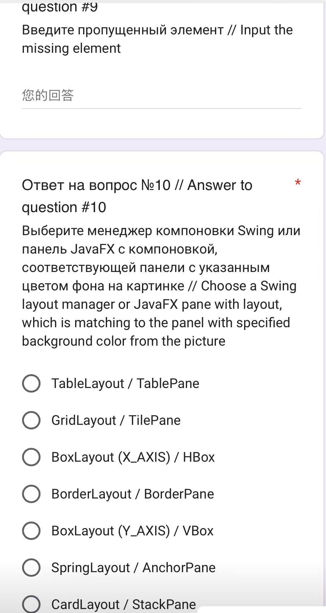
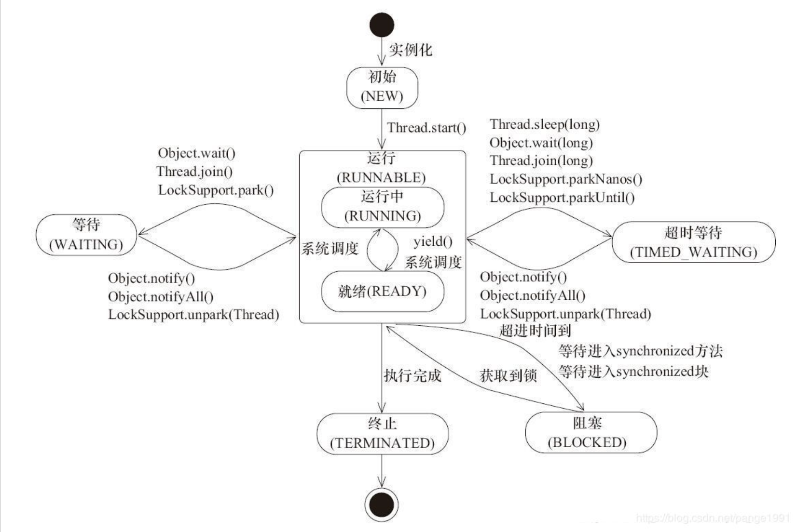

## 第二学期 Рубежная работа 边境工作

#### 总共十个题目，30min
  
  
  

  
  
  
  
  

#### 答案：
1. 
- DataOutputStream （字节流，有write(byte[])方法）

- ObjectInputStream （字节流，但没有直接write方法，它是输入流）

- ByteArrayInputStream （输入流，没有write方法）

- StringReader （字符输入流，没有write方法）

- CharArrayWriter （字符输出流，有write方法，但参数是char[]或String，不是byte[]）

- BufferedReader （字符输入流，没有write方法）

- FileWriter （字符输出流，有write方法，但参数是字符，不是byte[]）

- ByteArrayOutputStream （字节输出流，有write(byte[])方法）

所以选择为`DataOutputStream` 和 `ByteArrayOutputStream`  

2. 在idea上实现代码就可，但是直接看代码也挺容易理解的。  
答案为1,2,2,4

3. 第二行代码划分符合长度的词语（长度大于4），因此剩下（tiger, rabbit, dragon, snake）,后面执行swap方法，且String中没有swap方法，因此这个方法可能为自定义的（但不重要），题目给出这个swap方法是交换前两个的字符例如（tiger -> itger），后面一行的limit(2)方法是限制词语数量，只取前两个之后sort()方法，按照字母大小排列得到答案：`arbbititger`  

4. 
函数式接口匹配`lambda`表达式 `(Thread t) -> t.isAlive()`

这个lambda接受一个Thread对象，返回一个boolean。所以是Predicate<Thread>。

选项：

- TolntFunction<T> （可能拼写错误，应该是ToIntFunction，它接受T返回int，不匹配）

- Consumer<T> （接受T，无返回，不匹配）

- Function<T, R> （接受T，返回R，这里返回boolean，但需要指定R为Boolean，但这里没有指定）

- Supplier<T> （无参数，返回T，不匹配）

- Predicate<T> （接受T，返回boolean，匹配）

- UnaryOperator<T> （接受T返回T，不匹配）

- BinaryOperator<T> （接受两个T返回T，不匹配）

所以选 Predicate<T>，但注意T应该是Thread。

在选项中，Predicate<T>是泛型，我们可以用Predicate<Thread>

5. 
在TCP客户端，用于从字节流中读取的类是什么？  

在Java中，TCP客户端使用Socket获取输入流，通常用InputStream，但通常我们会使用装饰器，如BufferedReader（用于字符）或DataInputStream（用于基本数据类型）。但题目要求读取字节流，所以最基本的类是`InputStream`。

6. 
   1. ResultSet rs = st.executeQuery(...);

   2. if (rs.next()) String name = rs.getString(...);

   3. Statement st = conn.prepareStatement(...); 

   4. DriverManager dm = new DriverManager(...);  // DriverManager没有public构造方法，不能new

   5. Connection conn = Driver.createConnection(...); // 通常用DriverManager.getConnection

   6. Statement st = Statement.execute(...); // Statement是接口，不能直接实例化，且execute是实例方法

   7.  ResultSet rs = st.getResultSet(...); // 通常通过executeQuery返回ResultSet，而不是用getResultSet（用于多次结果？）

   8.  Connection conn = DriverManager.getConnection(...); // 正确

   9.  if (rs.hasName()) ... // ResultSet没有hasName方法

**过程：**
a. 注册驱动（但这里没有选项，现在通常自动注册）

b. 获取连接：Connection conn = DriverManager.getConnection(...); -> 选项8

c. 创建Statement：Statement st = conn.createStatement(); -> 选项3有误，应该是createStatement，不是prepareStatement（prepareStatement用于带参数的SQL，返回PreparedStatement，但这里没有使用PreparedStatement）。但选项3写的是：Statement st = conn.prepareStatement(...); 这是错误的，因为prepareStatement返回PreparedStatement，可以赋值给Statement变量，但通常我们使用createStatement。

d. 执行查询：ResultSet rs = st.executeQuery(...); -> 选项1

e. 处理结果：while(rs.next()) 或 if(rs.next()) -> 选项2（但选项2中，if块中定义了String name，这语法不对，但可能是伪代码）

答案：8,3,1,2

7. 从哪些流状态能进入`Sleeping(Timed_Waiting)`状态？
  
线程的几种状态：
- 初始(`NEW`)：新创建线程对象，但还没有调用start()方法。
- 运行(`RUNNABLE`)：Java 虚拟机中线程的可运行状态包括操作系统中线程的就绪（`ready`）和运行中（`running`）两种状态。即处于该状态时，线程可能正在等待来自操作系统的其他资源（如CPU）。
- 阻塞(`BLOCKED`)：表示线程阻塞于锁。
等待(`WAITING`)：进入该状态的线程需要等待其他线程做出一些特定动作（通知或中断）。
- 超时等待(`TIMED_WAITING`)：该状态不同于`WAITING`，它可以在指定的时间后自行返回。
终止(`TERMINATED`)：表示该线程已经执行完毕。

**答案：** `RUNNABLE (Running)` (不太确定)

8. 国际化和本地化
直接将要获取的字符串所对应的值，直接在库中改变。  
**答案：** world = mundo

9. 根据`KeyListener`接口，`keyTyped`方法的参数是`KeyEvent`

10. 