## [网编主页](../readme.md)/讲座ppt内容

### 1. 引言
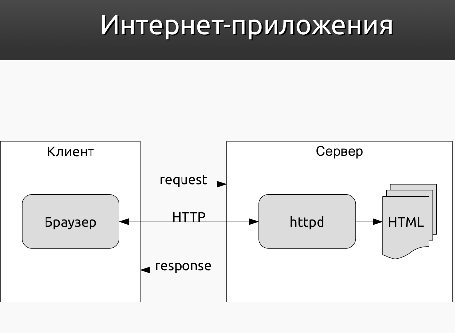  
- 互联网应用，及客户端与服务端之间的内部联系
  - 客户端内核为浏览器，通过发送请求至服务端
  - 服务端内通过httpd（是一个以守护进程模式运行HTTP协议的服务器软件）来实行HTML对于网页的形成
  - 客户端与服务端之间通过HTTP协议进行通信，实现数据的交换
  
#### Стандарты и протоколы сети Интернет 互联网的标准和协议
- Hypertext Transfer Protocol (HTTP) — предназначен для передачи гипертекста между клиентом и сервером.
- 超文本传输协议（HTTP）——用于在客户端和服务器之间传输超文本。
- Hypertext Markup Language (HTML) — язык разметки гипертекста
- 超文本标记语言 (HTML) - 超文本标记语言是用于创建网页的标记语言。

### 2. Протокол HTTP HTTP协议
- Протокол HTTP HTTP协议
  - Протокол прикладного уровня 
  - 应用层协议
  - Основа — технология «клиент-сервер»
  - 基础是客户端-服务端技术
  - Может быть использован в качестве «транспорта» для других протоколов прикладного уровня
  - 可用作其他应用层协议的“传输”
  - Основной объект манипуляции — ресурс, на который указывает URI
  - 主要对象是URI指向的资源
  - Обмен сообщениями идёт по схеме «запрос-ответ»
  - 消息传递是一种请求-响应模式
  - Stateless-протокол (один запрос — одно соединение). Для реализации сессий используются cookies.
  - 无状态协议（一个请求 - 一个连接）。Cookie 用于实现会话。

- URI, URL и URN
  - URI (Uniform Resource Identifer) — уникальный идентификатор ресурса — символьная строка, позволяющая идентифицировать ресурс. 
  - URI（统一资源标识符）是资源的唯一标识符，是允许您标识资源的字符串。
  - URL (Uniform Resource Locator) — URI, позволяющий определить местонахождение ресурса.
  - URL（统一资源定位器）是一个 URI，可用于确定资源的位置。
  - URN (Uniform Resource Name) — URI, содержащий единообразное имя ресурса (не указывает на его местонахождение).
  - URN（统一资源名称）：包含资源统一名称的 URI（不指示其位置）。

- 示例：
```
URI:  
<схема>:<идентификатор-в-зависимости-от-схемы>  

URL:
 http://cs.ifmo.ru/spip.html  
 ../task.shtml  
 mailto:Joe.Bloggs@somedomain.com  

URN:
urn:isbn:5170224575
urn:sha1:YNCKHTQCWBTRNJIV4WNAE52SJUQCZO5C
```

- REST 
  - Representational State Transfer (передача состояния представления) - подход к архитектуре сетевых протоколов, обеспечивающих доступ к информационным ресурсам
  - 表述状态传输是一种网络协议架构方法，提供对信息资源的访问
  - Основные концепции:
  - 关键概念：
    - Данные должны передаваться в виде небольшого числа  стандартных форматов (HTML, XML, JSON).
    - 数据应以少量标准格式（HTML、XML、JSON）传输。
    - Сетевой протокол должен поддерживать кэширование, не должен зависеть от сетевого слоя, не должен сохранять информацию о состоянии между парами «запрос-ответ».
    - 网络协议必须支持缓存，不得依赖于网络层，并且不得在请求-响应对之间存储状态信息。
  - Антипод REST — подход, основанный на вызове удаленных процедур (Remote Procedure Call — RPC).
  - REST 的对立面是一种基于远程过程调用 （RPC） 的方法。

- Структура запроса HTTP HTTP 请求结构
  - Стартовая строка: 起跑线
    - 
    ```
    Метод URI HTTP/Версия
    GET /spip.html HTTP/1.1
    ``` 
  - Заголовки 标题:
    -      
    ```
    Host: cs.ifmo.ru
    User-Agent: Mozilla/5.0 (X11; U; Linux i686; ru; rv:1.9b5) Gecko/2008050509 Firefox/3.6
    Accept: text/html
    Connection: close
    ```
  - Тело сообщения
  

- Структура ответа HTTP HTTP 响应结构
  - Стартовая строка: 起始线
    - 
    ```
    HTTP/Версия Код Состояния Пояснение
    HTTP/1.1 200 Ok
    ``` 
  - Заголовки 标题:
    - 
    ```
    Server: Apache/2.2.11 (Win32) PHP/5.3.0
    Last-Modified: Sat, 16 Jan 2010 21:16:42 GMT
    Content-Type: text/plain; charset=windows-1251
    Content-Language: ru
    ```
  - Тело сообщения

- Методы HTTP HTTP的方法
  - `OPTIONS` — определение возможностей сервера.
  - `OPTIONS` - 定义服务器的功能。
  - `GET` — запрос содержимого ресурса.
  - `GET` - 请求资源的内容。
  - `HEAD` — аналог GET, но в ответе отсутствует тело.
  - `HEAD` 与 `GET` 类似，但响应中没有正文。
  - `POST` — передача данных ресурсу.
  - `POST` — 将数据传输到资源。
  - `PUT` — загрузка содержимого запроса на указанный URI.
  - `PUT` - 将请求的内容下载到指定的 URI。

- Коды состояния 状态代码
  - Состоят из 3-х цифр.
  - 它们由 3 位数字组成。
  - Первая цифра — класс состояния:
  - 第一个数字是状态类：
    - «1» — Informational — информационный;
    - “1” — 信息 — 参考;
    - «2» — Success — успешно;
    - “2” — 成功;
    - «3» — Redirection — перенаправление; 
    - “3” — 重定向;
    - «4» — Client error — ошибка клиента;
    - “4” — 客户端错误;
    - «5» — Server error — ошибка сервера.
    - “5” – 服务器错误。

### 3. Основы HTML HTML基础
HTML是什么：  
- Стандартный язык разметки документов в Интернете.
- Интерпретируется браузером и отображается в виде документа.
- Разработан в 1989-91 годах Тимом Бернерсом-Ли.
- Является частным случаем SGML (стандартного обобщённого языка разметки).
- Существует нотация XHTML, являющаяся частным случаем языка XML
- 互联网文档的标准标记语言。
- 由浏览器解释并显示为文档。
- 由 Tim Berners-Lee 于 1989-91 年开发。
- 它是 SGML（标准通用标记语言）的一个特例。
- 有一种称为 XHTML 的符号，它是 XML 的一个特例。

`Браузер` — программа, отображающая HTML документ в его отформатированном виде.  
浏览器是一种以格式化形式显示 HTML 文档的程序。  

#### Объектная модель документа (DOM) 文件对象模型
- DOM — это платформо-независимый интерфейс, позволяющий программам и скриптам получить доступ к содержимому HTML-документов.
- Стандартизирована W3C.
- Документ в DOM представляет собой дерево 
узлов.
- Узлы связаны между собой отношением 
«родитель-потомок».
- Используется для динамического изменения страниц HTML.
- DOM 是一个独立于平台的接口，允许程序和脚本访问 HTML 文档的内容。
- 由 W3C 标准化。
- DOM 文档是一个由
节点组成的树。
- 节点之间通过父子关系相互关联。
- 用于动态修改HTML页面。

#### ES6 / ES2015+
- ES6 — новая версия языка ECMAScript, выпущенная в 2015 г.
- Добавляет в синтаксис языка множество новых возможностей.
- Поддерживается практически всеми современными браузерами (хотя с этим всё ещё могут быть нюансы).
- Для работы в старых браузерах может потребоваться специальная программа — транспилер (transpiler).
- ES6 是 ECMAScript 语言的新版本，于 2015 年发布。
- 它为该语言的语法添加了许多新功能。
- 几乎所有现代浏览器都支持它（尽管可能仍存在一些细微差别）。
- 可能需要使用一个名为“转译器”的特殊程序才能与旧版浏览器兼容。

#### Block Scope Variables 块作用域变量
- Два новых ключевых слова — let и const.
- 两个新的关键字 let 和 const。
- ES5:
```js
var x = 'outer'; // 只是个简单的变量
function test(inner) {
  if (inner) {
    var x = 'inner'; // 范围整个函数
    return x;
  }
  return x; // 在第 4 行重新定义
}
test(false); // undefined
test(true); // inner
```

##### Ключевое слово let 关键字let
Позволяет объявить переменную, областью видимости которой является блок.  
允许您声明一个范围为块的变量。  
```js
let x = 'outer'; // 范围为块的变量
function test(inner) {
  if (inner) {
    let x = 'inner'; // 范围整个函数
    return x;
  }
  return x; // 在第 4 行重新定义
}
test(false); // undefined
test(true); // inner
```

##### Ключевое слово const 关键字const
允许这样声明常量：
```js
const x = 5; // const 声明的常量不能被修改，且声明的常量必须初始化。

const x = 10; // 错误，常量不能被修改。
let x = 10; // 错误 （let声明的常量可以被修改且可以不用初始化）
var x = 10; // 错误

console.log('我最喜欢的数字是：'+ x) // 输出7
```

#### IIFE (Immediately Invoked Function Expression) IIFE（立即调用函数表达式）
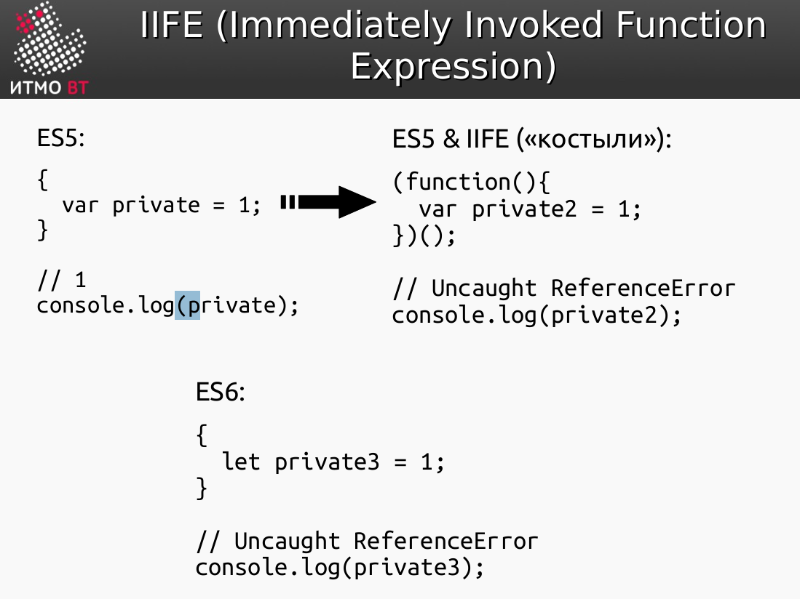

#### Template Literals 模板文字
ES5:
```js
var firstname = 'John';
var lastname = 'Wick';
console.log('His name is ' + firstname + ' ' + lastname);
```

ES6:
```js
const firstname = 'John';
const lastname = 'Wick';
console.log(`His name is ${firstname} ${lastname}`);
```

不同点在于,新版本ES6允许在字符串中*嵌入变量*,而不需要使用加号或字符串连接符。  

#### Деструктуризация 解构
*Деструктуризация* (destructuring assignment) – особый синтаксис присваивания, при котором можно присвоить массив или объект сразу нескольким переменным, разбив его на части.  
*解构赋值*是一种特殊的赋值语法，它允许您一次将数组或对象分配给多个变量，将其分解成多个部分。  
例子：
ES5  
```js
var array = [1,2,3,4,5];
var first = array[0];
var last = array[4];

console.log(first, last); // 1 5
```

ES6:
```js
const array = [1,2,3,4,5];
const [first, last] = array;

console.log(first, last); // 1 5
```

### 4. Серверные сценарии на PHP 在PHP语言上的服务器脚本
Язык PHP  
- PHP (PHP: Hypertext Preprocessor) — скриптовый язык, часто используемый для написания вебприложений.
- PHP (PHP: 超文本预处理器)——一种脚本语言，用于编写网络应用程序。

### 5. Сервлеты Java Servlets 
#### Платформа Java EE Java EE 平台
- Набор стандартов и спецификаций для создания корпоративных приложений на Java.
-  Cпецификации Java EE реализуются серверами приложений: 
  -  Apache Tomcat 
  -  Sun / Oracle GlassFish 
  -  BEA / Oracle WebLogic 
  -  IBM WebSphere 
  -  RedHat JBoss
- 一套用于创建 Java 企业级应用程序的标准和规范。
- Java EE 规范由以下应用服务器实现：
  - Apache Tomcat
  - Sun / Oracle GlassFish
  - BEA / Oracle WebLogic
  - IBM WebSphere
  - RedHat JBoss

#### Java Servlets
- Java Servlets — это программные компоненты, которые обрабатывают и отвечают на запросы HTTP, которые поступают веб-сервером.
- Java Servlets 是处理 HTTP 请求的软件组件。
- Сервлеты — это серверные сценарии, написанные на Java. 
- Servlet 是用 Java 编写的服务器端脚本。
- Жизненным циклом сервлетов управляет вебконтейнер (он же контейнер сервлетов). 
- servlet的生命周期由Web容器（也称为Servlet容器）管理。
- В отличие от CGI, запросы обрабатываются в отдельных потоках (а не процессах) на вебконтейнере.
- 与 CGI 不同，请求是在 Web 容器上的单独线程（而不是进程）中处理的。

#### Обработка HTTP-запросов сервлетом 处理 HTTP 请求的 Servlet
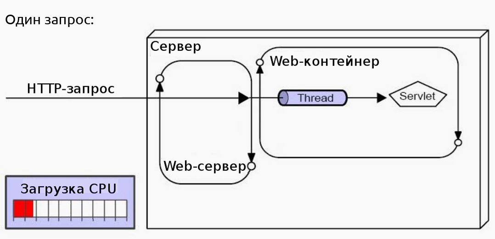  
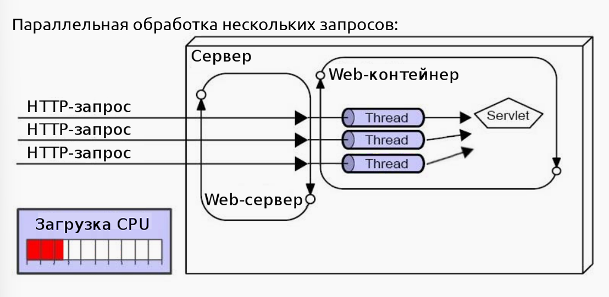  

#### Преимущества и недостатки сервлетов Servlet 的优点和缺点
- Преимущества сервлетов: 
  - Выполняются быстрее, чем CGI-сценарии. 
  - Хорошая масштабируемость. Надёжность и безопасность (реализованы на Java). 
  - Платформенно-независимы. 
  - Множество инструментов мониторинга и отладки. 
- Недостатки сервлетов:
  - Слабое разделение уровня представления и бизнес-логики. 
  - Возможны конфликты при параллельной обработке запросов.
- Servlet 的优点：
  - 执行速度比 CGI 脚本更快。
  - 良好的可扩展性。可靠性和安全性（使用 Java 实现）。
  - 平台无关性。
  - 丰富的监控和调试工具。
- Servlet 的缺点：
  - 表示层和业务逻辑分离性差。
  - 并发处理请求时可能会发生冲突。

### 6. Разработка сервлетов Java Servlets 开发
#### Архитектура веб-контейнера Web容器架构
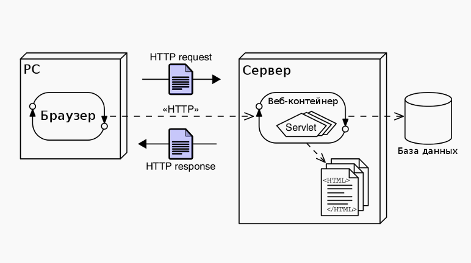

#### Обработка HTTP-запроса 处理 HTTP 请求
1. Браузер формирует HTTP-запрос и отправляет его на сервер. 浏览器形成HTTP请求并将它发到服务器中。
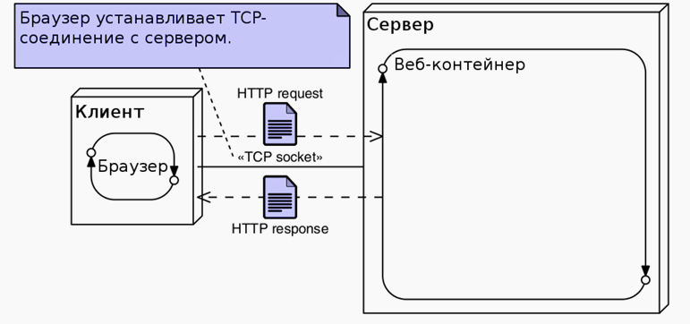  

2. Веб-контейнер создаёт объекты `HttpServletRequest` и `HttpServletResponse`. web容器创建`HttpServletRequest`和`HttpServletResponse`对象。
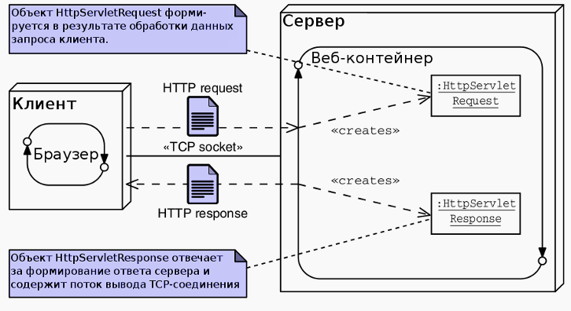  

3. Веб-контейнер вызывает метод service сервлета. web容器调用servlet的`service`方法。
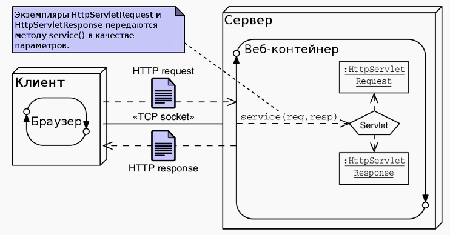  

4. Сервлет формирует ответ и записывает его в поток вывода HttpServletResponse. servlet生成响应并将其写入`HttpServletResponse`输出流。
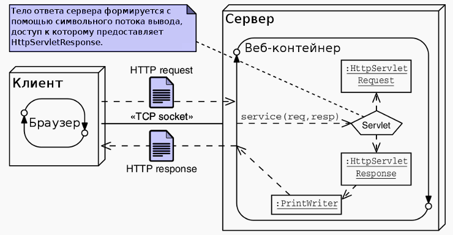  

#### HttpServlet API 
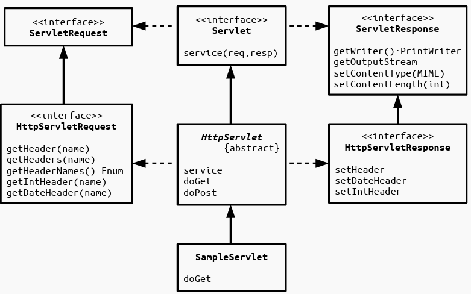  

#### Конфигурация сервлета Servlet 配置  
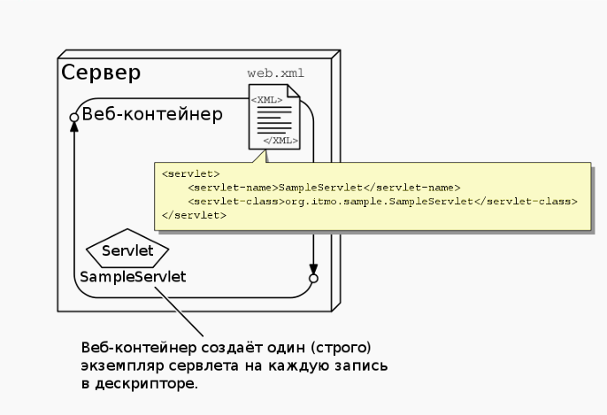  
`web.xml` 文件中配置servlet。  
如果web容器中有写好的`html`文件或者在`web.xml`中用`<url-pattern>/sample</url-pattern>`标记的该网页的访问地址，则可以直接访问该网页。  
```
http://localhost:8080/myweb/index.html
OR
http://localhost:8080/myweb/sample
```

#### Жизненный цикл сервлета Servlet的生命周期  
- Жизненным циклом сервлета управляет вебконтейнер. 
- Методы, управляющие жизненным циклом, должен вызывать только веб-контейнер.
- `Servlet` 的生命周期由 `Web` 容器管理。
- 生命周期管理方法只能由 `Web` 容器调用。

过程：
1. `Web` 容器加载 `Servlet` 类。
2. `Web` 容器创建 `Servlet` 对象。
3. 引用`init()`方法
4. `Web` 容器调用 `service()` 方法处理 `HTTP` 请求。
5. `Web` 容器调用 `destroy()` 方法销毁 `Servlet` 对象。

#### Контекст сервлетов Servlet 上下文
- API, с помощью которого сервлет может взаимодействовать со своим контейнером. 
- Servlet 与其容器交互的 API。
- Доступ к методам осуществляется через интерфейс `javax.servlet.ServletContext.` 
- 方法通过 `javax.servlet.ServletContext` 接口访问。
- У всех сервлетов внутри приложения общий контекст. 
- 应用程序中的所有 Servlet 共享一个公共上下文。
- В контекст можно помещать общую для всех сервлетов информацию (методы `getAttribute` и `setAttribute`). 
- 该上下文可用于存储所有 Servlet 的公共信息（`getAttribute` 和 `setAttribute` 方法）。
- Если приложение — распределённое, то на каждом экземпляре JVM контейнером создаётся свой контекст
- 如果应用程序是分布式的，容器会在每个 JVM 实例上创建自己的上下文。

```
import java.io.*;  
import javax.servlet.*; 
import javax.servlet.http.*;  
public class DemoServlet extends HttpServlet{  
  public void doGet(HttpServletRequest req,HttpServletResponse res) throws ServletException,IOException {           res.setContentType("text/html");  
  PrintWriter pw=res.getWriter(); //creating ServletContext object 
  ServletContext context=getServletContext();  
  //Getting the value of the initialization parameter 
  //and printing it  String driverName=context.getInitParameter("dname");  
  pw.println("driver name is="+driverName);  }
   pw.close();  }
```

#### HTTP-сессии HTTP会话
- HTTP — stateless-протокол. 
- HTTP 是一种无状态协议。
- `javax.servlet.HttpSession` — интерфейс, позволяющий идентифицировать конкретного клиента (браузер) при обработке множества HTTP-запросов от него. 
- Интерфейс `javax.servlet.HttpSession` 允许标识特定的客户端（浏览器）并处理来自该客户端的多个 HTTP 请求。
- Экземпляр HttpSession создаётся при первом обращении клиента к приложению и сохраняется некоторое (настраиваемое) время после последнего обращения. 
- HttpSession 实例在客户端首次访问应用程序时创建，并在最后一次访问后保持一段时间（可配置）。
- Идентификатор сессии либо помещается в cookie, либо добавляется к URL. Если удалить этот идентификатор, то сервер не сможет идентифицировать клиента и создаст новую сессию. 
- 会话标识符可以存储在 cookie 中，也可以附加到 URL 后。如果此标识符被移除，服务器将无法识别客户端，并会创建一个新的会话。
- В экземпляр HttpSession можно помещать общую для этой сессии информацию (методы getAttribute и setAttribute).
- 您可以在 `HttpSession` 实例中存储会话信息（使用 `getAttribute` 和 `setAttribute` 方法）。 
- Сессия «привязана» к конкретному приложению; у разных приложений — разные сессии.
- 会话绑定到特定的应用程序；不同的应用程序拥有不同的会话。
- В распределённом окружении обеспечивается сохранение целостности данных в HTTP-сессии (независимо от количества экземпляров JVM).
- 在分布式环境中，HTTP 会话中数据的完整性得到保证（无论 JVM 实例的数量如何）。

#### Диспетчеризация запросов сервлетами Servlet 的请求分发
- Сервлеты могут делегировать обработку запросов другим ресурсам (сервлетам, JSP и HTML-страницам). 
- Servlet 可以将请求处理委托给其他资源（Servlet、JSP 和 HTML 页面）。
- Диспетчеризация осуществляется с помощью реализаций интерфейса `javax.servlet.RequestDispatcher`. 
- 分发是通过 `javax.servlet.RequestDispatcher` 接口的实现来实现的。
- Два способа получения `RequestDispatcher` — через ServletRequest (абсолютный или относительный URL) и ServletContext (только абсолютный URL).
- `RequestDispatcher` 有两种方式：通过 `ServletRequest`（绝对或相对 URL）和 `ServletContext`（仅限绝对 URL）。
-  Два способа делегирования обработки запроса — forward и include.
-  委托请求处理有两种方式：转发 (`forward`) 和包含 (`include`)。

```
import java.io.*;  
import javax.servlet.*; 
import javax.servlet.http.*;  
public class MyServlet extends HttpServlet{  
  public void doGet(HttpServletRequest req,  HttpServletResponse res)  throws ServletException,IOException {  
  RequestDispatcher dispatcher = request.getRequestDispatcher("index.jsp"); dispatcher.forward( request, response );
  }
}
```

#### Фильтры запросов 请求过滤器
- Фильтры позволяют осуществлять пред- и постобработку запросов до и после передачи их ресурсу (сервлету, JSP или HTML-странице). 
- 过滤器允许在将请求传递给资源（Servlet、JSP 或 HTML 页面）之前和之后对其进行预处理和后处理。
- Пример предобработки — допуск к странице только авторизованных пользователей. 
- 预处理的一个例子是仅允许授权用户访问页面。
- Пример постобработки — запись в лог времени обработки запроса. 
- 后处理的一个例子是记录请求处理时间。
- Реализуют интерфейс `javax.servlet.Filter`. 
- 过滤器实现了 `javax.servlet.Filter` 接口。
- Ключевой метод — `doFilter`. 
- 关键方法是 `doFilter`。
- Метод `doFilter` класса `FilterChain` передаёт управление следующему фильтру или целевому ресурсу; таким образом, возможна реализация последовательностей фильтров,  обрабатывающих один и тот же запрос.
- `FilterChain` 类的 `doFilter` 方法将控制权传递给下一个过滤器或目标资源；因此，可以实现一系列过滤器来处理同一个请求。

##### 过滤器配置
```
<web-app>
  <servlet>
    <servlet-name>s1</servlet-name>
    <servlet-class>MyServlet</servlet-class
  </servlet>
  <servlet-mapping>
    <servlet-name>s1</servlet-name>
    <url-pattern>/myservlet</url-pattern>
  </servlet-mapping>
  <filter>
    <filter-name>f1</filter-name>
    <filter-class>MyFilter</filter-class>
  </filter>
  <filter-mapping>
    <filter-name>f1</filter-name>
    <url-pattern>/myservlet</url-pattern>
  </filter-mapping> 
</web-app>
```
### 7. JavaServer Pages Java服务器页面
定义：
- Страницы JSP — это текстовые файлы, содержащие статический HTML и JSP-элементы.
- JSP 页面是包含静态 HTML 和 JSP 元素的文本文件。
- JSP-элементы позволяют формировать динамическое содержимое. 
- JSP 元素允许生成动态内容。
- При загрузке в веб-контейнер страницы JSP транслируются компилятором (jasper) в сервлеты.
-  当加载到 Web 容器中时，JSP 页面会由编译器（例如 Jasper）转换为 Servlet。
- Позволяют отделить бизнес-логику от уровня представления (если их комбинировать с сервлетами).
- 它们（与 Servlet 结合使用时）可以实现业务逻辑与表示层的分离。

#### Преимущества и недостатки JSP 优缺点
- Преимущества: 
  - Высокая производительность — транслируются в сервлеты. 
  - Не зависят от используемой платформы — код пишется на Java. 
  - Позволяют использовать Java API. 
  - Простые для понимания — структура похожа на обычный HTML. 
- Недостатки: 
  - Трудно отлаживать, если приложение целиком основано на JSP. 
  - Возможны конфликты при параллельной обработке нескольких запросов.

- 优点：
  - 高性能 – 可转换为 Servlet。
  - 平台无关 – 代码使用 Java 编写。
  - 可使用 Java API。
  - 易于理解 – 结构类似于常规 HTML。
- 缺点：
  - 如果应用程序完全基于 JSP，则调试难度较大。
  - 并行处理多个请求时可能会出现冲突。

#### Жизненный цикл JSP JSP的生命周期
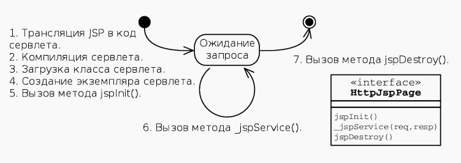  

1. JSP翻译成servlet代码
2. Servlet编译
3. Servlet类加载
4. Servlet实例化
5. 调用jsp的init()方法
6. 调用jsp的service()方法
7. 最后调用jsp的destroy()方法

#### JSP-элементы JSP 元素
- 2 варианта синтаксиса — на базе HTML и XML.
- 两种语法选项 - 基于HTML和XML
- 有五种JSP元素的类型：
  - Комментарий 注释 — `<%-- Comment --%>`;
  - Директива 指令 — `<%@ directive %>`;
  - Объявление 声明 — `<%! decl %>`;
  - Скриптлет 脚本 — `<% code %>`;
  - Выражение 表达式 — `<%= expr %>`.

##### 注释
有三种形式：
- HTML注释：`<!-- HTML comment -->`
- JSP注释：`<%-- JSP comment --%>`
- Java注释：`<% // Java comment %>`

##### 指令
Управляют процессом трансляции страницы в сервлет.  
管理将页面翻译成 servlet 的过程。  
句法：
```
<%@ directive attribute="value" %>
```

##### 声明
定义变量、方法和类。  
语法：
```
<%! 
declaration; AnyJavaClass; public statis privte int x = 1; ... 
%>
```

##### 脚本
Позволяют задать Java-код, который будет выполняться при обработке запросов (при вызове метода _jspService).  
允许您指定在处理请求时（调用 _jspService 方法时）要执行的 Java 代码。  
```
<%
JavaCode
%>
```

#### 补充
- Exception — используется только на страницах перенаправлениях с информацией об ошибках (Error Pages).
- Exception — 仅用于错误重定向页面 
- Page — API для доступа к экземпляру класса сервлета, в который транслируется JSP. 
- Page — 用于访问 JSP 页面所对应的 servlet 类实例的 API。
- PageContext — контекст JSP-страницы.
- PageContext — JSP 页面上下文。

### 8. Шаблоны проектирования в вебприложениях Web应用程序中的设计模板
- Шаблон проектирования или паттерн — повторимая архитектурная конструкция, представляющая собой решение проблемы проектирования в рамках некоторого часто возникающего контекста (© Wikipedia). 
- 设计模式是一种可重复使用的架构构造，它代表了在常见场景下解决设计问题的方案（© 维基百科）。
- Описывает подход к решению типовой задачи. 
- 它描述了一种解决常见问题的方法。
- Одну и ту же задачу часто можно решить с использованием разных шаблонов. 
- 同一个问题通常可以使用不同的模式来解决。
- Существует много литературы с описанием различных шаблонов проектирования.
- 已有大量文献描述了各种设计模式。

#### Порождающие GoFпаттерны 生成 GoF 模式
- Abstract Factory — Абстрактная фабрика. 抽象工厂模式
- Builder — Строитель. 建造者模式
- Factory Method — Фабричный метод. 工厂方法模式
- Prototype — Прототип. 原型模式
- Singleton — Одиночка. 单例模式

#### Структурные GoF-паттерны 结构性 GoF 模式
- Adapter — Адаптер. 适配器模式
- Bridge — Мост. 桥接模式
- Composite — Компоновщик. 组合模式
- Decorator — Декоратор. 装饰器模式
- Facade — Фасад. 外观模式
- Flyweight — Флейвор приспособленец. 享元模式
- Proxy — Заместитель 代理模式

#### Поведенческие GoF-паттерны 行为性 GoF 模式
- Chain of Responsibility — Цепочка ответственности. 责任链模式
- Command — Команда. 命令模式
- Interpreter — Интерпретатор. 解释器模式
- Iterator — Итератор. 迭代器模式
- Mediator — Медиатор. 中介者模式
- Memento — Мемо. 备忘录模式
- Observer — Наблюдатель. 观察者模式
- State — Состояние. 状态模式
- Strategy — Стратегия. 策略模式
- Template — Шаблонный метод. 模板方法模式
- Visitor — Посетитель. 访问者模式

#### web应用程序的结构
- Клиент — браузер, приложение.客户端
- Бизнес-логика — серверные приложения. 业务逻辑
- Данные — базы данных, файлы. 数据

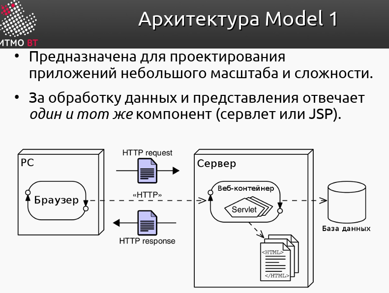  

#### MVC(Model-View-Controller) 模型-视图-控制器
模型-视图-控制器 （MVC）是一种软件架构模式 ，通常用于开发用户界面 ，将相关程序逻辑划分为三个互连元素。这些元素是：
  - the model, the internal representations of information
  - 模型，信息的内部表示
  - the view, the interface that presents information to and accepts it from the user
  - 视图，向用户提供信息并接受用户信息的界面
  - the controller, the software linking the two.
  - 控制器，连接两者的软件。

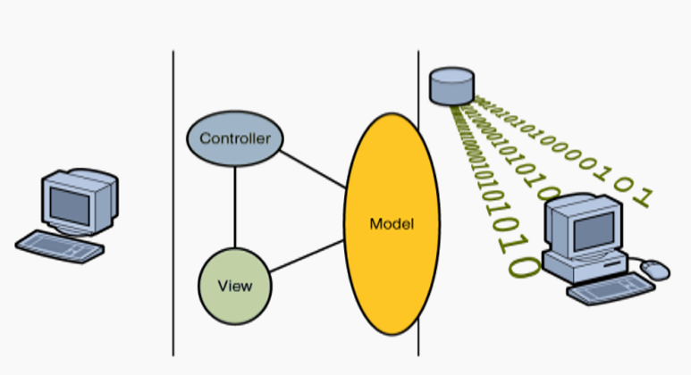  

##### Компоненты MVC 模型-视图-控制器的组件
###### Model型
- **图案的核心组成部分**。它是应用程序的动态数据结构 ，**独立于用户界面**。它直接管理应用程序的数据、逻辑和规则。在 Smalltalk-80 中，模型类型的设计完全留给程序员。对于 WebObjects、Rails 和 Django，模型类型通常表示**应用程序数据库中的一个表**。该模型对于保持数据的组织性和一致性至关重要。它确保应用程序的数据按照定义的规则和逻辑运行。

###### View 视图  
任何信息表示形式，例如图表、图形、表格。  

###### Controller 控制器  
接受输入并将其转换为模型或视图的命令。  

###### Interactions 交互
- MVC 设计模式还定义了这三个组件之间的交互：  
  - 该模型负责管理应用程序的数据。它接收来自控制器的用户输入。
  - 视图以特定格式呈现模型的表示。
  - 控制器响应用户输入并对数据模型对象执行交互。控制器接收输入，可选择验证它，然后将输入传递给模型。

### 9. JavaServer Faces
- JSF — фреймворк для разработки вебприложений. 
- JSF 是一个用于开发 Web 应用程序的框架。
- Входит в состав платформы Java EE. 
- 它是 Java EE 平台的一部分。
- Основан на использовании компонентов. 
- 它是基于组件的。
- Для отображения данных используются JSP или XML-шаблоны (facelets).
- JSP 或 XML 模板（Facelets）用于显示数据。

优点：
- Чёткое разделение бизнес-логики и интерфейса (фреймворк реализует шаблон MVC). 
- Управление обменом данными на уровне компонент. 
- Простая работа с событиями на стороне сервера. 
- Доступность нескольких реализаций от различных компаний-разработчиков. 
- Расширяемость (можно использовать дополнительные наборы компонентов). 
- Широкая поддержка со стороны интегрированных средств разработки (IDE).

- 业务逻辑与接口清晰分离（框架采用 MVC 模式）。
- 在组件级别管理数据交换。
- 轻松处理服务器端事件。
- 提供来自不同开发公司的多种实现。
- 可扩展性强（可使用其他组件集）。
- 集成开发工具 (IDE) 的广泛支持。

缺点：
- Высокоуровневый фреймворк — сложно реализовывать не предусмотренную авторами функциональность. 
- Сложности с обработкой GET-запросов (устранены в JSF 2.0). 
- Сложность разработки собственных компонентов.

- 框架级别较高，难以实现作者未预期的功能。
- 处理 GET 请求存在困难（已在 JSF 2.0 中解决）。
- 开发自定义组件较为复杂。

#### JSF应用程序结构
- JSP или XHTML-страницы, содержащие компоненты GUI.
- Библиотеки тегов. 
- Управляемые бины. 
- Дополнительные объекты (компоненты, конвертеры и валидаторы). 
- Дополнительные теги. 
- Конфигурация — faces-confg.xml (опционально). 
- Дескриптор развёртывания — web.xml.

- 包含 GUI 组件的 JSP 或 XHTML 页面。
- 标签库。
- 托管 bean。
- 其他对象（组件、转换器和验证器）。
- 其他标签。
- 配置 — faces-confg.xml（可选）。
- 部署描述符 — web.xml。

#### MVC-модель JSF
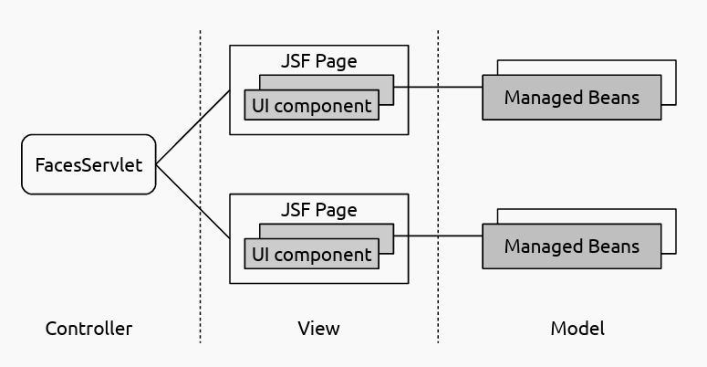  


#### FacesServlet
- Обрабатывает запросы с браузера. 
- Формирует объекты-события и вызывает методы слушатели.
- 处理来自浏览器的请求。
- 生成事件对象并调用监听器方法。
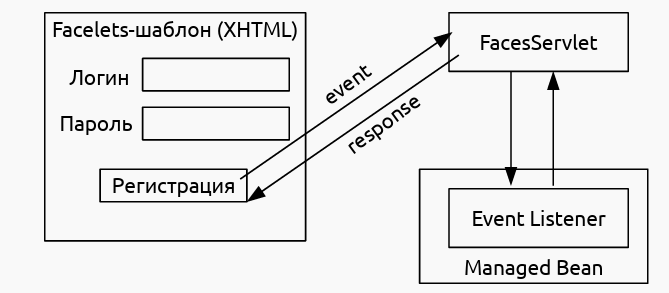  

#### Cтраницы и компоненты UI UI页面和组件
- Интерфейс строится из компонентов. 
- Компоненты расположены на Facelets-шаблонах или страницах JSP. 
- Компоненты реализуют интерфейс `javax.faces.component.UIComponent`. 
- Можно создавать собственные компоненты. 
- Компоненты на странице объединены в древовидную структуру — представление. 
- Корневым элементов представления является экземпляр класса `javax.faces.component.UIViewRoot`.

- 界面由组件构建而成。
- 组件位于 `Facelets` 模板或 JSP 页面中。
- 组件实现了 `javax.faces.component.UIComponent` 接口。
- 您可以创建自己的组件。
- 页面上的组件以树状结构组织，称为视图。
- 视图的根元素是 `javax.faces.component.UIViewRoot` 类的实例。

#### Иерархия компонентов JSF JSF组件层次结构
  

#### Навигация между страницами JSF 页面间导航
- Реализуется экземплярами класса `NavigationHandler`.
- Правила задаются в файле `faces-confg.xml`:
```xml
<navigation-rule>   
  <from-view-id>/pages/inputname.xhtml</from-view-id>       
  <navigation-case> 
    <from-outcome>sayHello</from-outcome> 
    <to-view-id>/pages/greeting.xhtml</to-view-id>        
  </navigation-case>   
   <navigation-case>
    <to-view-id>/pages/goodbye.xhtml</to-view-id>     
    </navigation-case> 
  </navigation-rule> 
```

#### Управляемые бины 管理Bean
- Содержат параметры и методы для обработки данных с компонентов. 
- 包含用于处理组件数据的参数和方法。
- Используются для обработки событий UI и валидации данных. 
- 用于处理 UI 事件和验证数据。
- Жизненным циклом управляет JSF Runtime Envronment. 
- 生命周期由 JSF 运行时环境管理。
- Доступ из JSF-страниц осуществляется с помощью элементов EL. 
- 通过 JSF 页面使用 EL 元素进行访问。
- Конфигурация задаётся в `faces-confg.xml` (JSF 1.X), либо с помощью аннотаций (JSF 2.0).
- 配置在 `faces-confg.xml`（JSF 1.X）或使用注解（JSF 2.0）中指定。

一般管理Bean类有注解`@ManagedBean` & `@SessionScoped`

#### Контекст (scope) управляемых бинов 托管Bean范围
- Задаётся через `faces-confg.xml` или с помощью аннотаций. 
- 可通过 `faces-confg.xml` 文件或注解进行指定。
- 6 вариантов конфигурации:
- 6 个配置选项：
  - `@NoneScoped` — контекст не определён, жизненным циклом управляют другие бины. 
  - `@NoneScoped` — 上下文未定义，生命周期由其他 bean 管理。
  - `@RequestScoped` (применяется по умолчанию) — контекст — запрос. 
  - `@RequestScoped`（默认）— 上下文为请求。
  - `@ViewScoped` (JSF 2.0) — контекст — страница.
  - `@ViewScoped`（JSF 2.0）— 上下文为页面。 
  - `@SessionScoped` — контекст — сессия. 
  - `@SessionScoped` — 上下文为会话。
  - `@ApplicationScoped` — контекст — приложение. 
  - `@ApplicationScoped` — 上下文为应用程序。
  - `@CustomScoped` (JSF 2.0) — бин сохраняется в Map; программист сам управляет его жизненным циклом.
  - `@CustomScoped`（JSF 2.0）— bean 存储在 Map 中；程序员管理其生命周期。

#### Конфигурация управляемых бинов 管理Bean配置
- 方法一： 通过`faces-confg.xml`
```xml
<managed-bean>  
  <managed-bean-name>customer</managed-bean-name>  
  <managed-bean-class>CustomerBean</managed-bean-class>  
  <managed-bean-scope>request</managed-bean-scope>  
  <managed-property>    
    <property-name>areaCode</property-name>    
    <value>#{initParam.defaultAreaCode}</value>  
    </managed-property> 
</managed-bean>
```
- 方法二： 通过注解annotation(JSF 2.0)
```java
@ManagedNamed("customer")
@RequestScoped
public class CustomerBean {
  private String areaCode;

  @PostConstruct
  public void init() {
    ...
  }
```

#### Доступ к управляемым бинам со страниц приложения JSF 访问管理Bean
Осуществляется с помощью EL-выражений:  
这是通过EL表达式实现的：  
```xml
<h:outputText value="#{customer.areaCode}"
              validator="#{user.validate}" />
```

#### Конвертеры данных 数据转换器
- Используются для преобразования данных компонента в заданный формат (дата, число и т. д.). 
- 用于将组件数据转换为指定格式（日期、数字等）。
- Реализуют интерфейс `javax.faces.convert.Converter`. 
- 实现 javax.faces.convert.Converter 接口。
- Существуют стандартные конвертеры для основных типов данных. 
- 提供了常用数据类型的标准转换器。
- Можно создавать собственные конвертеры.
- 您可以创建自定义转换器。

#### Назначение конвертеров 转换器的用途
- Автоматическое (на основании типа данных): 自动转换
- `<h: inputText value="#{user.age}" />`
- С помощью атрибута converter: 使用转换器属性：
- `<h inputText converter="#{javax.faces.DateTime}" />`
- С помощью вложенного тега: 使用嵌套标签：
- `<h:outputText value="#{user.birthDay}"> <f:converter converterId="#{javax.faces.DateTime}"/> </h:outputText>`

#### Валидация данных JSF-компонентов JSF组件数据验证
- Осуществляется перед обновлением значения компонента на уровне модели. 
- 在模型级别更新组件值之前执行。
- Класс, осуществляющий валидацию, должен реализовывать интерфейс `javax.faces.validator.Validator`. 
- 执行验证的类必须实现 `javax.faces.validator.Validator` 接口。
- Существуют стандартные валидаторы для основных типов данных. 
- 针对常见数据类型，有标准验证器。
- Можно создавать собственные валидаторы.
- 您可以创建自己的验证器。

#### Способы валидации данных 验证数据的不同方式
- С помощью параметров компонента: 使用组件参数：
- `<h:inputText id="zip" size="10" value="#{customerBean.zip}" required="true"> </h:inputText> <h:message for="zip"/>`
- С помощью вложенного тега: 使用嵌套标签：
- `<h:inputText id="quantity" size="4" value="#{item.quantity}"> <f:validateLongRange minimum="1"/> </h:inputText> <h:message for="quantity"/>`
- С помощью логики на уровне управляемого бина. 
- 在管理 bean 级别实现逻辑。

#### 事件处理过程
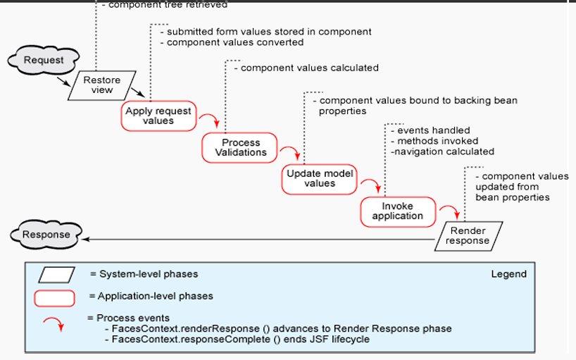  

#### Фаза формирования представления 表征形成阶段  
- JSF Runtime формирует представление (начиная с UIViewRoot):  
  - Создаются объекты компонентов. 
  - Назначаются слушатели событий, конвертеры и валидаторы. 
  - Все элементы представления помещаются в FacesContext. 
- Если это первый запрос пользователя к странице JSF, то формируется пустое представление. 
- Если это запрос к уже существующей странице, то JSF Runtime синхронизирует состояние компонентов представления с клиентом.
- JSF 运行时生成视图（从 UIViewRoot 开始）：
  - 创建组件对象。
  - 分配事件监听器、转换器和验证器。
  - 所有视图元素都放置在 `FacesContext` 中。
- 如果这是用户首次请求 JSF 页面，则生成一个空视图。
- 如果这是对现有页面的请求，JSF 运行时会将视图组件的状态与客户端同步。

#### Фаза получения значений компонентов 获取组件值的阶段  
- На стороне клиента все значения хранятся в строковом формате — нужна проверка их корректности: 
  - Вызывается конвертер в соответствии с типом данных значения. 
- Если конвертация заканчивается успешно, значение сохраняется в локальной переменной компонента. 
- Если конвертация заканчивается неудачно, создаётся сообщение об ошибке, которое помещается в FacesContext.
- 在客户端，所有值均以字符串格式存储；必须验证其正确性：
  - 根据值的数据类型调用转换器。
- 如果转换成功，则将值存储在组件的局部变量中。
- 如果转换失败，则生成错误消息并将其放置在 FacesContext 中。
 
#### Фаза валидации значений компонентов 组件值验证阶段
- Вызываются валидаторы, зарегистрированные для компонентов представления.
- Если значение компонента не проходит валидацию, формируется сообщение об ошибке, которое сохраняется в FacesContext.
- 调用为视图组件注册的验证器。
- 如果组件的值验证失败，则会生成错误消息并将其存储在 FacesContext 中。

#### Фаза обновления значений компонентов 组件值更新阶段  
- Если данные валидны, то значение компонента обновляется. 
- Новое значение присваивается полю объекта компонента.
- 如果数据有效，则更新组件的值。
- 新值将赋给组件的对象字段。

#### Фаза вызова приложения 应用程序调用阶段
- Управление передаётся слушателям событий. 
- Формируются новые значения компонентов.
- 控制权移交给事件监听器。
- 生成新的组件值。

#### Фаза формирования ответа сервера 服务器响应生成阶段
- JSF Runtime обновляет представление в соответствии с результатами обработки запроса. 
- Если это первый запрос к странице, то компоненты помещаются в иерархию представления. 
- Формируется ответ сервера на запрос. 
- На стороне клиента происходит обновление страницы.
- JSF 运行时会根据请求处理结果更新视图。
- 如果这是页面的首次请求，则会将组件放置在视图层次结构中。
- 生成对请求的服务器响应。
- 客户端刷新页面。

### 10. Java EE Full Profle  Java EE 全功能开发
Java 平台  
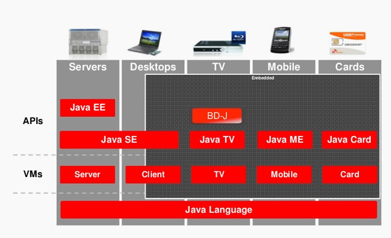  

#### Основные концепции 基本概念
- Приложения строятся из компонентов, работающих под управлением контейнеров. 
- Используются следующие принципы: 
  - Inversion of Control (IoC) + Contexts & Dependency Injection (CDI). 
  - Location Transparency.
- 应用程序由运行在容器管理下的组件构建而成。
- 遵循以下原则：
  - 控制反转 (IoC) + 上下文和依赖注入 (CDI)。
  - 位置透明性。

#### Принципы IoC и CDI IoC 和 CDI 原则
- IoC (применительно к Java EE): 
  - Жизненным циклом компонента управляет контейнер (а не программист). 
  - За взаимодействие между компонентами отвечает тоже контейнер. 
- CDI — позволяет снизить (или совсем убрать) зависимость компонента от контейнера: 
  - Не требуется реализации каких-либо интерфейсов.
  -  Не нужны прямые вызовы API. 
  -  Реализуется через аннотации.
- 控制流 (IoC)（适用于 Java EE）：
  - 组件的生命周期由容器（而非程序员）管理。
  - 容器还负责组件之间的交互。
- 容器依赖注入 (CDI) 允许您减少（或完全消除）组件对容器的依赖：
  - 无需实现接口。
  - 无需直接调用 API。
  - 通过注解实现。

#### Java Naming & Directory Interface (JNDI) Java命名和目录接口（JNDI）
JNDI — это набор Java API, организованный в виде службы каталогов, который позволяет Java-клиентам открывать и просматривать данные и объекты по их именам (С) Wikipedia.  
JNDI 是一组 Java API，组织成目录服务，允许 Java 客户端按名称发现和查看数据和对象 (C) 维基百科。  
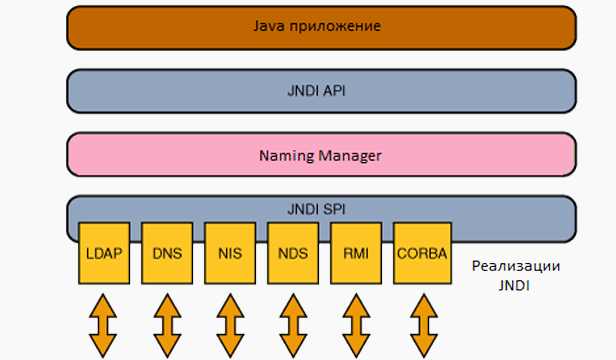  

#### JNDI API   
- Два варианта использования JNDI: 
  - CDI (аннотации) — работает только в managed компонентах.  
  - Прямой вызов API — работает везде.
- 使用 JNDI 有两种方式：
  - CDI（注解）- 仅适用于托管组件。
  - 直接 API 调用 - 适用于所有情况。

#### Принцип Location Transparency 位置透明度原则
Благодаря CDI не важно, где физически расположен вызываемый компонент — за его вызов отвечает контейнер.  
使用 CDI，被调用的组件的物理位置并不重要——容器负责调用它。  
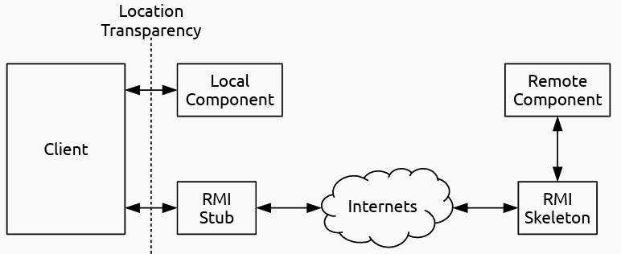  

#### Remote Method Invocation 远程方法调用
RMI — Java API, позволяющий вызывать методы удалённых объектов.  
RMI 是一个 Java API，允许调用远程对象上的方法。  
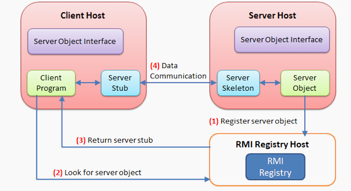

- 特性：
  - В общем случае, объекты передаются по значению (копии).
  - Передаваемые объекты должны быть `Serializable`.
  - 通常情况下，对象是按值（副本）传递的。
  - 传递的对象必须是可序列化的。

#### Java EE Application Tiers  Java EE 应用程序层
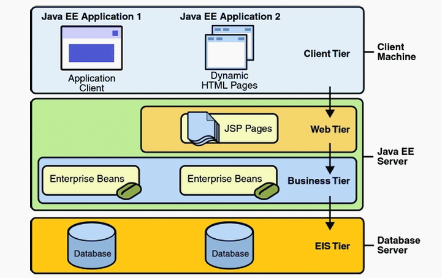  
大致分为三个层面：客户端 java EE 服务端 java EE 数据库  

#### Профили платформы Java EE
- Появились в Java EE 6. 
- Позволяют сделать более «лёгкими» приложения, которым не нужен полный стек технологий Java EE. 
- Существует только 2 профиля — `Full` и `Web`. 
- Сервер приложений может реализовывать спецификации не всей платформы, а конкретного профиля.
- 在 Java EE 6 中引入。
- 允许构建更轻量级的应用程序，这些应用程序不需要完整的 Java EE 技术栈。
- 只有两种配置文件：`Full` 和 `Web`。
- 应用服务器可以实现特定配置文件的规范，而不是整个平台。

### 11. Enterprise Java Beans 企业级 Java Bean
EJB — технология разработки серверных компонентов, реализующих бизнес-логику.  
- Особенности EJB: 
  - Возможность локального и удалённого доступа. 
  - Возможность доступа через JNDI или Dependency Injection. 
  - Поддержка распределённых транзакций (с помощью JTA). 
  - Поддержка событий. 
  - Жизненным циклом управляет EJB-контейнер (в составе сервера приложений).
EJB 是一种用于开发实现业务逻辑的服务器端组件的技术。  
- EJB 特性：
  - 支持本地和远程访问。
  - 支持通过 JNDI 或依赖注入进行访问。
  - 支持分布式事务（使用 JTA）。
  - 支持事件处理。
  - 生命周期由 EJB 容器（应用服务器的一部分）管理。

#### Виды EJB  EJB 类型
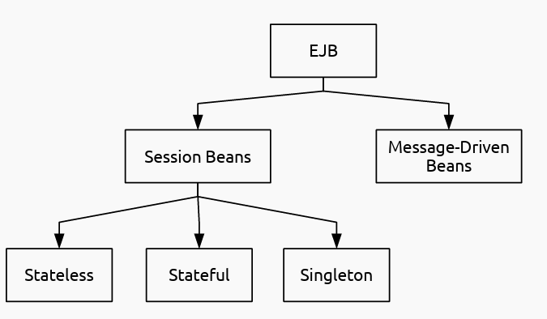  

#### Компонентная модель EJB EJB组件模型
- EJB-компоненты инкапсулируются контейнером.
- Контейнер предоставляет клиентам проксиобъекты (proxy objects) для доступа к EJBкомпонентам. 
- Прокси-объекты реализуют бизнес-интерфейсы (Business Interfaces). 
- Клиенты вызывают методы бизнесинтерфейсов.
- EJB 组件被容器封装。
- 容器为客户端提供代理对象，以便客户端访问 EJB 组件。
- 代理对象实现业务接口。
- 客户端调用业务接口的方法。
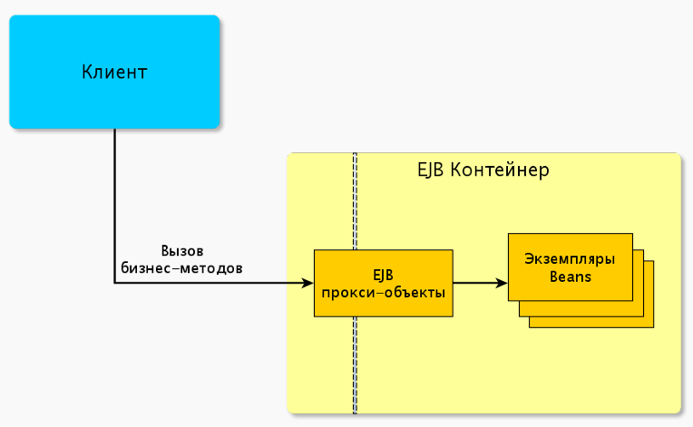  

#### Варианты доступа к EJB EJB 访问选项
- Локальный (Local) — из той же самой JVM.
- Удалённый (Remote) — из другой JVM. 
- Через веб-сервис.
- 本地 — 来自同一 JVM。
- 远程 — 来自不同的 JVM。
- 通过 Web 服务。

#### Session Beans
- Предназначены для синхронной обработки вызовов. 
- Вызываются посредством обращения через API. 
- Могут вызываться локально или удалённо.
- Могут быть endpoint'ами для веб-сервисов. 
- CDI — аннотация @EJB. 
- Не обладают свойством персистентности. 
- Можно формировать пулы бинов (за исключением `@Singleton`).
- 专为同步调用处理而设计。
- 通过 API 访问。
- 可本地或远程调用。
- 可作为 Web 服务的端点。
- 支持 CDI — @EJB 注解。
- 不具备持久化功能。
- 可以创建 Bean 池（`@Singleton` 注解除外）。

#### Stateless Session Beans
- Не сохраняют состояние между последовательными обращениями клиента. 
- Нет привязки к конкретному клиенту. 
- Хорошо масштабируются. 
- Объявление — аннотация `@Stateless`.
- 不会在连续的客户端请求之间维护状态。
- 不绑定到特定客户端。
- 可扩展性好。
- 声明方式：使用 `@Stateless` 注解。

#### Stateful Session Beans
- «Привязываются» к конкретному клиенту. 
- Можно сохранять контекст в полях класса. 
- Масштабируются хуже, чем @Stateless. 
- Объявление — аннотация @Stateful.
- 与特定客户端绑定。
- 上下文可以存储在类字段中。
- 扩展性不如 `@Stateless` 注解。
- 声明为 `@Stateful` 注解。

#### Singleton Session Beans
- Контейнер гарантирует существование строго одного экземпляра такого бина. 
- Объявление — аннотация `@Singleton`.
- 该容器保证此类 bean 只有一个实例。
- 声明 — `@Singleton` 注解。

### 12. ORM & JPA
#### Объектно-реляционное отображение
ORM ― Object/Relational Mapping ― преобразование данных из объектной формы в реляционную и наоборот.  
ORM ― 对象/关系映射 ― 将数据从对象形式转换为关系形式，反之亦然。

#### Подходы к реализации ORM 实现 ORM 的方法
Существует три подхода: 
1) Top-Down (Сверху-Вниз) – доменная модель приложения определяет реляционную. 
2) Bottom-up (Снизу-Вверх) – доменная модель строится на основании реляционной схемы. 
3) Meet-in-the-Middle – параллельная разработка доменной и реляционной моделей с учетом особенностей друг друга.  

有三种方法：
1) 自顶向下——应用程序的领域模型决定关系模型。
2) 自底向上——领域模型基于关系模式构建。
3) 中间方法——领域模型和关系模型并行开发，同时考虑彼此的特性。