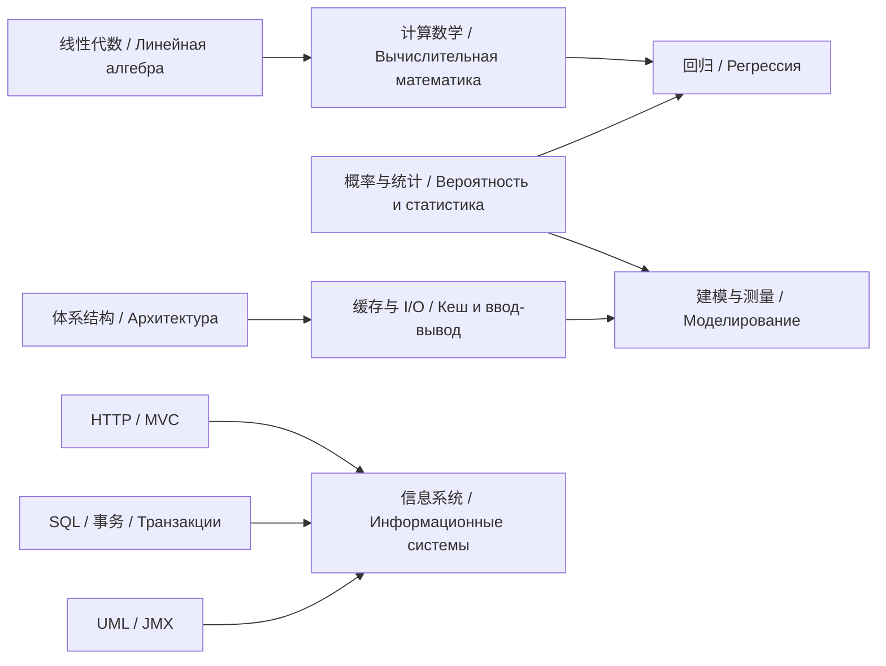

# 跨课程知识 / Связи между дисциплинами

[主页](../README.md) · [答辩入口](../study/defense.md) · [复习入口](../study/revision.md)

从一个概念找到它的理论说明、实验代码和口述材料。下表关联的是已有资料；阅读顺序是学习建议，不能作为课程完成或实验通过的记录。

## 用概念查资料

| 概念 / Термин | 课程联系 | 先理解，再看实例 | 自测问题 |
|---|---|---|---|
| 矩阵、线性方程组 / Матрица, СЛАУ | 线性代数 → 计算数学 → 人工智能 | [线性代数](../Math/LinearAlgebra/1.md) → [Jacobi 速查](../ComputationalMath/cheatsheet.md) → [线性回归](../AISystem/Labs/lab1/Lab1_AI_Linear_Regression.md) | Ax=b 与最小化预测误差分别解决什么问题？ |
| 导数、梯度 / Производная, градиент | 数学分析 → 数值优化 → 人工智能 | [多元微积分](../Math/ExtraMath/ans.md) → [回归速查](../AISystem/cheatsheet.md) → [线性回归实现](../AISystem/Labs/lab1/linear_regression.py) | 更新为何沿负梯度？学习率过大会发生什么？ |
| 标准差、置信区间 / СКО, доверительный интервал | 数理统计 → 建模 → 操作系统测量 | [建模实验一](../Modeling/lab1/实验一学习笔记_中俄双语_变体115.md) → [OS 实测答辩](../OperatingSystem/Lab/lab1-intro-ex/Intro-Exp-最终学习与答辩.md) | 个体离散程度、均值标准误和系统误差有何区别？ |
| 残差与模型评价 / Невязка, оценка модели | 计算数学 → 数理统计 → 人工智能 | [SLAE 残差与误差](../ComputationalMath/cheatsheet.md) → [线性回归指标](../AISystem/Labs/lab1/Lab1_AI_Linear_Regression.md) | 残差小能否直接证明解误差小？RMSE 与 R² 如何解释？ |
| 数据预处理与泄漏 / Подготовка данных, утечка | 人工智能 → 建模与统计 | [逻辑回归双语答辩](../AISystem/Labs/lab2/Защита_RU_ZH.md) → [实际预处理实现](../AISystem/Labs/lab2/logistic_regression.py) | 填补和标准化参数应由哪部分数据计算？ |
| 状态、转移与稳态 / Состояние, стационарное распределение | 概率论 → 建模 | [概率论课件](../ProbabilityTheory/index.md) → [排队系统答辩](../Modeling/lab2/УИР2_defense.md) → [模型复核](../Modeling/lab2/УИР2_复核说明.md) | 超指数服务为什么需要相位状态？拒绝事件是否改变状态？ |
| 页缓存、CPU 缓存、虚拟内存 / Файловый кеш, кеш CPU, виртуальная память | 计算机体系结构 → 操作系统 | [体系结构速查](../ComputerArchitecture/quick-review.md) → [OS 速查](../OperatingSystem/quick-review.md) → [mmap 源码](../OperatingSystem/Lab/lab1-intro-ex/course-code/lab/intro-exp/src/graph_traverse_mmap.c) | mmap、MMIO 与 CPU 缓存是同一概念吗？ |
| 指令、寻址与调用 / Инструкция, адресация, вызов | OPD → 计算机体系结构 | [基础指令知识](../OPD/Part1.md) → [Wrench 实验说明](../ComputerArchitecture/Lab3/readme.md) → [RISC-IV 指令解释](../ComputerArchitecture/Lab3/task4/expla_instr.md) | 从源码到指令执行，应跟踪哪些寄存器和内存变化？ |
| HTTP、会话与 MVC / HTTP, сессия, MVC | Web → 信息系统 | [Servlet 与 JSP](../WebProgramming/Ans/answer2.md) → [信息系统双语答辩](../InformationSystem/Lab1/DEFENSE_QA_ZH_RU.md) → [ApiController](../InformationSystem/Lab1/Lab1/src/main/java/edu/lab/city/web/ApiController.java) | 一次请求如何经过 Controller、Service 与 Repository？ |
| 关系、约束、事务与 ORM / Ограничение, транзакция, ORM | 数据库 → Web → 信息系统 | [数据库实验三问答](../Database/labs/lab3/questions.md) → [JDBC/JPA](../WebProgramming/Ans/answer3.md) → [ObjectRepository](../InformationSystem/Lab1/Lab1/src/main/java/edu/lab/city/repository/ObjectRepository.java) | JPA 是标准、实现还是驱动？数据库如何保证约束？ |
| 索引、监控与测量 / Индекс, мониторинг, измерение | 数据库 → 软件工程 → 操作系统 | [执行计划](../Database/labs/lab4/questions.md) → [JMX 实验报告](../OPI/Lab4/readme.md) → [OS 测量协议](../OperatingSystem/Lab/lab1-intro-ex/Intro-Exp-最终学习与答辩.md) | 指标由谁采集？测量本身有哪些开销？ |
| 物理量与可视化 / Физическая величина, визуализация | 物理 → 图形学 → 建模 | [图形学实验一答辩](../ComputerGraphicsAlgo/Lab1/defense_zh_ru.md) → [球面亮度实验](../ComputerGraphicsAlgo/Lab2/lab2_overleaf_project/README.md) | 绝对亮度、归一化灰度和背景掩码如何区分？ |
| 关系建模与证据 / Связи, источники данных | 数据库 → 知识图谱 → 用户界面 | [电影知识图谱提案](../KnowledgeGraphs/Step-1/des.md) → [用户场景](../UIDesign/HW/04_Задание_2_Пользовательские_сценарии.md) | 图谱关系解决什么查询问题？结果如何说明来源？ |

最后一行连接的是项目提案与设计材料，不能据此认为知识图谱查询服务已经实现。信息系统课件的 Java EE / javax 示例与实际项目的 Jakarta Persistence / jakarta 导入应按[版本说明](../InformationSystem/Lab1/DEFENSE_QA_ZH_RU.md)分别阅读。

## 三条串联路线

箭头表示本仓库可串联阅读的概念，不是教务规定的先修课关系。对应文件见上方表格。

1. **数值计算与机器学习**：矩阵 → SLAE → 梯度 → 线性回归 → 逻辑回归。重点比较算法输入、停止条件和评价指标。
2. **从处理器到测量结果**：寻址 → 缓存层次 → 系统调用 / mmap → 重复测量 → 置信区间。重点说明每个结论的测量范围。
3. **从请求到数据**：HTTP → MVC → 事务与 ORM → SQL 计划 → JMX。每到一层都找一段实际代码解释职责。

[返回主页](../README.md) · [去答辩练习](../study/defense.md) · [去考前复习](../study/revision.md)

