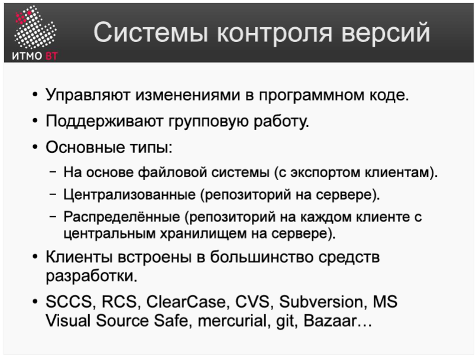

## Вопросы к защите лабораторной работы:
#### 1. Системы контроля версий - назначение, примеры решений.
#### 1. 版本控制系统——目的、解决方案示例。
Системы контроля версий (VCS) предназначены для систематического сохранения изменений в файлах, управления историей разработки, обеспечения совместной работы нескольких разработчиков над одним проектом и возможности отката к предыдущим состояниям. Они решают проблемы потери кода, перезаписи чужих изменений и сложностей с интеграцией.
Примеры: централизованные (SVN, CVS), распределенные (Git, Mercurial).  
版本控制系统（VCS）用于系统性地保存文件更改、管理开发历史、支持多名开发者协同参与同一项目，以及提供回滚到先前状态的能力。它们解决了代码丢失、覆盖他人修改以及集成困难等问题。
示例：集中式（SVN、CVS），分布式（Git、Mercurial）。  

**git**:Git — это распределённая система контроля версий.
У каждого разработчика на компьютере есть полная копия всего репозитория (со всей историей). Можно работать без интернета, а потом отправить изменения на удалённый сервер.  
是一个分布式版本控制系统。
每个开发者电脑上都有一份完整的仓库（包括所有历史记录）。你可以离线工作，提交代码不用每次都连服务器。最后再把自己的修改推送到远程服务器。  
**svn**:SVN (Subversion) — это централизованная система контроля версий.
Весь код хранится на одном центральном сервере. Чтобы отправить или обновить код, нужно каждый раз подключаться к серверу. Как один большой общий «центральный склад».  
是一个集中式版本控制系统。
所有代码都保存在一台中央服务器上，大家每次工作都要连上这台服务器才能提交和更新代码。像一个“中央仓库”，所有人围着它转。

#### 2. Ревизии и ветки.  修订和分支。
Ревизия (коммит) — это зафиксированное состояние всех файлов проекта в определенный момент времени. Каждая ревизия имеет уникальный идентификатор и описание изменений. Она позволяет вернуться к любой прошлой версии проекта.  
Ветка (branch) — это независимая линия разработки, отходящая от основной (trunk/main). Ветки позволяют разрабатывать новые функции или исправлять баги изолированно, не нарушая стабильность основного кода, а затем сливать (merge) изменения обратно.  
修订版（提交） 是项目所有文件在特定时间点的已固定状态。每个修订版都有唯一标识符和更改说明。它允许你回到项目的任何历史版本。  
分支 是从主线分叉出的独立开发线。分支允许隔离地开发新功能或修复错误，而不破坏主代码的稳定性，随后再将更改合并回去。  

#### 3. Основные операции над данными в системах контроля версий. Основные команды svn и git.
#### 3. 版本控制系统中的数据基本操作。基本的 svn 和 git 命令。
Основные операции: инициализация репозитория, добавление файлов, фиксация изменений, получение обновлений с сервера, создание веток и слияние веток.  
基本操作：初始化仓库、添加文件、提交更改、从服务器获取更新、创建分支和合并分支。  

**Основные команды Git**:

- git init / git clone — создание/клонирование репозитория 创建或克隆存储库
- git add — добавление файлов в индекс 添加文件到索引处
- git commit — фиксация изменений 更改提交状态
- git pull / git push — получение/отправка изменений 拉取/推送状态
- git checkout -b — создание и переход на ветку 创建并切换分支
- git merge — слияние веток 合并分支
- git status - 在文件系统中展示文件现有状态和分支信息
- git log - 展示提交集合 --graph以图像形式展示分支
- git diff - 展示所有更改

**Основные команды SVN:**
svn checkout — получение рабочей копии 检出
svn add — добавление файлов под контроль версий 添加文件
svn commit — отправка изменений на сервер 向服务器提交改动
svn update — получение актуальных изменений с сервера 从服务器更新改变状态
svn copy — создание ветки 创建分支
svn switch — переключение между ветками 切换分支
svn merge — слияние веток 合并分支

#### 4. Виды конфликтов и способы их решения.
#### 4. 冲突的类型及解决方法。
Конфликт возникает, когда два разработчика изменяют одни и те же строки в одном и том же файле, и система не может автоматически объединить эти изменения.  
当两名开发者修改了同一文件的相同行，且系统无法自动合并这些更改时，就会发生冲突。  
**Виды конфликтов**:

1. Текстовый конфликт — изменения в одних и тех же строках исходного кода. 对源代码相同行的更改。
2. Конфликт свойств (property) — изменения метаданных файла. 对文件元数据的更改。
3. Конфликт дерева (tree conflict) — один разработчик переименовал или удалил файл, а другой разработчик фиксировал его. 一名开发者重命名或删除了文件，而另一名开发者修改了它

**Способы решения**:

1. Ручное разрешение: разработчик открывает конфликтный файл, удаляет маркеры конфликта (<<<<<<<, =======, >>>>>>>), оставляет нужный код и сохраняет файл. Затем помечает файл как разрешенный (git add <file> в Git или svn resolve --accept working <file> в SVN).
2. Автоматическое разрешение с помощью стратегий: использование флагов слияния, например, принять только свою версию (-X ours в Git, --accept mine-full в SVN) или только чужую версию (-X theirs в Git, --accept theirs-full в SVN).
3. Использование инструментов визуального слияния (Merge Tools), таких как KDiff3, Meld или встроенные инструменты IDE.

1. 手动解决：开发者打开冲突文件，删除冲突标记（<<<<<<<, =======, >>>>>>>），保留所需代码并保存。然后将文件标记为已解决（Git 中用 git add <file>，SVN 中用 svn resolve --accept working <file>）。
2. 使用策略自动解决：使用合并标志，例如只接受自己的版本（Git 中 -X ours，SVN 中 `--accept mine-full）或只接受他人的版本（Git 中 -X theirs，SVN 中 --accept theirs-full`）
3. 使用可视化合并工具，如 KDiff3、Meld 或 IDE 的内置工具。

#### Одновременная модификация файлов文件的并发编辑
两种工作模式：
1. Lock - modify - unlock（锁定 - 修改 - 解锁）

特点：在版本控制系统（SCM）中，这种模式会阻塞其他人的操作命令。
原理解释：Когда один пользователь блокирует файл и вносит в него изменения, другие не могут отправлять свои изменения и могут только ждать разблокировки файла.  
 当一个人锁定文件进行修改时，其他人无法提交修改命令，只能等待文件被解锁。
2. Copy - modify - merge（复制 - 修改 - 合并）

特点：让每个开发者都有该文件的独立副本，但最终的合并较为困难。
原理解释：Каждый вносит изменения в свою копию, не мешая друг другу, но при слиянии изменений в основную ветку легко могут возникнуть конфликты, что усложняет процесс слияния.  
大家各自修改自己的副本，互不干扰，但最后将各自的修改合并到主干时，容易产生冲突，合并过程具有挑战性。  

66-88